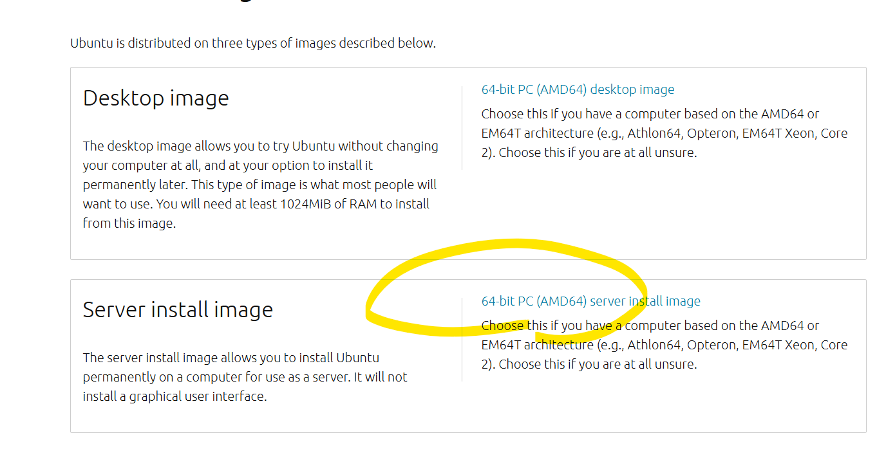
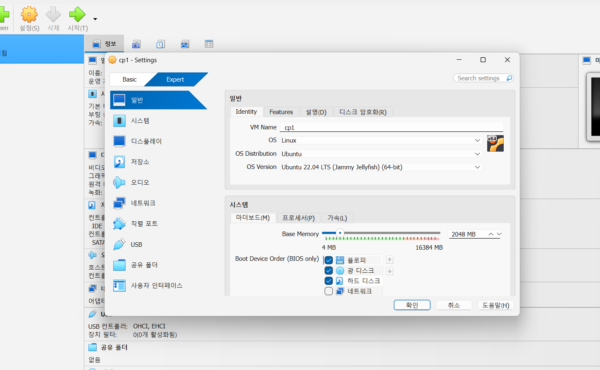
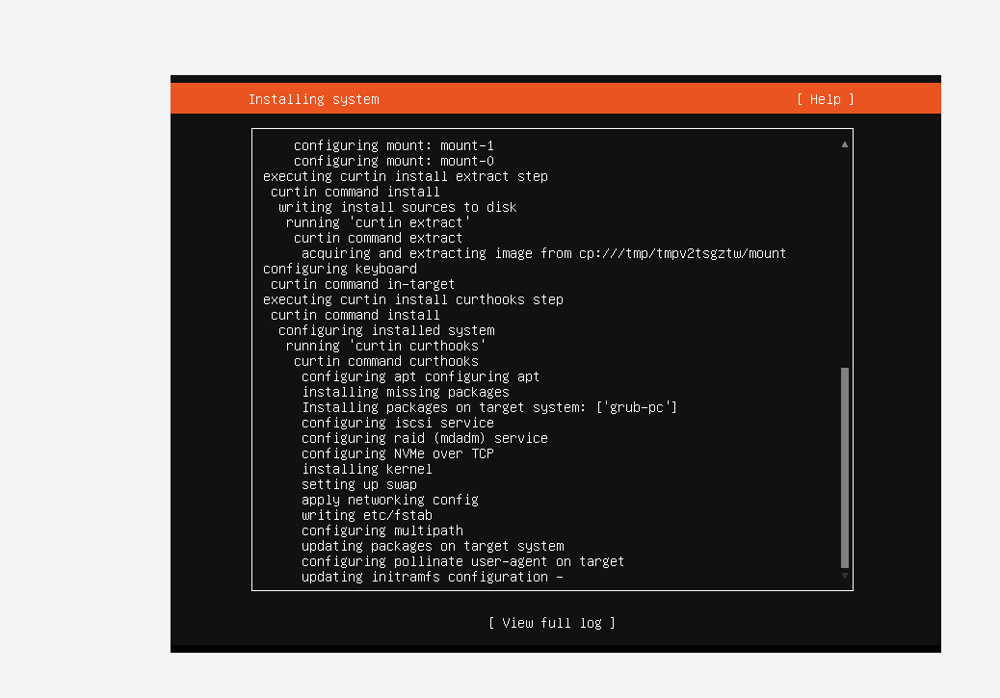

# Lecture 01 - 환경 구축과 Docker 이미지 준비

> 이 README는 lecture01 폴더의 개별 MD를 통합한 강의 노트입니다.

## 강의 목표
- 실습 환경(WSL/VirtualBox/K3s/SSH/kubeconfig) 준비
- Docker 이미지 빌드/푸시 흐름 이해

## 포함 이론 문서
- 0. wsl_po wershell_docker_k8s_cheatsheet.md
- 1. virtualbox.md
- 2. k3s.md
- 3. ssh.md
- 8. Config.md

## 포함 실습
- 00-Docker-Images

## 권장 순서
1. 환경 문서(0/1/2/3/8) 순서대로 확인
2. `00-Docker-Images` 실습 진행
3. `lecture02`로 이동

## 통합 문서 목록
- `0. wsl_po wershell_docker_k8s_cheatsheet.md`
- `1. virtualbox.md`
- `2. k3s.md`
- `3. ssh.md`
- `8. Config.md`

---

# WSL + PowerShell + Docker + Kubernetes 치트시트

## WSL 초기 설정 (예시)

Windows PowerShell:

```powershell
wsl --install
wsl --set-default-version 2
wsl -l -v
```

WSL(Ubuntu)에서 systemd 활성화:

```sh
sudo tee /etc/wsl.conf >/dev/null <<'EOF'
[boot]
systemd=true
EOF

sudo apt update
sudo apt -y upgrade
```

설정 반영 후 WSL 재시작:

```powershell
wsl --shutdown
wsl -d Ubuntu
```

WSL에서 상태 확인:

```sh
systemctl is-system-running
```

---

## 0) 빠른 목차

- [1. PowerShell 네트워크](#1-powershell-네트워크)
- [2. WSL(리눅스) 네트워크](#2-wsl리눅스-네트워크)
- [3. Docker](#3-docker)
- [4. Kubernetes(kubectl)](#4-kuberneteskubectl)
- [5. 실전 트러블슈팅 체크리스트](#5-실전-트러블슈팅-체크리스트)
- [6. 원샷 점검 스니펫](#6-원샷-점검-스니펫)

---

## 1) PowerShell 네트워크

### 1-1) IP / NIC / 게이트웨이 / DNS 확인

```powershell
ipconfig /all
```

예시 출력(일부):
```text
Ethernet adapter 이더넷:
   IPv4 Address. . . . . . . . . . . : 192.168.0.10
   Subnet Mask . . . . . . . . . . . : 255.255.255.0
   Default Gateway . . . . . . . . . : 192.168.0.1
   DNS Servers . . . . . . . . . . . : 1.1.1.1
                                       8.8.8.8
```

```powershell
Get-NetIPConfiguration
```

예시:
```text
InterfaceAlias : 이더넷
IPv4Address    : 192.168.0.10
IPv4DefaultGateway : 192.168.0.1
DNSServer      : {1.1.1.1, 8.8.8.8}
```

---

### 1-2) DNS 조회 / 검증

```powershell
nslookup naver.com
```

예시:
```text
Server:  one.one.one.one
Address: 1.1.1.1

Non-authoritative answer:
Name:    naver.com
Addresses: 223.130.195.200
           223.130.195.95
```

```powershell
Resolve-DnsName naver.com
```

예시:
```text
Name      Type TTL Section IPAddress
----      ---- --- ------- ---------
naver.com A    60  Answer  223.130.195.200
```

---

### 1-3) 연결성 테스트 (ICMP / TCP 포트)

```powershell
ping 8.8.8.8
```

예시:
```text
Reply from 8.8.8.8: bytes=32 time=35ms TTL=115
```

```powershell
Test-NetConnection naver.com -Port 443
```

예시:
```text
ComputerName     : naver.com
RemoteAddress    : 223.130.195.200
RemotePort       : 443
TcpTestSucceeded : True
```

---

### 1-4) 경로/라우팅 확인

```powershell
tracert naver.com
```

예시:
```text
  1  192.168.0.1  2 ms
  2  10.10.0.1    5 ms
  3  ...
```

```powershell
route print
```

예시(일부):
```text
IPv4 Route Table
Network Destination        Netmask          Gateway       Interface  Metric
0.0.0.0                    0.0.0.0          192.168.0.1   192.168.0.10  25
```

---

### 1-5) 열려있는 포트 / 연결 상태 / PID 매핑

```powershell
netstat -ano
```

예시(일부):
```text
TCP  0.0.0.0:80     0.0.0.0:0   LISTENING   1234
TCP  127.0.0.1:5432 0.0.0.0:0   LISTENING   5678
```

```powershell
Get-NetTCPConnection -State Listen |
  Select LocalAddress,LocalPort,OwningProcess |
  Sort LocalPort
```

예시:
```text
LocalAddress LocalPort OwningProcess
----------- --------- -------------
0.0.0.0     80        1234
127.0.0.1   5432      5678
```

PID → 프로세스:
```powershell
Get-Process -Id 1234
```

예시:
```text
Handles  NPM(K)    PM(K)      WS(K)     CPU(s)     Id  SI ProcessName
-------  ------    -----      -----     ------     --  -- -----------
    260      18    45000      90000       1.23   1234   1 nginx
```

---

### 1-6) 방화벽 상태 / 규칙 확인·추가

```powershell
Get-NetFirewallProfile
```

예시:
```text
Name    Enabled DefaultInboundAction DefaultOutboundAction
----    ------- -------------------- ---------------------
Domain  True    Block                Allow
Private True    Block                Allow
Public  True    Block                Allow
```

포트(예: 8080) 인바운드 허용 규칙 추가:
```powershell
New-NetFirewallRule -DisplayName "Allow 8080" -Direction Inbound -Action Allow -Protocol TCP -LocalPort 8080
```

예시:
```text
Name        : {GUID...}
DisplayName : Allow 8080
Enabled     : True
```

---

## 2) WSL(리눅스) 네트워크

### 2-1) IP / 라우팅 / DNS

```sh
ip a
```

예시:
```text
2: eth0: <BROADCAST,MULTICAST,UP,LOWER_UP> ...
    inet 172.24.155.12/20 brd 172.24.159.255 scope global eth0
```

```sh
ip route
```

예시:
```text
default via 172.24.144.1 dev eth0
172.24.144.0/20 dev eth0 proto kernel scope link src 172.24.155.12
```

```sh
cat /etc/resolv.conf
```

예시:
```text
nameserver 172.24.144.1
```

---

### 2-2) 연결성 테스트 (HTTP/TLS/TCP)

```sh
ping -c 3 8.8.8.8
```

예시:
```text
3 packets transmitted, 3 received, 0% packet loss
```

```sh
curl -I https://naver.com
```

예시:
```text
HTTP/2 200
server: NWS
```

TCP 포트 체크:
```sh
nc -vz naver.com 443
```

예시:
```text
Connection to naver.com 443 port [tcp/https] succeeded!
```

대체(내장 TCP):
```sh
timeout 2 bash -c 'cat < /dev/null > /dev/tcp/naver.com/443' && echo OK || echo FAIL
```

예시:
```text
OK
```

---

### 2-3) 리스닝 포트 / 프로세스 확인

```sh
ss -lntp
```

예시:
```text
LISTEN 0 4096 0.0.0.0:8000 0.0.0.0:* users:(("python",pid=2201,fd=3))
```

```sh
lsof -i :8000
```

예시:
```text
python 2201 user  3u  IPv4  ... TCP *:8000 (LISTEN)
```

---

### 2-4) 방화벽(ubuntu 기준)

```sh
sudo ufw status
```

예시:
```text
Status: active
To                         Action      From
22/tcp                     ALLOW       Anywhere
```

포트 허용:
```sh
sudo ufw allow 8080/tcp
```

---

## 3) Docker

### 3-1) 상태/버전

```sh
docker version
docker info
```

예시(일부):
```text
Server: Docker Engine - Community
 Kernel Version: 5.15.x
 Operating System: Docker Desktop
```

---

### 3-2) 이미지

```sh
docker images
```

예시:
```text
REPOSITORY   TAG     IMAGE ID       CREATED        SIZE
nginx        latest  ca871a86d45a   2 weeks ago    228MB
```

```sh
docker pull redis:7
```

예시:
```text
7: Pulling from library/redis
Status: Downloaded newer image for redis:7
```

---

### 3-3) 컨테이너 실행/조회/로그/exec

```sh
docker run -d --name web -p 8080:80 nginx:latest
```

예시:
```text
a1b2c3d4e5f6...
```

```sh
docker ps
```

예시:
```text
CONTAINER ID  IMAGE       COMMAND                  STATUS         PORTS                  NAMES
a1b2c3d4e5f6  nginx:latest "nginx -g 'daemon off'" Up 10 seconds  0.0.0.0:8080->80/tcp   web
```

```sh
docker logs -f web
```

예시:
```text
2026/01/10 01:02:03 [notice] 1#1: start worker processes
```

```sh
docker exec -it web bash
```

예시:
```text
root@a1b2c3d4e5f6:/#
```

---

### 3-4) 네트워크 / 볼륨

```sh
docker network ls
docker network inspect bridge
```

```sh
docker volume ls
docker volume create pgdata
```

예시:
```text
pgdata
```

---

### 3-5) 정리(종료/삭제/정리)

```sh
docker stop web
docker rm web
docker rmi nginx:latest
docker system df
docker system prune -a
```

---

## 4) Kubernetes(kubectl)

### 4-1) 클러스터/컨텍스트

```sh
kubectl version --client
kubectl config get-contexts
kubectl config current-context
kubectl cluster-info
```

예시:
```text
Kubernetes control plane is running at https://127.0.0.1:6443
CoreDNS is running at https://127.0.0.1:6443/api/v1/namespaces/kube-system/services/kube-dns:dns/proxy
```

---

### 4-2) 리소스 조회(가장 많이 씀)

```sh
kubectl get nodes -o wide
kubectl get ns
kubectl get pods -A
kubectl get svc -A
kubectl get deploy -n default
```

예시:
```text
NAME   STATUS   ROLES           AGE   VERSION
cp1    Ready    control-plane   10d   v1.30.2

NAMESPACE  NAME                    READY  STATUS   RESTARTS  AGE
default    api-5f6b7c8d9f-2kq7m   1/1    Running  0         2m
```

---

### 4-3) describe / events (문제 파악 핵심)

```sh
kubectl describe pod api-5f6b7c8d9f-2kq7m -n default
kubectl get events -A --sort-by=.metadata.creationTimestamp
```

예시(일부):
```text
Events:
  Type    Reason     Age   From               Message
  Normal  Scheduled  2m    default-scheduler  Successfully assigned default/api... to cp1
  Normal  Pulled     2m    kubelet            Container image "myapi:1.0" already present
```

---

### 4-4) 로그 / exec / 포트포워딩

```sh
kubectl logs -n default api-5f6b7c8d9f-2kq7m
kubectl logs -f -n default api-5f6b7c8d9f-2kq7m
```

예시:
```text
INFO  Server started on :8080
```

```sh
kubectl exec -it -n default api-5f6b7c8d9f-2kq7m -- sh
```

예시:
```text
/ # ls
app  bin  etc  ...
```

```sh
kubectl port-forward -n default svc/api 18080:80
```

예시:
```text
Forwarding from 127.0.0.1:18080 -> 80
```

---

### 4-5) 배포/롤아웃/롤백

```sh
kubectl apply -f deployment.yaml
kubectl rollout status deploy/api -n default
kubectl rollout history deploy/api -n default
kubectl rollout undo deploy/api -n default
```

예시:
```text
deployment.apps/api configured
deployment "api" successfully rolled out
```

---

## 5) 실전 트러블슈팅 체크리스트

### 5-1) “포트가 진짜 열렸나?” (로컬/WSL/컨테이너/Pod)

**Windows**
```powershell
Test-NetConnection 127.0.0.1 -Port 8080
netstat -ano | findstr :8080
```

**WSL**
```sh
ss -lntp | grep ':8080'
curl -I http://127.0.0.1:8080
```

**Docker**
```sh
docker ps
docker port web
docker logs web
```

**K8s**
```sh
kubectl get pod -o wide
kubectl logs <pod> -n <ns>
kubectl port-forward -n <ns> svc/<svc> 18080:80
```

---

### 5-2) “Pod는 Running인데 서비스가 안 붙는다”

```sh
kubectl get svc -n default
kubectl describe svc api -n default
kubectl get endpoints api -n default
kubectl get pod -n default -o wide
```

확인 포인트:
- Service selector가 Pod label과 매칭되는지
- endpoints가 비어있지 않은지
- targetPort/containerPort가 일치하는지

---

### 5-3) “이미지 Pull 안됨 (ErrImagePull / ImagePullBackOff)”

```sh
kubectl describe pod <pod> -n <ns>
```

Events에서:
- `ErrImagePull`, `ImagePullBackOff`
- 레지스트리 인증 필요하면 imagePullSecret
- 태그 오타/아키텍처 불일치(amd64/arm64)도 빈번

---

## 6) 원샷 점검 스니펫

### 6-1) PowerShell: 네트워크 요약 + 포트 리스닝 요약

```powershell
Write-Host "== IP CONFIG ==" -ForegroundColor Cyan
Get-NetIPConfiguration | Format-List

Write-Host "== DNS TEST ==" -ForegroundColor Cyan
Resolve-DnsName naver.com | Select-Object -First 3 | Format-Table

Write-Host "== ROUTES (default) ==" -ForegroundColor Cyan
route print | Select-String "0.0.0.0"

Write-Host "== LISTEN PORTS (Top 20) ==" -ForegroundColor Cyan
Get-NetTCPConnection -State Listen |
  Select LocalAddress,LocalPort,OwningProcess |
  Sort LocalPort |
  Select -First 20 | Format-Table
```

---

### 6-2) WSL: IP/Route/DNS/Listen/Curl 한 번에

```sh
echo "== ip a =="; ip a | sed -n '1,80p'
echo
echo "== ip route =="; ip route
echo
echo "== resolv.conf =="; cat /etc/resolv.conf
echo
echo "== listen ss =="; ss -lntp | head -n 20
echo
echo "== curl https =="; curl -I https://naver.com | head -n 10
```

---

## 참고: 자주 쓰는 “정리” 구문

- Docker 전체 정리(주의: 이미지/캐시 싹 지움)
  ```sh
  docker system prune -a
  ```
- K8s 네임스페이스 전체 Pod 보기
  ```sh
  kubectl get pods -A
  ```
- 특정 워크로드만 필터링
  ```sh
  kubectl get pod -A | grep api
  ```


---

# VirtualBox 설치 요약 (Windows)

> 통합본: `1. virtualbox.md` + `1. virtualbox_hostonly_k8s_guide.md`

## 기존 문서 1

> 목표: Windows에서 VirtualBox를 설치하고 **Host-Only 네트워크(vboxnet0 역할)**를 만들어
> K3s 멀티노드 VM(cp1/w1/w2)을 준비합니다.

---

## 1) 다운로드/설치

- 다운로드: <https://www.virtualbox.org/wiki/Downloads>
- 설치 중 네트워크 드라이버/어댑터 설치 안내가 뜨면 **반드시 허용(Install)**
- 설치 후 필요 시 재부팅

> Host-Only 어댑터가 안 생기는 가장 흔한 이유는 드라이버 설치 실패입니다.

### (참고) Ubuntu Server ISO 다운로드 예시



### (참고) VM 기본 설정 화면 예시



### (참고) Ubuntu 서버 설치 진행 화면



---

## 2) Host-Only 네트워크 생성 (GUI)

VirtualBox 실행 후 아래 경로 중 하나로 이동합니다.

- **File → Tools → Network Manager**
- **File → Host Network Manager**

`Host-only Networks` 탭에서 **Create** 클릭 후 아래처럼 설정합니다.

- **IPv4 Address**: `192.168.56.1`
- **IPv4 Mask**: `255.255.255.0`
- **DHCP**: `OFF` (정적 IP 사용 예정)

---

## 3) Windows에서 Host-Only 어댑터 확인

PowerShell에서 확인:

```powershell
ipconfig | findstr /i "VirtualBox"
```

또는(이름이 “이더넷” 등으로 표시될 때):

```powershell
Get-NetAdapter -IncludeHidden | Sort-Object Name | Format-Table -Auto Name, Status, InterfaceDescription
```

정상이라면 **VirtualBox Host-Only** 어댑터가 보이며 IPv4가 `192.168.56.1`로 표시됩니다.

---

## 4) Create 후에도 어댑터가 안 생길 때 (빠른 해결)

1) VirtualBox 설치 파일 재실행 → **Repair(복구)**
2) 드라이버 설치 경고 시 **Install/허용**
3) 필요 시 재부팅

그래도 안 되면 **완전 제거 → 재부팅 → 최신 버전 재설치**를 권장합니다.

---

## 5) 다음 단계 (미리보기)

VM 3대(cp1/w1/w2) 네트워크 설정은 다음처럼 붙입니다.

- **Adapter 1**: NAT
- **Adapter 2**: Host-Only (vboxnet0)

이후 Ubuntu에서 `192.168.56.10/11/12` 정적 IP를 설정하면 K3s 멀티노드 구성이 가능합니다.

---

## 기존 문서 2

> 목표: Windows 호스트에서 VirtualBox로 **Kubernetes 멀티노드 VM 3대(cp1/w1/w2)**를 구성하기 위해,  
> **Host-Only 네트워크(일반적으로 vboxnet0 역할)**를 만들고, **정적 IP(192.168.56.10/11/12)**로 통신되게 설정합니다.

---

## 1) VirtualBox 다운로드/설치

- 다운로드: VirtualBox 공식 페이지  
  - https://www.virtualbox.org/wiki/Downloads

설치 중 **네트워크 드라이버/어댑터 설치 안내**가 뜨면 반드시 **허용(Install)** 하세요.  
(Host-Only가 안 생기는 가장 흔한 이유가 네트워크 구성요소/드라이버 설치 실패입니다.)

설치 후 필요 시 재부팅합니다.

---

## 2) Host-Only 네트워크(vboxnet0 역할) 만들기 (GUI)

VirtualBox 버전에 따라 메뉴 위치가 다를 수 있습니다. 아래 중 가능한 경로로 들어가세요.

### 경로 A: Network Manager/Host Network Manager

- VirtualBox 실행 → **File → Tools → Network Manager**  
  또는  
- VirtualBox 실행 → **File → Host Network Manager**

> 여기서 **Host-only Networks(호스트 전용 네트워크)** 탭에서 **Create(생성)** 를 누릅니다.

### 경로 B: Preferences(환경 설정)에서 생성

- VirtualBox 메인 화면 → **환경 설정(Preferences)** → **Network(네트워크)**  
- 탭에서 **Host-only Networks / Host Network Manager** 를 찾아 **추가(+) / Create** 로 생성

### 권장 설정

- **IPv4 Address**: `192.168.56.1`  
- **IPv4 Mask**: `255.255.255.0`  
- **DHCP Server**: `OFF(끔)` (VM에서 정적 IP를 쓸 예정이라 꺼두는 것을 권장)

생성되면 이름이 `vboxnet0`로 보이거나, Windows 쪽에 **VirtualBox Host-Only Ethernet Adapter**가 잡히는 형태로 나타납니다.

---

## 3) (대체 루트) VBoxManage로 Host-Only 생성/설정 (GUI 없이 가능)

GUI에서 메뉴가 안 보이거나 꼬인 경우, PowerShell에서 VirtualBox CLI로 확인/생성할 수 있습니다.

### 3-1) Host-Only 목록 확인

```powershell
& "C:\Program Files\Oracle\VirtualBox\VBoxManage.exe" list hostonlyifs
```

정상 예시:
```text
Name:            VirtualBox Host-Only Ethernet Adapter
DHCP:            Disabled
IPAddress:       192.168.56.1
NetworkMask:     255.255.255.0
Status:          Up
```

### 3-2) Host-Only 생성

```powershell
& "C:\Program Files\Oracle\VirtualBox\VBoxManage.exe" hostonlyif create
```

### 3-3) IP 설정

어댑터 이름은 `list hostonlyifs`에서 나온 **Name**을 그대로 사용합니다.

```powershell
& "C:\Program Files\Oracle\VirtualBox\VBoxManage.exe" hostonlyif ipconfig "VirtualBox Host-Only Ethernet Adapter" --ip 192.168.56.1 --netmask 255.255.255.0
```

---

## 4) Windows에서 Host-Only 어댑터 확인 (ipconfig가 안 잡히는 경우 포함)

`ipconfig | findstr "VirtualBox"`는 **어댑터 이름에 VirtualBox가 포함될 때만** 잡힐 수 있어요.  
Windows에선 이름이 그냥 **“이더넷”**으로 잡히고, 설명(InterfaceDescription)에만 VirtualBox가 들어가는 경우도 흔합니다.

### 4-1) 어댑터 존재 여부 확인(확실)

```powershell
Get-NetAdapter -IncludeHidden |
  Sort-Object Name |
  Format-Table -Auto Name, Status, InterfaceDescription
```

예시:
```text
Name    Status  InterfaceDescription
----    ------  --------------------
이더넷  Up      VirtualBox Host-Only Ethernet Adapter
```

### 4-2) Host-Only IPv4 주소 확인

(예: 인터페이스 별칭이 "이더넷"인 경우)

```powershell
Get-NetIPAddress -InterfaceAlias "이더넷" -AddressFamily IPv4
```

정상 예시:
```text
IPAddress      : 192.168.56.1
PrefixLength   : 24
PrefixOrigin   : Manual
```

필요하면(비어 있거나 다른 값이면) 강제 설정:
```powershell
New-NetIPAddress -InterfaceAlias "이더넷" -IPAddress 192.168.56.1 -PrefixLength 24
```

### 4-3) GUI에서 어댑터 활성화 확인

- 실행(Win+R): `ncpa.cpl`  
- “VirtualBox Host-Only …”가 보이면 **사용(Enable)** 상태인지 확인  
- 어댑터 속성에서 **Internet Protocol Version 4 (TCP/IPv4)** 체크 여부 확인

---

## 5) Host-Only 네트워크가 계속 안 보일 때(Repair/재설치)

- Expert 모드에도 네트워크 항목이 전혀 안 보이거나
- Host-Only 드라이버가 Windows에 안 잡히는 경우

✅ 가장 빠른 해결은 **VirtualBox 설치 파일 재실행 → Repair(복구)** 입니다.

1) 설치 파일(.exe) 다시 실행 → **Repair(복구)** 선택  
2) 드라이버 설치 경고가 뜨면 반드시 **Install/허용**  
3) 필요 시 재부팅  
4) 다시 `Get-NetAdapter` / `VBoxManage list hostonlyifs`로 확인

그래도 안 되면:
- 완전 제거 → 재부팅 → 최신 버전 재설치
- 회사 PC 보안/백신이 드라이버 설치를 막는지 점검

---

## 6) VM 3대(cp1/w1/w2)에 Host-Only 붙이기 (네트워크 어댑터 설정)

각 VM 설정 → **Network(네트워크)**

- **Adapter 1**: `NAT`
- **Adapter 2**: `Host-only Adapter`
  - Name: `VirtualBox Host-Only Ethernet Adapter` (또는 vboxnet0에 해당하는 항목)
  - ✅ **Cable connected** 체크

---

## 7) Ubuntu VM에서 정적 IP(192.168.56.10/11/12) 설정 (netplan)

VM에서 인터페이스 이름부터 확인합니다.

---
```
기본 설치로 vboxuser / 123456 , ubuntu / ubuntu
```
---

```sh
ip -br a
```

보통:
- NAT: `enp0s3` (DHCP)
- Host-Only: `enp0s8` (정적)

### cp1 (192.168.56.10)

```sh
sudo tee /etc/netplan/00-installer-config.yaml >/dev/null <<'EOF'
network:
  version: 2
  ethernets:
    enp0s3:
      dhcp4: true
    enp0s8:
      dhcp4: no
      addresses: [192.168.56.10/24]
EOF

sudo netplan apply
ip -br a
```

### w1 (192.168.56.11), w2 (192.168.56.12)

위 파일에서 `192.168.56.10`만 각각 `192.168.56.11`, `192.168.56.12`로 바꾸면 됩니다.

---

---
# VirtualBox에서 netplan YAML을 고정(변경 없이 유지)하는 방법

VirtualBox에서 **Ubuntu netplan YAML을 “고정(변경 없이 유지)”**하려면, 핵심은 이 2가지를 막는 겁니다.

1) **부팅/재부팅 때 netplan 파일이 다시 생성/덮어쓰기 되는 것**  
2) **클라우드-init / NetworkManager / systemd-networkd가 설정을 다시 바꾸는 것**

아래는 “가장 흔한 케이스” 기준으로, **변경 없이 고정**하는 실전 방법들입니다.

---

## 1) cloud-init이 netplan을 덮어쓰는 경우 (가장 흔함)

Ubuntu VM 이미지는 보통 cloud-init이 네트워크 설정을 관리하면서 `/etc/netplan/50-cloud-init.yaml` 같은 파일을 생성/갱신합니다.  
이때는 **cloud-init 네트워크 기능을 꺼야** netplan이 고정됩니다.

### A. cloud-init 네트워크 비활성화

```sh
sudo bash -lc 'cat >/etc/cloud/cloud.cfg.d/99-disable-network-config.cfg <<EOF
network: {config: disabled}
EOF'
```

### B. 기존 cloud-init netplan 파일은 내 설정으로 “대체”

- 권장: cloud-init 파일을 쓰지 말고, **내 파일**을 새로 만듭니다 (예: `01-netcfg.yaml`).
- 그리고 cloud-init이 만든 파일은 제거(또는 무시)합니다.

```sh
sudo rm -f /etc/netplan/50-cloud-init.yaml
```

### C. netplan 적용

```sh
sudo netplan generate
sudo netplan apply
```

### D. (선택) cloud-init 캐시까지 정리

이미 생성된 설정이 남아 계속 영향을 주면:

```sh
sudo cloud-init clean --logs
```

---

## 2) netplan YAML을 “절대 덮어쓰지 못하게” 파일 자체를 잠그기

정말 “고정”이 목적이면, 파일에 immutable(변경 불가) 속성을 걸면 강력합니다.

예: `/etc/netplan/01-netcfg.yaml`을 고정

```sh
sudo chattr +i /etc/netplan/01-netcfg.yaml
```

> 나중에 수정하려면 반드시:

```sh
sudo chattr -i /etc/netplan/01-netcfg.yaml
```

---

## 3) NetworkManager vs systemd-networkd 충돌 방지

Ubuntu Desktop은 NetworkManager가 기본인 경우가 많고, Server는 systemd-networkd가 기본인 경우가 많습니다.  
netplan의 `renderer`가 실제 환경과 맞아야 “안 바뀝니다”.

### Ubuntu Server(보통)

```yaml
network:
  version: 2
  renderer: networkd
  ethernets:
    enp0s3:
      dhcp4: no
      addresses: [192.168.56.10/24]
      gateway4: 192.168.56.1
      nameservers:
        addresses: [8.8.8.8,1.1.1.1]
```

### Ubuntu Desktop(보통)

`renderer: NetworkManager`로 맞추는 게 안정적입니다.

```yaml
network:
  version: 2
  renderer: NetworkManager
  ethernets:
    enp0s3:
      dhcp4: no
      addresses: [192.168.56.10/24]
```

적용:

```sh
sudo netplan apply
```

---

## 4) VirtualBox 쪽 “MAC 주소 고정”도 같이 해야 IP가 흔들리지 않음

netplan을 고정해도, VirtualBox에서 어댑터 MAC이 바뀌면 인터페이스 이름/매칭이 틀어질 수 있습니다.

- VirtualBox → VM 설정 → 네트워크 → 어댑터 → **MAC 주소 고정(수정하지 않기)**
- 가능하면 netplan에서 `match:`로 MAC을 묶어두면 더 안전합니다.

예:

```yaml
ethernets:
  lan0:
    match:
      macaddress: "08:00:27:12:34:56"
    set-name: lan0
    dhcp4: no
    addresses: [192.168.56.10/24]
```

---

## 가장 추천 조합 (진짜 안 바뀌게)

1) cloud-init 네트워크 끄기  
2) `/etc/netplan/01-netcfg.yaml`로 내 설정 관리  
3) 필요 시 `chattr +i`로 파일 잠금  
4) VirtualBox MAC 고정 + netplan match(macaddress) 사용

---

원하는 방향이 **“VM 복제/재부팅/업데이트해도 절대 유지”**인지, 아니면 **“VirtualBox Host-Only(192.168.56.x)에서만 안정적으로 유지”**인지에 따라 YAML 예시가 조금 달라집니다.  
지금 VM이 **Ubuntu Desktop**인지 **Server**인지(= NetworkManager인지 networkd인지)만 알려주면, 당신 환경에 딱 맞는 고정용 netplan 파일을 바로 완성본으로 써줄게요.

---


## 8) 통신 테스트(반드시 성공해야 다음 단계가 쉬움)

### Windows → cp1

```powershell
ping 192.168.56.10
```

### cp1 → Windows(Host-Only)

```sh
ping -c 1 192.168.56.1
```

✅ 여기까지 되면, 클러스터 구성 시 워커 조인 URL도 아래처럼 명확해집니다.

- 예: `https://192.168.56.10:6443`

---

## 9) 다음 단계(예고): K3s 멀티노드 조인 흐름

1) cp1에 k3s server 설치  
2) cp1에서 token 확인  
3) w1/w2에서 join  
4) `kubectl get nodes`로 3대 노드 확인

원하시면 cp1/w1/w2 구성(네트워크/OS 버전)에 맞춰 **k3s 설치/조인 명령을 그대로 복붙 가능한 형태로** 이어서 정리해드릴게요.

---

# K3s 멀티노드 빠른 요약 (VirtualBox Host-Only 192.168.56.x)

> 통합본: `2. k3s.md` + `2. k3s_multinode_hostonly_guide.md`

## 기존 문서 1

> 목표: VM 3대(cp1/w1/w2)를 Host-Only 네트워크로 묶고
> K3s 멀티노드 클러스터를 설치합니다.

---

## 1) VM 네트워크 설정 (3대 모두)

VirtualBox → VM 설정 → Network

- **Adapter 1**: NAT
- **Adapter 2**: Host-only Adapter
  - Name: VirtualBox Host-Only Ethernet Adapter
  - ✅ Cable connected

---

## 2) Ubuntu Host-Only 고정 IP 설정 (netplan)

인터페이스 확인:

```sh
ip -br a
```

보통:
- NAT: `enp0s3`
- Host-Only: `enp0s8`

### cp1 (192.168.56.10)

```sh
sudo tee /etc/netplan/00-installer-config.yaml >/dev/null <<'NETPLAN'
network:
  version: 2
  ethernets:
    enp0s3:
      dhcp4: true
    enp0s8:
      dhcp4: no
      addresses: [192.168.56.10/24]
NETPLAN

sudo netplan apply
ip -br a
```

### w1 / w2

`192.168.56.11`, `192.168.56.12`로 IP만 변경해 동일하게 적용합니다.

---

## 3) 통신 테스트

Windows → cp1:

```powershell
ping 192.168.56.10
```

cp1 → Windows Host-Only:

```sh
ping -c 1 192.168.56.1
```

---

## 4) K3s 설치

### 4-1) 호스트명 설정 (각 VM에서 1회)

```sh
sudo hostnamectl set-hostname cp1   # cp1
sudo hostnamectl set-hostname w1    # w1
sudo hostnamectl set-hostname w2    # w2
```

### 4-2) cp1: 서버 설치

```sh
sudo apt update && sudo apt install -y curl

curl -sfL https://get.k3s.io | \
  K3S_KUBECONFIG_MODE="644" sh -s - \
  --node-ip 192.168.56.10 \
  --flannel-iface enp0s8
```

토큰 확인:

```sh
sudo cat /var/lib/rancher/k3s/server/node-token
```

### 4-3) w1/w2: 워커 조인

```sh
sudo apt update && sudo apt install -y curl

curl -sfL https://get.k3s.io | \
  K3S_URL="https://192.168.56.10:6443" \
  K3S_TOKEN="K107dfd07309e3133b797bbcfb593ff72e8914933602a81f409140dc80682c91bef::server:8020a384dc6428dd8b834dbe41ee33c4" sh -s - \
  --node-ip 192.168.56.11 \
  --flannel-iface enp0s8
```

w2는 `--node-ip 192.168.56.12`로 변경합니다.

---

## 5) 최종 확인 (cp1)

```sh
kubectl get nodes -o wide
kubectl get pods -A
```

---

## 참고

- WSL은 워커 조인 대신 `kubectl` 관리용으로만 사용하는 것을 권장합니다.

---

## 기존 문서 2

> 목표: VirtualBox VM 3대(**cp1/w1/w2**)를 **Host-Only 네트워크(192.168.56.0/24)**로 묶고,
> **K3s 멀티노드 클러스터**를 설치/조인한 뒤 정상 동작까지 확인합니다.

- 날짜: 2026-01-10
- 전제: Host-Only가 구성되어 있고, VM들 간/호스트 간 **ping이 성공**해야 합니다.
  (Host-Only 구성은 별도 문서 “VirtualBox Host-Only 네트워크 가이드” 참고)

---

## 0) 목표 IP/역할

| 노드 | 역할 | Host-Only IP |
|---|---|---|
| cp1 | k3s server(control-plane) | `192.168.56.10` |
| w1 | k3s agent(worker) | `192.168.56.11` |
| w2 | k3s agent(worker) | `192.168.56.12` |

---

## 1) VirtualBox VM 네트워크 설정 (3대 모두)

각 VM → **Settings → Network**

- **Adapter 1**: `NAT`
- **Adapter 2**: `Host-only Adapter`
  - Name: `VirtualBox Host-Only Ethernet Adapter`(또는 vboxnet0 역할)
  - ✅ Cable connected 체크

> 이 설정이 되어야 **VM ↔ VM**, **Windows ↔ VM**이 `192.168.56.x`로 통신됩니다.

---

## 2) Ubuntu에서 Host-Only 고정 IP 설정 (netplan)

### 2-1) 인터페이스 이름 확인

각 VM에서:
```sh
ip -br a
```

보통:
- NAT: `enp0s3` (DHCP)
- Host-Only: `enp0s8` (정적)

> 아래 예시는 Host-Only가 `enp0s8`인 케이스 기준입니다. 다르면 이름만 바꾸세요.

### 2-2) cp1 (192.168.56.10)

```sh
sudo tee /etc/netplan/00-installer-config.yaml >/dev/null <<'EOF'
network:
  version: 2
  ethernets:
    enp0s3:
      dhcp4: true
    enp0s8:
      dhcp4: no
      addresses: [192.168.56.10/24]
EOF

sudo netplan apply
ip -br a
```

### 2-3) w1 / w2

위 파일에서 IP만 바꿉니다.

- w1: `192.168.56.11/24`
- w2: `192.168.56.12/24`

---

## 3) 통신 테스트 (여기서 성공해야 다음 진행)

### 3-1) Windows → cp1

PowerShell:
```powershell
ping 192.168.56.10
```

### 3-2) cp1 → Windows(Host-Only)

cp1에서:
```sh
ping -c 1 192.168.56.1
```

✅ 둘 다 성공하면 네트워크 준비 완료.

---

## 4) 호스트명(Hostname) 유니크 설정 (각 VM에서 1회)

```sh
sudo hostnamectl set-hostname cp1   # cp1에서
sudo hostnamectl set-hostname w1    # w1에서
sudo hostnamectl set-hostname w2    # w2에서
```

(선택) 바로 반영 확인:
```sh
hostname
```

---

## 5) K3s 설치

### 5-1) cp1: k3s server 설치

cp1에서:
```sh
sudo apt update && sudo apt install -y curl

curl -sfL https://get.k3s.io |   K3S_KUBECONFIG_MODE="644" sh -s -   --node-ip 192.168.56.10   --flannel-iface enp0s8
```

설치/상태 확인:
```sh
sudo systemctl status k3s --no-pager -l
kubectl get nodes -o wide
```

### 5-2) cp1: 조인 토큰 확인

```sh
sudo cat /var/lib/rancher/k3s/server/node-token
```

> 이 토큰을 w1/w2 조인 시 `K3S_TOKEN=`에 그대로 넣습니다.

---

## 6) w1/w2: k3s agent 조인

> ⚠️ 조인은 **WSL이 아니라 각 VM 콘솔/SSH**에서 실행하는 것을 권장합니다.
> (WSL ↔ Host-Only 직접 통신이 꼬이는 케이스가 많음)

### 6-1) w1 조인

```sh
sudo apt update && sudo apt install -y curl

curl -sfL https://get.k3s.io |   K3S_URL="https://192.168.56.10:6443"   K3S_TOKEN="(cp1에서 복사한 토큰)" sh -s -   --node-ip 192.168.56.11   --flannel-iface enp0s8
```

### 6-2) w2 조인

```sh
sudo apt update && sudo apt install -y curl

curl -sfL https://get.k3s.io |   K3S_URL="https://192.168.56.10:6443"   K3S_TOKEN="(cp1에서 복사한 토큰)" sh -s -   --node-ip 192.168.56.12   --flannel-iface enp0s8
```

---

## 7) 최종 확인 (cp1)

```sh
kubectl get nodes -o wide
kubectl get pods -A
```

정상 예시(형태):
```text
NAME  STATUS  ROLES                 AGE  VERSION
cp1   Ready   control-plane,master  ...
w1    Ready   <none>                ...
w2    Ready   <none>                ...
```

---

## 8) (문제 해결) 조인/통신이 꼬일 때 체크 포인트

### 8-1) cp1 API(6443) 접근 테스트

w1/w2에서:
```sh
curl -k https://192.168.56.10:6443/ping
```
(응답이 없더라도 “연결 자체”가 되는지 판단용)

### 8-2) node-ip / flannel-iface 실수

- `--node-ip`가 Host-Only IP와 일치해야 함
- `--flannel-iface`가 Host-Only 인터페이스와 일치해야 함 (`enp0s8` 등)

### 8-3) 방화벽(UFW)

UFW가 켜져 있으면 내부 통신이 막힐 수 있습니다.
```sh
sudo ufw status
```

---

## 부록) WSL에서 설치 로그가 섞였던 경우(주의)

WSL에서 `ip -br a`가 `172.x` 대역이고 `flannel.1`, `cni0`가 보였다면,
그 환경은 **VM Host-Only(192.168.56.x)** 멀티노드 조인과는 네트워크 모델이 달라서 막힐 가능성이 큽니다.

✅ 권장: **VM 내부에서만** server/agent 설치를 완료하고,
WSL은 추후 `kubectl` 관리용(원격 kubeconfig)으로만 사용합니다.

---

## 참고(원본 발췌/로그 단서)

원문에는 w1 조인 커맨드/토큰 예시, WSL 환경의 `ip -br a` 출력(172.x), iptables legacy 설정 관련 메모가 포함되어 있습니다.
필요 시, 당신 환경(인터페이스명/방화벽/iptables) 기준으로 “완전 복붙” 최종 커맨드를 다시 커스터마이징하세요.

---

# SSH 빠른 접속 메모 (Ubuntu 서버 VM)

> 통합본: `3. ssh.md` + `3. ssh_access_troubleshooting_guide.md`

## 기존 문서 1

> 목표: Ubuntu 서버 VM(cp1 등)에 **SSH로 접속**해 Windows 터미널에서 복붙하며 운영합니다.

---

## 1) cp1에서 SSH 서버 설치/활성화

```sh
sudo apt update
sudo apt install -y openssh-server
sudo systemctl enable --now ssh
sudo systemctl status ssh --no-pager -l
```

정상 예시:

```text
Active: active (running)
```

---

## 2) UFW가 켜져 있으면 22/tcp 허용 (선택)

```sh
sudo ufw status
```

`Status: active`라면:

```sh
sudo ufw allow 22/tcp
```

---

## 3) 22번 포트 리스닝 확인

```sh
sudo ss -lntp | grep ':22' || echo "22 not listening"
```

---

## 4) Windows에서 접속

PowerShell:

```powershell
ssh ubuntu@192.168.56.10
```

- Host-Only IP가 아직 확정 전이면 현재 VM IP(예: `192.168.56.101`)로 접속합니다.
- 첫 접속 시 fingerprint 확인은 `yes` 입력.

---

## 5) 자주 발생하는 문제 요약

### 5-1) `Connection refused`

대부분 **sshd가 실행되지 않은 상태**입니다. 섹션 1~3을 재확인하세요.

### 5-2) `no hostkeys available`

```sh
sudo ssh-keygen -A
sudo systemctl restart ssh
sudo systemctl status ssh --no-pager -l
```

---

## 6) Desktop VM인 경우 (Guest Additions)

GUI가 있는 VM이라면:

- VirtualBox → **Devices → Insert Guest Additions CD image…**
- 게스트에서 설치 후 재부팅

서버(Text) VM에서는 SSH가 가장 효율적입니다.

---

## 기존 문서 2

> 목표: Ubuntu 서버 VM(cp1 등)에 **SSH로 접속**해서 Windows 터미널에서 명령을 **복붙**하며 운영합니다.
> “GUI 없는 서버 VM”에서는 이 방식이 가장 빠르고 안정적입니다.

- 날짜: 2026-01-10

---

## 1) cp1(Ubuntu)에서 SSH 서버 설치/활성화

cp1에서:
```sh
sudo apt update
sudo apt install -y openssh-server
sudo systemctl enable --now ssh
sudo systemctl status ssh --no-pager -l
```

정상 예시:
```text
Active: active (running)
```

---

## 2) (선택) UFW가 켜져 있으면 22/tcp 허용

cp1에서:
```sh
sudo ufw status
```

`Status: active`라면:
```sh
sudo ufw allow 22/tcp
```

---

## 3) cp1에서 22번 포트 리스닝 확인

```sh
sudo ss -lntp | grep ':22' || echo "22 not listening"
```

정상 예시(형태):
```text
LISTEN ... :22 ... users:(("sshd",pid=...,fd=...))
```
---
### 서버 재 설치 후 ssh 접속 중 오류

```sh
PS C:\Windows\system32> ssh ubuntu@192.168.56.10
@@@@@@@@@@@@@@@@@@@@@@@@@@@@@@@@@@@@@@@@@@@@@@@@@@@@@@@@@@@
@    WARNING: REMOTE HOST IDENTIFICATION HAS CHANGED!     @
@@@@@@@@@@@@@@@@@@@@@@@@@@@@@@@@@@@@@@@@@@@@@@@@@@@@@@@@@@@
IT IS POSSIBLE THAT SOMEONE IS DOING SOMETHING NASTY!
Someone could be eavesdropping on you right now (man-in-the-middle attack)!
It is also possible that a host key has just been changed.
The fingerprint for the ED25519 key sent by the remote host is
SHA256:eX2RzRgJQDVRWBaaWWxGexVLnMsyGlD/NmAZ+x8t6Vs.
Please contact your system administrator.
Add correct host key in C:\\Users\\TJ/.ssh/known_hosts to get rid of this message.
Offending ECDSA key in C:\\Users\\TJ/.ssh/known_hosts:3
Host key for 192.168.56.10 has changed and you have requested strict checking.
Host key verification failed.
```
---
```sh
PS C:\Windows\system32> ssh-keygen -R 192.168.56.10
# Host 192.168.56.10 found: line 1
# Host 192.168.56.10 found: line 2
# Host 192.168.56.10 found: line 3
C:\Users\TJ/.ssh/known_hosts updated.
Original contents retained as C:\Users\TJ/.ssh/known_hosts.old
PS C:\Windows\system32> ssh ubuntu@192.168.56.10
The authenticity of host '192.168.56.10 (192.168.56.10)' can't be established.
ED25519 key fingerprint is SHA256:eX2RzRgJQDVRWBaaWWxGexVLnMsyGlD/NmAZ+x8t6Vs.
This key is not known by any other names.
Are you sure you want to continue connecting (yes/no/[fingerprint])? yes
Warning: Permanently added '192.168.56.10' (ED25519) to the list of known hosts.
ubuntu@192.168.56.10's password:
Welcome to Ubuntu 22.04.5 LTS (GNU/Linux 5.15.0-164-generic x86_64)
```

---

## 4) Windows(PowerShell)에서 접속

```powershell
ssh ubuntu@192.168.56.10
```

- Host-Only IP가 아직 확정 전이라면, 현재 VM의 Host-Only IP(예: `192.168.56.101`)로 접속합니다.
- 최초 접속 시 fingerprint 확인이 나오면 `yes` 입력.

---

## 5) 자주 발생하는 에러 & 해결

### 5-1) `Connection refused`

의미: 네트워크가 아니라, **SSH 서버(sshd)가 안 떠 있음**이 99%입니다.

해결:
- 1) SSH 설치/실행 (섹션 1)
- 2) 22번 리슨 확인 (섹션 3)

---

### 5-2) `sshd -t` 단계에서 실패 / `no hostkeys available`

상태에서 이런 로그가 나오면:
- `ExecStartPre=/usr/sbin/sshd -t (status=1/FAILURE)`
- `sshd: no hostkeys available -- exiting`

✅ 해결(호스트키 생성 → 재시작):
```sh
sudo ssh-keygen -A
sudo systemctl restart ssh
sudo systemctl status ssh --no-pager -l
```

---

### 5-3) 설정 파일 문법 오류(희귀)

```sh
sudo sshd -t
echo $?
```

에러가 뜨면 설정 원복(안전 루트):
```sh
sudo cp /etc/ssh/sshd_config /etc/ssh/sshd_config.bak.$(date +%Y%m%d%H%M%S)
sudo dpkg-reconfigure openssh-server
sudo systemctl restart ssh
```

---

## 6) (Desktop 설치 VM인 경우) Guest Additions로 클립보드/드래그&드롭

Ubuntu Desktop VM이라면:
- VirtualBox 상단 메뉴 → **Devices → Insert Guest Additions CD image…**
- 게스트에서 설치 후 재부팅

> 서버(Text) VM에서는 일반적으로 **SSH가 가장 효율적**입니다.

---

## 7) 점검용 “3줄 세트”

문제 생겼을 때 cp1에서 아래 3줄 출력만 있으면 원인 분리가 거의 끝납니다.

```sh
ip -br a
sudo systemctl status ssh --no-pager -l
sudo ss -lntp | grep ':22' || echo "22 not listening"
```

---

## 참고(원본 단서)

원문에는 `Connection refused` → sshd 미기동, 그리고 `no hostkeys available` → `ssh-keygen -A`로 해결한 흐름이 포함되어 있습니다.

---

# k3s kubeconfig 확인 + Context 개념 정리

> ⚠️ 주의: kubeconfig에는 **클러스터 인증서/토큰/클라이언트 키** 같은 민감 정보가 들어갈 수 있습니다.  
> 화면 공유/깃 업로드/외부 전송 전에 반드시 확인하세요.

---

## 0) kubeconfig란?
`kubeconfig`는 **kubectl(및 Helm 등 Kubernetes 클라이언트)** 이 “어느 클러스터에, 어떤 계정으로, 어떤 네임스페이스로” 접속할지 알려주는 **설정 파일**입니다.

- 보통 위치: `~/.kube/config`
- k3s 기본 kubeconfig: `/etc/rancher/k3s/k3s.yaml`

---

## 1) k3s kubeconfig 위치 확인

### 1-1) 파일 존재/권한 확인
```sh
sudo ls -al /etc/rancher/k3s/k3s.yaml
```

- `-rw-------` 처럼 보이면 일반 사용자로는 읽기 어려울 수 있어요.
- 그래서 아래처럼 `sudo cat` 또는 홈으로 복사가 필요합니다.

---

## 2) kubeconfig 내용 보기

### 2-1) 그대로 출력
```sh
sudo cat /etc/rancher/k3s/k3s.yaml
```

kubeconfig는 YAML 형태이며, 대표적으로 아래 섹션을 가집니다.

- `clusters`: “클러스터 주소(API Server)와 인증서”
- `users`: “사용자/인증 정보(토큰/키 등)”
- `contexts`: “(clusters + users + namespace) 묶음”
- `current-context`: 기본으로 사용할 컨텍스트

---

## 3) kubectl이 실제로 쓰는 kubeconfig 확인 (minify)

### 3-1) 현재 사용 중인 단일 컨텍스트만 보기
```sh
kubectl config view --minify
```

`--minify`는 **현재 컨텍스트 기준으로 필요한 내용만** 보여줘서,
“kubectl이 지금 어디를 바라보는지” 점검하기 좋습니다.

추가로 자주 쓰는 확인 명령:
```sh
kubectl config current-context
kubectl config get-contexts
```

---

## 4) 일반 사용자(ubuntu)로 보기 편하게 복사 (추천)

k3s 기본 kubeconfig(`/etc/rancher/k3s/k3s.yaml`)는 보통 root 권한이 필요합니다.  
`sudo`가 불편하면 홈 디렉토리로 복사해 사용합니다.

### 4-1) 복사 및 권한 설정
```sh
mkdir -p ~/.kube
sudo cp /etc/rancher/k3s/k3s.yaml ~/.kube/config
sudo chown $USER:$USER ~/.kube/config
chmod 600 ~/.kube/config
```

### 4-2) 이제 일반 사용자로 확인/접속
```sh
cat ~/.kube/config
kubectl get nodes
```

---

## 5) Context(컨텍스트) 개념 설명

### 5-1) 컨텍스트는 무엇인가?
**Context = (Cluster + User + Namespace)** 를 한 번에 묶은 “프로필”입니다.

- **Cluster**: 접속 대상 Kubernetes API 서버
- **User**: 어떤 인증/권한으로 접속할지
- **Namespace**: 기본으로 사용할 네임스페이스(선택)

즉 컨텍스트는:
> “이 클러스터에, 이 계정으로, 기본 네임스페이스는 여기로 접속해!”

라는 의미입니다.

---

### 5-2) kubeconfig 내부 구조 예시(간단)
(설명용 예시이며 실제 값은 환경마다 다릅니다)

```yaml
apiVersion: v1
kind: Config

clusters:
- name: default
  cluster:
    server: https://127.0.0.1:6443
    certificate-authority-data: <BASE64...>

users:
- name: default
  user:
    client-certificate-data: <BASE64...>
    client-key-data: <BASE64...>

contexts:
- name: default
  context:
    cluster: default
    user: default
    namespace: default

current-context: default
```

핵심 포인트:
- `contexts[].context.cluster` 가 `clusters[].name` 을 참조
- `contexts[].context.user` 가 `users[].name` 을 참조
- `current-context` 는 “기본으로 쓸 컨텍스트 이름”

---

### 5-3) 컨텍스트 목록 보기 / 전환하기
```sh
kubectl config get-contexts
kubectl config use-context <컨텍스트이름>
kubectl config current-context
```

예:
```sh
kubectl config use-context default
```

---

### 5-4) Namespace 기본값 바꾸기(컨텍스트 단위)
컨텍스트에 기본 namespace를 지정하면 매번 `-n` 옵션을 덜 써도 됩니다.

```sh
kubectl config set-context --current --namespace=demo-hpa
```

확인:
```sh
kubectl config view --minify
kubectl get pods   # 이제 -n demo-hpa 없이도 demo-hpa를 기본으로 봄
```

원복:
```sh
kubectl config set-context --current --namespace=default
```

---

## 6) kubeconfig를 여러 개 쓰는 방법 (자주 쓰는 패턴)

### 6-1) 환경변수 KUBECONFIG
```sh
export KUBECONFIG=/etc/rancher/k3s/k3s.yaml
kubectl get nodes
```

### 6-2) 여러 kubeconfig 합쳐 사용하기
```sh
export KUBECONFIG=~/.kube/config:~/.kube/other-config
kubectl config get-contexts
```

---

## 7) k3s에서 “외부 PC(Windows)에서 kubectl로 붙는” 경우
k3s 기본 kubeconfig는 종종 `server: https://127.0.0.1:6443` 로 되어 있어,
외부 PC에서는 `127.0.0.1`이 **외부 PC 자신**을 의미해 접속이 안 됩니다.

이 경우 kubeconfig의 `server:` 값을 **cp1의 실제 IP**로 바꿔야 합니다(예: `192.168.56.10`).

예:
```sh
sed -i 's#https://127.0.0.1:6443#https://192.168.56.10:6443#g' ~/.kube/config
```

> 단, 외부에서 접근하려면 방화벽/라우팅/포트(6443) 접근 가능 여부도 필요합니다.

---

## 빠른 체크리스트
- kubeconfig 위치: `/etc/rancher/k3s/k3s.yaml`
- 일반 사용자 사용: `~/.kube/config`로 복사 후 권한 600
- 현재 컨텍스트 확인: `kubectl config current-context`
- 컨텍스트 목록: `kubectl config get-contexts`
- 현재 설정 축약 보기: `kubectl config view --minify`
- 네임스페이스 기본값 변경: `kubectl config set-context --current --namespace=<ns>`


```
PS C:\Users\LG> ssh ubuntu@192.168.56.10
ubuntu@192.168.56.10's password:
Welcome to Ubuntu 22.04.5 LTS (GNU/Linux 5.15.0-164-generic x86_64)

 * Documentation:  https://help.ubuntu.com
 * Management:     https://landscape.canonical.com
 * Support:        https://ubuntu.com/pro

This system has been minimized by removing packages and content that are
not required on a system that users do not log into.

To restore this content, you can run the 'unminimize' command.
New release '24.04.3 LTS' available.
Run 'do-release-upgrade' to upgrade to it.

Last login: Sat Jan 10 04:54:13 2026 from 192.168.56.1
ubuntu@cp1:~$ ls -al
total 44
drwxr-x--- 6 ubuntu ubuntu 4096 Jan  4 02:56 .
drwxr-xr-x 3 root   root   4096 Jan  1 06:28 ..
-rw------- 1 ubuntu ubuntu 6450 Jan 10 05:08 .bash_history
-rw-r--r-- 1 ubuntu ubuntu    0 Jan  6  2022 .bash_logout
-rw-r--r-- 1 ubuntu ubuntu   44 Jan  4 02:58 .bashrc
drwx------ 3 ubuntu ubuntu 4096 Jan  4 02:56 .cache
drwxrwxr-x 3 ubuntu ubuntu 4096 Jan  4 02:56 .config
drwxr-x--- 3 ubuntu ubuntu 4096 Jan  3 02:34 .kube
-rw-r--r-- 1 ubuntu ubuntu    0 Jan  6  2022 .profile
drwx------ 2 ubuntu ubuntu 4096 Jan  4 03:01 .ssh
-rw-r--r-- 1 ubuntu ubuntu    0 Jan  1 07:59 .sudo_as_admin_successful
-rw------- 1 ubuntu ubuntu  840 Jan  3 02:44 .viminfo
-rw-rw-r-- 1 ubuntu ubuntu  283 Jan  3 02:44 ing-whoami.yaml
ubuntu@cp1:~$ cd .kube
ubuntu@cp1:~/.kube$ ls -al
total 12
drwxr-x--- 3 ubuntu ubuntu 4096 Jan  3 02:34 .
drwxr-x--- 6 ubuntu ubuntu 4096 Jan  4 02:56 ..
drwxr-x--- 4 ubuntu ubuntu 4096 Jan  3 02:34 cache
ubuntu@cp1:~/.kube$ cd config
-bash: cd: config: No such file or directory
ubuntu@cp1:~/.kube$ ls -al
total 12
drwxr-x--- 3 ubuntu ubuntu 4096 Jan  3 02:34 .
drwxr-x--- 6 ubuntu ubuntu 4096 Jan  4 02:56 ..
drwxr-x--- 4 ubuntu ubuntu 4096 Jan  3 02:34 cache
ubuntu@cp1:~/.kube$ echo $KUBECONFIG

ubuntu@cp1:~/.kube$ ls -la ~/.kube
total 12
drwxr-x--- 3 ubuntu ubuntu 4096 Jan  3 02:34 .
drwxr-x--- 6 ubuntu ubuntu 4096 Jan  4 02:56 ..
drwxr-x--- 4 ubuntu ubuntu 4096 Jan  3 02:34 cache
ubuntu@cp1:~/.kube$ # 1. 환경변수 확인 (가장 먼저 확인하세요!)
echo $KUBECONFIG

# 2. 기본 위치에 정말 없는지 다시 한 번 확인
ls -la ~/.kube

# 3. kubeadm으로 만든 클러스터라면 대개 여기에 있음
sudo ls -la /etc/kubernetes/admin.conf
# 있으면 → 보통 이 파일을 사용자 홈으로 복사해서 사용
sudo cp /etc/kubernetes/admin.conf ~/.kube/config
sudo chown ubuntu:ubuntu ~/.kube/config
chmod 600 ~/.kube/config

# 4. 현재 디렉토리에 혹시 있나?
ls -la ~/config   2>/dev/null || ls -la ./config 2>/dev/null

# 5. kubectl이 실제로 어떤 설정을 보고 있는지 확인
kubectl config view --minify
# → 에러가 나면 kubeconfig를 못 찾고 있다는 뜻

total 12
drwxr-x--- 3 ubuntu ubuntu 4096 Jan  3 02:34 .
drwxr-x--- 6 ubuntu ubuntu 4096 Jan  4 02:56 ..
drwxr-x--- 4 ubuntu ubuntu 4096 Jan  3 02:34 cache
[sudo] password for ubuntu:
ls: cannot access '/etc/kubernetes/admin.conf': No such file or directory
cp: cannot stat '/etc/kubernetes/admin.conf': No such file or directory
chown: cannot access '/home/ubuntu/.kube/config': No such file or directory
chmod: cannot access '/home/ubuntu/.kube/config': No such file or directory
apiVersion: v1
clusters:
- cluster:
    certificate-authority-data: DATA+OMITTED
    server: https://127.0.0.1:6443
  name: default
contexts:
- context:
    cluster: default
    user: default
  name: default
current-context: default
kind: Config
users:
- name: default
  user:
    client-certificate-data: DATA+OMITTED
    client-key-data: DATA+OMITTED
ubuntu@cp1:~/.kube$ # 1. 파일 내용 확인 (root 권한 필요)
sudo cat /etc/rancher/k3s/k3s.yaml

# 2. 일반 사용자(ubuntu)가 kubectl로 바로 사용할 수 있게 복사 및 권한 변경
mkdir -p ~/.kube
sudo cp /etc/rancher/k3s/k3s.yaml ~/.kube/config
sudo chown ubuntu:ubuntu ~/.kube/config
chmod 600 ~/.kube/config

# 3. 잘 되는지 확인
kubectl get nodes
kubectl get pods -A
apiVersion: v1
clusters:
- cluster:
    certificate-authority-data: LS0tLS1CRUdJTiBDRVJUSUZJQ0FURS0tLS0tCk1JSUJkakNDQVIyZ0F3SUJBZ0lCQURBS0JnZ3Foa2pPUFFRREFqQWpNU0V3SHdZRFZRUUREQmhyTTNNdGMyVnkKZG1WeUxXTmhRREUzTmpjME1EWXhNakl3SGhjTk1qWXdNVEF6TURJd09EUXlXaGNOTXpZd01UQXhNREl3T0RReQpXakFqTVNFd0h3WURWUVFEREJock0zTXRjMlZ5ZG1WeUxXTmhRREUzTmpjME1EWXhNakl3V1RBVEJnY3Foa2pPClBRSUJCZ2dxaGtqT1BRTUJCd05DQUFRd0tIektIWE0wS3Q3bEQ3N1ZvRGsveDB5cXlGdmlzcXoxQWVXRWNrQWoKcjB5U2tXTTU4T3JTazdTZ1N1M0JCdTVKaTgxd3VnSjFST2drVFYxYkJmN0VvMEl3UURBT0JnTlZIUThCQWY4RQpCQU1DQXFRd0R3WURWUjBUQVFIL0JBVXdBd0VCL3pBZEJnTlZIUTRFRmdRVWhyaGVMNWlFQzFTTjVad1dPTmVRCit1VUdWbk13Q2dZSUtvWkl6ajBFQXdJRFJ3QXdSQUlnWEh3RFpMZ3dwVmpvdGx3bXY0YllJVVN0ZDJVVGJ0eEMKejg1ejdnWmxUaU1DSUN2eUhOVFRJYWIyZ3hQUFJsMTNjSG01M2dIVWdpa0xoQUs1VDJNMHpQWWMKLS0tLS1FTkQgQ0VSVElGSUNBVEUtLS0tLQo=
    server: https://127.0.0.1:6443
  name: default
contexts:
- context:
    cluster: default
    user: default
  name: default
current-context: default
kind: Config
users:
- name: default
  user:
    client-certificate-data: LS0tLS1CRUdJTiBDRVJUSUZJQ0FURS0tLS0tCk1JSUJrVENDQVRlZ0F3SUJBZ0lJUjlSMGh2cFRGaHN3Q2dZSUtvWkl6ajBFQXdJd0l6RWhNQjhHQTFVRUF3d1kKYXpOekxXTnNhV1Z1ZEMxallVQXhOelkzTkRBMk1USXlNQjRYRFRJMk1ERXdNekF5TURnME1sb1hEVEkzTURFdwpNekF5TURnME1sb3dNREVYTUJVR0ExVUVDaE1PYzNsemRHVnRPbTFoYzNSbGNuTXhGVEFUQmdOVkJBTVRESE41CmMzUmxiVHBoWkcxcGJqQlpNQk1HQnlxR1NNNDlBZ0VHQ0NxR1NNNDlBd0VIQTBJQUJGWXlFWjdYdGZqTkE5d2wKYW1PMlUxRkNFWkcxaXl5NytkcUxjN1YzWGwrS2x3K3Z2UzNaaVZWSzIvU3pIOXlKdUdlcXFVTGxHM3F4Q2VDdwpjUjMyZ0Z5alNEQkdNQTRHQTFVZER3RUIvd1FFQXdJRm9EQVRCZ05WSFNVRUREQUtCZ2dyQmdFRkJRY0RBakFmCkJnTlZIU01FR0RBV2dCVDRFVklyMTg0eUJFaDU4OVVQNlpOUXRwWkVPakFLQmdncWhrak9QUVFEQWdOSUFEQkYKQWlFQTA2T2JxeVNFUjVacGJCeE1qcTNtd1JIK1F2VVVLaENzNE5tK0M0RnFWd1lDSUh2TnpGYitraFo3c0p4SgozcHBiTGZQdE1YcjNJaHhLQmgxd1NmTUxoakNiCi0tLS0tRU5EIENFUlRJRklDQVRFLS0tLS0KLS0tLS1CRUdJTiBDRVJUSUZJQ0FURS0tLS0tCk1JSUJkakNDQVIyZ0F3SUJBZ0lCQURBS0JnZ3Foa2pPUFFRREFqQWpNU0V3SHdZRFZRUUREQmhyTTNNdFkyeHAKWlc1MExXTmhRREUzTmpjME1EWXhNakl3SGhjTk1qWXdNVEF6TURJd09EUXlXaGNOTXpZd01UQXhNREl3T0RReQpXakFqTVNFd0h3WURWUVFEREJock0zTXRZMnhwWlc1MExXTmhRREUzTmpjME1EWXhNakl3V1RBVEJnY3Foa2pPClBRSUJCZ2dxaGtqT1BRTUJCd05DQUFUdlEwYWdZVzBkb0dPVkFXSFpZbFpidHNKTEFQVmFaaDF2ZTY3YlB6VXMKTTU4WGQycjkzdWpza0lVOXVkZ0FkWXR6SlBodmZ6eWNScFBiSExBaHNGWHdvMEl3UURBT0JnTlZIUThCQWY4RQpCQU1DQXFRd0R3WURWUjBUQVFIL0JBVXdBd0VCL3pBZEJnTlZIUTRFRmdRVStCRlNLOWZPTWdSSWVmUFZEK21UClVMYVdSRG93Q2dZSUtvWkl6ajBFQXdJRFJ3QXdSQUlnT1cweFNheWd3YTFlTjlpWWhOS1dReHBEbDlBbldZM3AKbjlkWEx1cDdCMndDSUNoM0dqNUFmT3hBQ0Fya0VVOFljeVI0WkVFTDZEV1JpQ0duakxyVW1BaXMKLS0tLS1FTkQgQ0VSVElGSUNBVEUtLS0tLQo=
    client-key-data: LS0tLS1CRUdJTiBFQyBQUklWQVRFIEtFWS0tLS0tCk1IY0NBUUVFSU5MZWFYLzdhdExXeDc0T2hlcDNpNkFKNXJReU00em5HRkNmOGwvVVJIQVZvQW9HQ0NxR1NNNDkKQXdFSG9VUURRZ0FFVmpJUm50ZTErTTBEM0NWcVk3WlRVVUlSa2JXTExMdjUyb3R6dFhkZVg0cVhENis5TGRtSgpWVXJiOUxNZjNJbTRaNnFwUXVVYmVyRUo0TEJ4SGZhQVhBPT0KLS0tLS1FTkQgRUMgUFJJVkFURSBLRVktLS0tLQo=
NAME   STATUS     ROLES           AGE    VERSION
cp1    Ready      control-plane   7d6h   v1.34.3+k3s1
w1     NotReady   <none>          7d6h   v1.34.3+k3s1
w2     NotReady   <none>          7d6h   v1.34.3+k3s1
NAMESPACE              NAME                                                    READY   STATUS             RESTARTS   AGE
default                nginx-66686b6766-6jkr4                                  1/1     Terminating        0          7d6h
default                nginx-66686b6766-7x2d9                                  1/1     Running            0          7d6h
default                nginx-66686b6766-d4xtt                                  1/1     Running            0          3h23m
default                nginx-66686b6766-frj65                                  1/1     Running            0          4m58s
default                nginx-66686b6766-v4fsg                                  1/1     Terminating        0          7d6h
default                whoami-b85fc56b4-fk6p4                                  1/1     Running            0          4m58s
default                whoami-b85fc56b4-z2vrp                                  1/1     Terminating        0          7d5h
demo-hpa               hey                                                     0/1     ImagePullBackOff   0          3h51m
demo-hpa               nginx-c7d5945f8-7c769                                   1/1     Running            0          4m57s
demo-hpa               nginx-c7d5945f8-hh5wg                                   1/1     Running            0          3h56m
demo-hpa               nginx-c7d5945f8-xv6lp                                   1/1     Terminating        0          3h45m
kube-system            coredns-7f496c8d7d-bjdjf                                1/1     Running            0          7d6h
kube-system            helm-install-traefik-crd-rjtd8                          0/1     Completed          0          7d6h
kube-system            helm-install-traefik-zxz5t                              0/1     Completed          1          7d6h
kube-system            local-path-provisioner-578895bd58-lp56l                 1/1     Running            0          7d6h
kube-system            metrics-server-7b9c9c4b9c-pw2fz                         1/1     Running            0          7d6h
kube-system            svclb-traefik-e918a231-dfppl                            2/2     Running            0          7d6h
kube-system            svclb-traefik-e918a231-mtwlj                            2/2     Running            0          7d6h
kube-system            svclb-traefik-e918a231-vc6kg                            2/2     Running            0          7d6h
kube-system            traefik-6f5f87584-lq22d                                 1/1     Running            0          7d6h
kubernetes-dashboard   kubernetes-dashboard-api-6d5bb95b6c-nzjvg               1/1     Terminating        0          6d5h
kubernetes-dashboard   kubernetes-dashboard-api-6d5bb95b6c-w2xtc               1/1     Running            0          3h23m
kubernetes-dashboard   kubernetes-dashboard-auth-6f886b65cf-bp4hc              1/1     Terminating        0          6d5h
kubernetes-dashboard   kubernetes-dashboard-auth-6f886b65cf-txz84              1/1     Running            0          3h23m
kubernetes-dashboard   kubernetes-dashboard-kong-9849c64bd-dfjx2               1/1     Running            0          3h23m
kubernetes-dashboard   kubernetes-dashboard-kong-9849c64bd-hrcx2               1/1     Terminating        0          6d5h
kubernetes-dashboard   kubernetes-dashboard-metrics-scraper-7685fd8b77-95wkp   1/1     Terminating        0          6d5h
kubernetes-dashboard   kubernetes-dashboard-metrics-scraper-7685fd8b77-vnm6p   1/1     Running            0          4m58s
kubernetes-dashboard   kubernetes-dashboard-web-5c9f966b98-gd5c6               1/1     Terminating        0          6d5h
kubernetes-dashboard   kubernetes-dashboard-web-5c9f966b98-hjw6n               1/1     Running            0          4m58s
ubuntu@cp1:~/.kube$ ls -al
total 16
drwxr-x--- 3 ubuntu ubuntu 4096 Jan 10 08:37 .
drwxr-x--- 6 ubuntu ubuntu 4096 Jan  4 02:56 ..
drwxr-x--- 4 ubuntu ubuntu 4096 Jan  3 02:34 cache
-rw------- 1 ubuntu ubuntu 2937 Jan 10 08:37 config

ubuntu@cp1:~/.kube$ kubectl config get-contexts
CURRENT   NAME      CLUSTER   AUTHINFO   NAMESPACE
*         default   default   default
ubuntu@cp1:~/.kube$ sudo ls -al /etc/rancher/k3s/k3s.yaml
-rw-r--r-- 1 root root 2937 Jan  3 02:08 /etc/rancher/k3s/k3s.yaml
ubuntu@cp1:~/.kube$ kubectl config view --minify
apiVersion: v1
clusters:
- cluster:
    certificate-authority-data: DATA+OMITTED
    server: https://127.0.0.1:6443
  name: default
contexts:
- context:
    cluster: default
    user: default
  name: default
current-context: default
kind: Config
users:
- name: default
  user:
    client-certificate-data: DATA+OMITTED
    client-key-data: DATA+OMITTED
ubuntu@cp1:~/.kube$
```