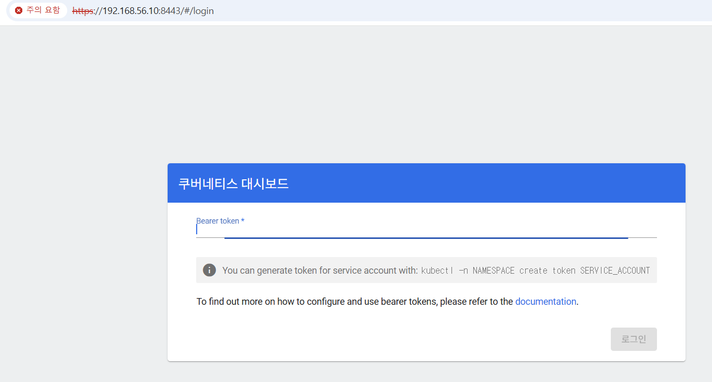
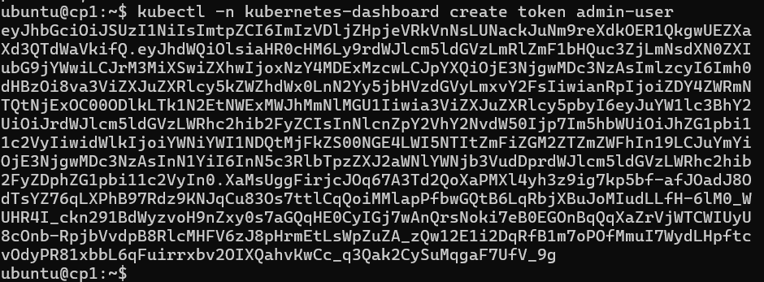

# Ingress + Metrics Server + Kubernetes Dashboard (요약)

> 목표: K3s 환경에서 Ingress, Metrics Server, Dashboard까지 빠르게 구성하고 접속합니다.

---

## 1) 현재 상태 확인 (cp1)

```sh
kubectl get nodes -o wide
kubectl -n kube-system get deploy,svc | egrep "traefik|metrics" || true
kubectl -n kube-system get svc traefik -o wide
```

---

## 2) Ingress 실습 (whoami)

### 2-1) 테스트 앱 배포

```sh
kubectl create deploy whoami --image=traefik/whoami
kubectl expose deploy whoami --port 80
kubectl get pod -o wide
```

### 2-2) Ingress 생성

`ing-whoami.yaml`:

```yaml
apiVersion: networking.k8s.io/v1
kind: Ingress
metadata:
  name: whoami-ing
spec:
  rules:
  - host: whoami.local
    http:
      paths:
      - path: /
        pathType: Prefix
        backend:
          service:
            name: whoami
            port:
              number: 80
```

적용:

```sh
kubectl apply -f ing-whoami.yaml
kubectl get ingress
```

### 2-3) Windows hosts 설정

`C:\Windows\System32\drivers\etc\hosts`에 추가:

```text
192.168.56.10  whoami.local
```

브라우저: <http://whoami.local/>

---

## 3) Metrics Server 확인

```sh
kubectl top nodes
kubectl top pods -A | head
```

`metrics not available`라면:

```sh
kubectl -n kube-system get deploy metrics-server
kubectl -n kube-system logs deploy/metrics-server --tail=50
```

(최후수단) upstream 설치:

```sh
kubectl apply -f https://github.com/kubernetes-sigs/metrics-server/releases/latest/download/components.yaml
```

---

## 4) Kubernetes Dashboard 설치 (Helm)

```
https://github.com/kubernetes-retired/dashboard
```


```sh
curl -fsSL https://raw.githubusercontent.com/helm/helm/main/scripts/get-helm-3 | bash
helm repo add kubernetes-dashboard https://kubernetes.github.io/dashboard/
helm repo update

helm upgrade --install kubernetes-dashboard kubernetes-dashboard/kubernetes-dashboard \
  --create-namespace --namespace kubernetes-dashboard
```

---
### repo 주소 변경으로 다른 대시보드 다운 로드 가능
```
kubectl get pods -n kube-system -l app.kubernetes.io/name=headlamp
kubectl get svc -n kube-system headlamp -o wide
kubectl get endpoints -n kube-system headlamp -o wide
curl -I http://127.0.0.1:8080
```
---
### 원본 대시보드 주소
```
https://github.com/kubernetes-retired/dashboard
```

```
git clone https://github.com/kubernetes-retired/dashboard.git
cd dashboard

helm upgrade --install kubernetes-dashboard ./charts/kubernetes-dashboard \
  --create-namespace \
  --namespace kubernetes-dashboard
```


```
kubectl create token headlamp --namespace kube-system
```


### 4-1) Helm이 localhost:8080으로 실패할 때

```text
Get "http://localhost:8080/version": connect: connection refused
```

kubeconfig를 지정합니다:

```sh
export KUBECONFIG=/etc/rancher/k3s/k3s.yaml
```

---

## 5) Dashboard 접속 (port-forward)

cp1에서 실행:

```sh
kubectl -n kubernetes-dashboard port-forward \
  svc/kubernetes-dashboard-kong-proxy 8443:443 \
  --address 0.0.0.0
```
---
### 백그라운드에서 실행
```
nohup kubectl -n kubernetes-dashboard port-forward \
  svc/kubernetes-dashboard-kong-proxy 8443:443 \
  --address 0.0.0.0 \
  > ~/k8s-dashboard-portforward.log 2>&1 &
```

Windows 브라우저: <https://192.168.56.10:8443>



---

## 6) 로그인 토큰 생성

```sh
kubectl -n kubernetes-dashboard create token admin-user
```

> `admin-user`가 없다면 별도 ServiceAccount/ClusterRoleBinding을 생성해야 합니다.



## 7) 접속 후 화면 예시


## 부연설명
### https://chatgpt.com/share/69719b43-f6c8-8007-a762-70ae06b7a4c1