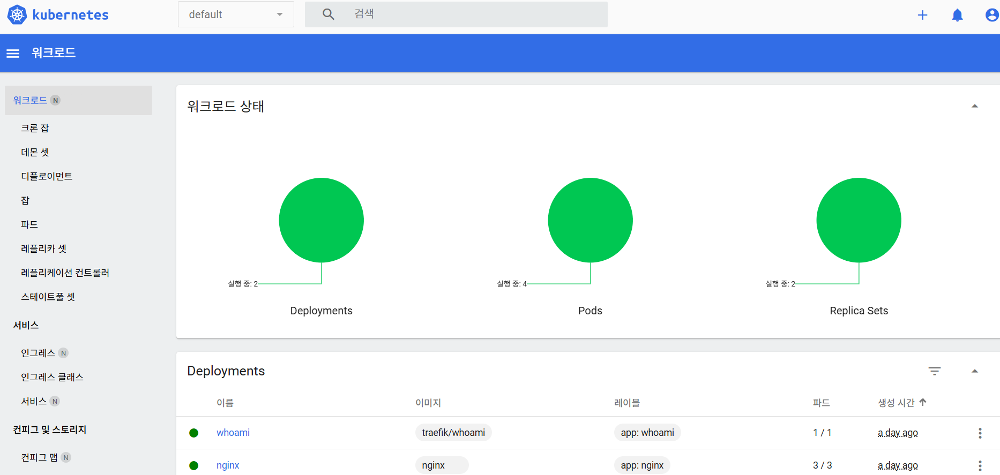
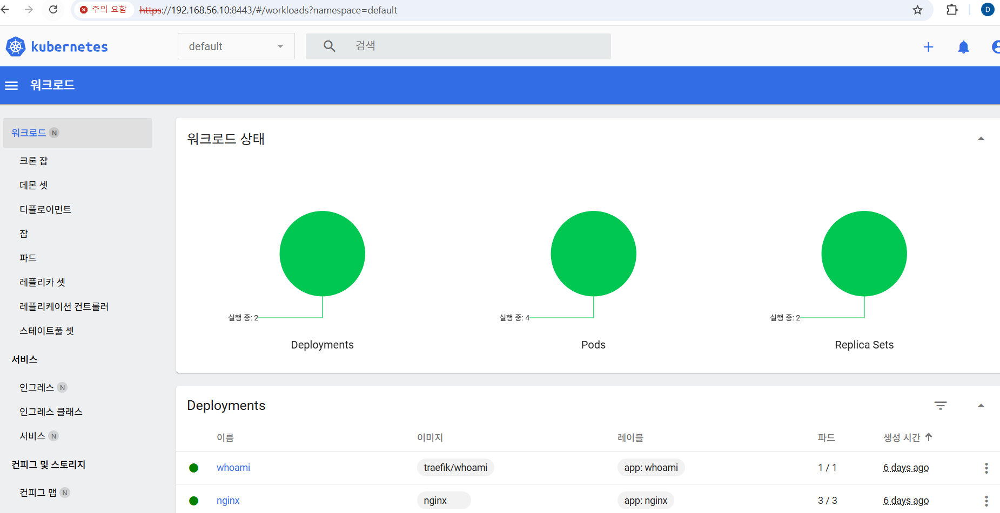
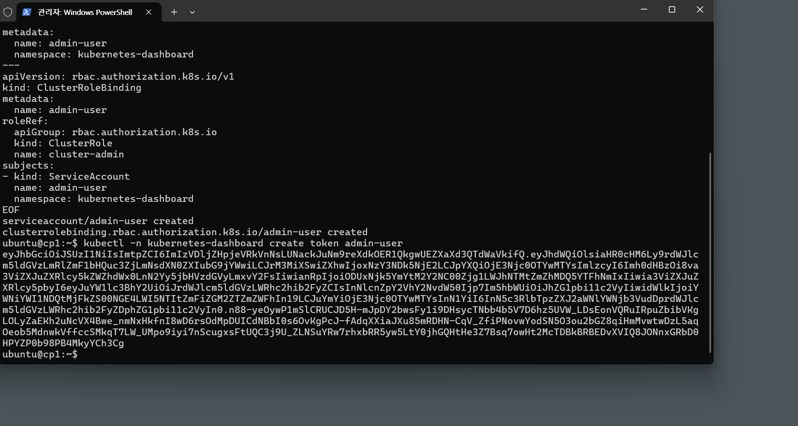
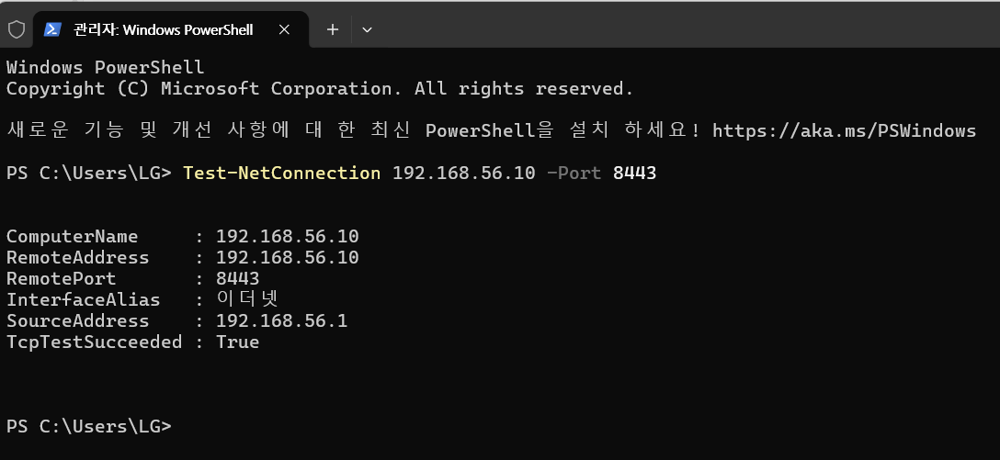
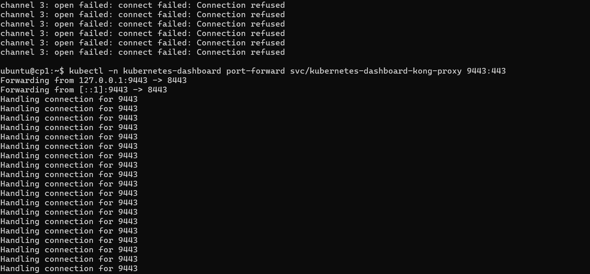
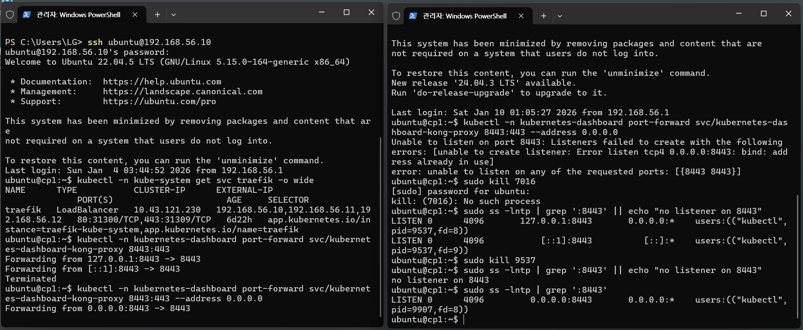

# Lecture 12 - Dashboard와 Observability

> 이 README는 lecture12 폴더의 개별 MD를 통합한 강의 노트입니다.

## 강의 목표
- Ingress/Metrics Server/Dashboard 구성
- 재접속/포트포워딩 복구 절차 숙련

## 포함 문서
- 4. dashboard.md
- 4.1 4번의 결과에 대한 분석.md
- 5. re-connect.md

## 권장 순서
1. dashboard 구성 문서 확인
2. 분석 문서로 코어/애드온 역할 정리
3. 재접속 가이드로 운영 절차 마무리

## 통합 문서 목록
- `4. dashboard.md`
- `4.1 4번의 결과에 대한 분석.md`
- `5. re-connect.md`

---

# Ingress + Metrics Server + Kubernetes Dashboard (요약)

> 통합본: `4. dashboard.md` + `4. k3s_ingress_metrics_dashboard_guide.md`

## 기존 문서 1

> 목표: K3s 환경에서 Ingress, Metrics Server, Dashboard까지 빠르게 구성하고 접속합니다.

---

## 1) 현재 상태 확인 (cp1)

```sh
kubectl get nodes -o wide
kubectl -n kube-system get deploy,svc | egrep "traefik|metrics" || true
kubectl -n kube-system get svc traefik -o wide
```

---

## 2) Ingress 실습 (whoami)

### 2-1) 테스트 앱 배포

```sh
kubectl create deploy whoami --image=traefik/whoami
kubectl expose deploy whoami --port 80
kubectl get pod -o wide
```

### 2-2) Ingress 생성

`ing-whoami.yaml`:

```yaml
apiVersion: networking.k8s.io/v1
kind: Ingress
metadata:
  name: whoami-ing
spec:
  rules:
  - host: whoami.local
    http:
      paths:
      - path: /
        pathType: Prefix
        backend:
          service:
            name: whoami
            port:
              number: 80
```

적용:

```sh
kubectl apply -f ing-whoami.yaml
kubectl get ingress
```

### 2-3) Windows hosts 설정

`C:\Windows\System32\drivers\etc\hosts`에 추가:

```text
192.168.56.10  whoami.local
```

브라우저: <http://whoami.local/>

---

## 3) Metrics Server 확인

```sh
kubectl top nodes
kubectl top pods -A | head
```

`metrics not available`라면:

```sh
kubectl -n kube-system get deploy metrics-server
kubectl -n kube-system logs deploy/metrics-server --tail=50
```

(최후수단) upstream 설치:

```sh
kubectl apply -f https://github.com/kubernetes-sigs/metrics-server/releases/latest/download/components.yaml
```

---

## 4) Kubernetes Dashboard 설치 (Helm)

```
https://github.com/kubernetes-retired/dashboard
```


```sh
curl -fsSL https://raw.githubusercontent.com/helm/helm/main/scripts/get-helm-3 | bash
helm repo add kubernetes-dashboard https://kubernetes.github.io/dashboard/
helm repo update

helm upgrade --install kubernetes-dashboard kubernetes-dashboard/kubernetes-dashboard \
  --create-namespace --namespace kubernetes-dashboard
```

---
### repo 주소 변경으로 다른 대시보드 다운 로드 가능
```
kubectl get pods -n kube-system -l app.kubernetes.io/name=headlamp
kubectl get svc -n kube-system headlamp -o wide
kubectl get endpoints -n kube-system headlamp -o wide
curl -I http://127.0.0.1:8080
```
---
### 원본 대시보드 주소
```
https://github.com/kubernetes-retired/dashboard
```

```
git clone https://github.com/kubernetes-retired/dashboard.git
cd dashboard

helm upgrade --install kubernetes-dashboard ./charts/kubernetes-dashboard \
  --create-namespace \
  --namespace kubernetes-dashboard
```


```
kubectl create token headlamp --namespace kube-system
```


### 4-1) Helm이 localhost:8080으로 실패할 때

```text
Get "http://localhost:8080/version": connect: connection refused
```

kubeconfig를 지정합니다:

```sh
export KUBECONFIG=/etc/rancher/k3s/k3s.yaml
```

---

## 5) Dashboard 접속 (port-forward)

cp1에서 실행:

```sh
kubectl -n kubernetes-dashboard port-forward \
  svc/kubernetes-dashboard-kong-proxy 8443:443 \
  --address 0.0.0.0
```
---
### 백그라운드에서 실행
```
nohup kubectl -n kubernetes-dashboard port-forward \
  svc/kubernetes-dashboard-kong-proxy 8443:443 \
  --address 0.0.0.0 \
  > ~/k8s-dashboard-portforward.log 2>&1 &
```

Windows 브라우저: <https://192.168.56.10:8443>


---

## 6) 로그인 토큰 생성

```sh
kubectl -n kubernetes-dashboard create token admin-user
```

> `admin-user`가 없다면 별도 ServiceAccount/ClusterRoleBinding을 생성해야 합니다.


## 7) 접속 후 화면 예시




## 부연설명
### https://chatgpt.com/share/69719b43-f6c8-8007-a762-70ae06b7a4c1
---

## 기존 문서 2

> 목표: K3s 멀티노드(또는 단일노드) 환경에서
> 1) **Ingress(라우팅)**, 2) **Metrics Server(top)**, 3) **Kubernetes Dashboard(웹 UI)**를 구성하고 접속합니다.

- 날짜: 2026-01-10
- 환경 전제: K3s, 기본 Traefik(대개 내장/Helm) 사용

---

## 0) 현재 상태 확인 (cp1)

```sh
kubectl get nodes -o wide
kubectl -n kube-system get deploy,svc | egrep "traefik|metrics" || true
kubectl -n kube-system get svc traefik -o wide
```

Traefik 서비스의 노출 방식(포트/EXTERNAL-IP)을 먼저 확인합니다.

---

## 1) Ingress 실습 (Traefik 기본 사용)

### 1-1) 테스트 앱(whoami) 배포

```sh
kubectl create deploy whoami --image=traefik/whoami
kubectl expose deploy whoami --port 80
kubectl get pod -o wide
kubectl get svc whoami
```

### 1-2) Ingress 생성 (host 기반 라우팅)

`ing-whoami.yaml`:
```yaml
apiVersion: networking.k8s.io/v1
kind: Ingress
metadata:
  name: whoami-ing
spec:
  rules:
  - host: whoami.local
    http:
      paths:
      - path: /
        pathType: Prefix
        backend:
          service:
            name: whoami
            port:
              number: 80
```

적용:
```sh
kubectl apply -f ing-whoami.yaml
kubectl get ingress
```

### 1-3) Windows hosts 파일에 도메인 매핑

Windows(관리자 권한)에서 파일 편집:
- `C:\Windows\System32\drivers\etc\hosts`

맨 아래 추가:
```text
192.168.56.10  whoami.local
```

브라우저:
- `http://whoami.local/`

> 안 열리면 우선 Traefik 서비스가 80으로 노출되는지, 포트 충돌(호스트 80 사용 중) 여부를 확인하세요.

---

## 2) Metrics Server 확인 & 사용

### 2-1) top 명령 (metrics-server 필요)

```sh
kubectl top nodes
kubectl top pods -A | head
```

### 2-2) metrics not available 대응

metrics-server 배포/로그 확인:
```sh
kubectl -n kube-system get deploy metrics-server
kubectl -n kube-system logs deploy/metrics-server --tail=50
```

(최후수단) upstream metrics-server 설치:
```sh
kubectl apply -f https://github.com/kubernetes-sigs/metrics-server/releases/latest/download/components.yaml
```

> K3s 패키지 매니페스트는 재기동 시 덮어씌워질 수 있으니, “패키지 disable + 별도 설치” 전략이 필요할 수 있습니다.

---

## 3) Kubernetes Dashboard 설치 (Helm 표준)

### 3-1) Helm 설치 (cp1)

```sh
curl -fsSL https://raw.githubusercontent.com/helm/helm/main/scripts/get-helm-3 | bash
helm version
```

### 3-2) Dashboard 설치

```sh
helm repo add kubernetes-dashboard https://kubernetes.github.io/dashboard/
helm repo update

helm upgrade --install kubernetes-dashboard kubernetes-dashboard/kubernetes-dashboard   --create-namespace --namespace kubernetes-dashboard
```

---

## 4) Helm이 “localhost:8080 접속” 하며 실패할 때(중요)

에러 형태:
```text
Get "http://localhost:8080/version": connect: connection refused
```

의미: Helm이 **kubeconfig를 못 찾아** 기본값 localhost:8080으로 접속한 것.

해결(즉시 적용):
```sh
export KUBECONFIG=/etc/rancher/k3s/k3s.yaml
helm ls -A
```

영구 적용(추천):
```sh
echo 'export KUBECONFIG=/etc/rancher/k3s/k3s.yaml' >> ~/.bashrc
source ~/.bashrc
```

권한 문제 시(읽기 권한이 없을 때) 홈으로 복사:
```sh
mkdir -p ~/.kube
sudo cp /etc/rancher/k3s/k3s.yaml ~/.kube/config
sudo chown $USER:$USER ~/.kube/config
chmod 600 ~/.kube/config
unset KUBECONFIG
kubectl get nodes
```

---

## 5) Dashboard 접속(Port-forward)

### 옵션 A) cp1에서 외부 접근 가능하게 직접 바인딩(학습용)

```sh
kubectl -n kubernetes-dashboard port-forward   svc/kubernetes-dashboard-kong-proxy 8443:443   --address 0.0.0.0
```

Windows 브라우저:
- `https://192.168.56.10:8443`

> 브라우저 인증서 경고는 “고급 → 계속”으로 진행(자체 서명 인증서).



### 옵션 B) SSH 터널(추천: 외부로 0.0.0.0 열지 않음)

Windows PowerShell:
```powershell
ssh -L 8443:localhost:8443 ubuntu@192.168.56.10
```

cp1(SSH 접속 세션)에서:
```sh
kubectl -n kubernetes-dashboard port-forward svc/kubernetes-dashboard-kong-proxy 8443:443
```

Windows 브라우저:
- `https://localhost:8443`

---

## 6) “address already in use” 포트 충돌 해결

에러:
```text
bind: address already in use
```

의미: 이미 다른 프로세스가 8443을 점유 중(SSH -L, 기존 port-forward 등)

해결 2가지:

### 6-1) 포트 바꾸기(가장 빠름)

cp1:
```sh
kubectl -n kubernetes-dashboard port-forward svc/kubernetes-dashboard-kong-proxy 9443:443
```

(SSH 터널도 포트를 맞춰야 함)
```powershell
ssh -L 9443:localhost:9443 ubuntu@192.168.56.10
```

브라우저:
- `https://localhost:9443` 또는 `https://192.168.56.10:9443`

### 6-2) 누가 점유 중인지 확인 후 종료

cp1:
```sh
sudo ss -lntp | grep ':8443' || echo "no listener on 8443"
```

PID 확인 후:
```sh
sudo kill <PID>
# 안 죽으면
sudo kill -9 <PID>
```

---

## 7) 로그인 토큰 생성 (학습용 관리자)

> ⚠️ 아래는 학습 편의용으로 **관리자 권한**을 줍니다. 운영 환경에서는 최소 권한으로 구성하세요.

`dash-admin.yaml`:
```yaml
apiVersion: v1
kind: ServiceAccount
metadata:
  name: admin-user
  namespace: kubernetes-dashboard
---
apiVersion: rbac.authorization.k8s.io/v1
kind: ClusterRoleBinding
metadata:
  name: admin-user
roleRef:
  apiGroup: rbac.authorization.k8s.io
  kind: ClusterRole
  name: cluster-admin
subjects:
- kind: ServiceAccount
  name: admin-user
  namespace: kubernetes-dashboard
```

적용 + 토큰:
```sh
kubectl apply -f dash-admin.yaml
kubectl -n kubernetes-dashboard create token admin-user
```



---

## 8) 상태 확인

```sh
kubectl -n kubernetes-dashboard get pods,svc
```
정상이라면 Pod들이 `Running`이고, 서비스에 `kubernetes-dashboard-kong-proxy`가 보입니다.
---
## 참고(원본 단서)
원문에는 Helm 설치/에러 원인(쿠버 설정 없음), Dashboard 설치 성공 로그, 그리고 port-forward 충돌(ssh가 127.0.0.1:8443 점유) 사례가 포함되어 있습니다.


---
## 현재 까지의 리소스에 대한 부연 설명
4.1 4번의 결과에 대한 분석.md

## Control Plane 에서 실행 명령 목록
```
   55  sudo apt update && sudo apt install -y curl
   56  curl -sfL https://get.k3s.io |   K3S_KUBECONFIG_MODE="644" sh -s -   --node-ip 192.168.56.10   --flannel-iface enp0s8
   57  sudo systemctl status k3s --no-pager -l
   58  kubectl
   59  kubectl get nodes -o wide
   60  sudo cat /var/lib/rancher/k3s/server/node-token
   61  kubectl get nodes -o wide
   62  kubectl get pods -A
   63  kubectl
   64  kubectl get pods -A
   65  kubectl get nodes -o wide
   66  kubectl -n kube-system get deploy,svc | egrep "traefik|metrics" || true
   67  kubectl -n kube-system get svc traefik -o wide
   68  kubectl create deploy whoami --image=traefik/whoami
   69  kubectl expose deploy whoami --port 80
   70  kubectl get pod -o wide
   71  ls -al
   72  pwd
   73  cd ~
   74  ls -al
   75  sudo vi ./ing-whoami.yaml
   76  ls -al
   77  sudo vi ./ing-whoami.yaml
   78  kubectl apply -f ing-whoami.yaml
   79  kubectl get ingress
   80  kubectl top nodes
   81  kubectl top pods -A | head
   82  kubectl -n kube-system get deploy metrics-server
   83  kubectl -n kube-system logs deploy/metrics-server --tail=50
   84  curl -fsSL https://raw.githubusercontent.com/helm/helm/main/scripts/get-helm-3 | bash
   85  helm repo add kubernetes-dashboard https://kubernetes.github.io/dashboard/
   86  helm repo update
   87  helm upgrade --install kubernetes-dashboard kubernetes-dashboard/kubernetes-dashboard   --create-namespace --namespace kubernetes-dashboard
   88  helm repo update
   89  curl -fsSL https://raw.githubusercontent.com/helm/helm/main/scripts/get-helm-3 | bash
   90  helm repo add kubernetes-dashboard https://kubernetes.github.io/dashboard/
   91  helm upgrade --install kubernetes-dashboard kubernetes-dashboard/kubernetes-dashboard   --create-namespace --namespace kubernetes-dashboard
   92  echo "KUBECONFIG=$KUBECONFIG"
   93  ls -al ~/.kube/config
   94  kubectl config current-context
   95  kubectl config view --minify
   96  sudo ls -al /etc/kubernetes/admin.conf
   97  sudo ls -al /etc/rancher/k3s/k3s.yaml
   98  # 1) ubuntu 유저 홈에 kubeconfig 설치
   99  mkdir -p ~/.kube
  100  sudo cp -i /etc/rancher/k3s/k3s.yaml ~/.kube/config
  101  mkdir -p ~/.kube
  103  sudo cp -i /etc/rancher/k3s/k3s.yaml ~/.kube/config
  104  sudo chown $(id -u):$(id -g) ~/.kube/config
  105  chmod 600 ~/.kube/config
  106  kubectl cluster-info
  107  kubectl get nodes
  108  kubectl get --raw /version
  109  helm repo add kubernetes-dashboard https://kubernetes.github.io/dashboard/
  110  helm repo update
  111  helm upgrade --install kubernetes-dashboard kubernetes-dashboard/kubernetes-dashboard   --create-namespace --namespace kubernetes-dashboard
  112  kubectl -n kubernetes-dashboard port-forward   svc/kubernetes-dashboard-kong-proxy 8443:443   --address 0.0.0.0
  ```


---

# 쿠버네티스 코어 기능 vs 서드파티(애드온/에코시스템)

## 1) 쿠버네티스 원 기능(코어 기능)

### A. 클러스터 기본 동작 (오케스트레이션)
- **스케줄링**: Pod를 어떤 Node에 배치할지 결정 (scheduler)
- **상태 유지/자가 치유**: 장애 시 재시작/재스케줄 (kubelet + controller)
- **스케일링**: Deployment/ReplicaSet 기반 수평 확장
- **롤링 업데이트/롤백**: Deployment 기본 동작

### B. 워크로드/리소스 모델
- Pod, Deployment, ReplicaSet, StatefulSet, DaemonSet, Job/CronJob
- ConfigMap, Secret
- Namespace, Label/Selector, Annotation

### C. 서비스 디스커버리 & L4 로드밸런싱
- Service (ClusterIP/NodePort/LoadBalancer)
- CoreDNS (서비스 이름 기반 DNS)

### D. 네트워킹 규약
- CNI 플러그인 연동 구조
- NetworkPolicy 오브젝트

### E. 스토리지 규약
- Volume / PV / PVC / StorageClass
- CSI 연동 구조

### F. 접근제어/보안
- RBAC, ServiceAccount
- API 인증/인가, Admission
- Pod Security 표준(버전별)

### G. 운영/확장 메커니즘
- kubectl / API 서버 / etcd / controller-manager
- CRD (커스텀 리소스 정의)
- Operator 패턴 기반

👉 **한 줄 요약**: 쿠버네티스 코어는 *컨트롤 플레인 + 표준 리소스 모델 + 확장 인터페이스(CNI/CSI/CRD)* 제공

---

## 2) 대표적인 서드파티 솔루션

### A. 네트워킹(CNI)
- Calico, Cilium, Flannel, Weave Net

### B. Ingress / Gateway
- NGINX Ingress Controller, HAProxy, Traefik
- Envoy 기반 Gateway API 컨트롤러

### C. 서비스 메시
- Istio, Linkerd, Kuma

### D. 스토리지(CSI)
- Rook-Ceph, Longhorn, OpenEBS
- 클라우드 벤더 CSI (EBS, GCE PD, Azure Disk)

### E. 관측(Observability)
- Prometheus, Grafana
- Loki, ELK, Fluent Bit/Fluentd
- Jaeger, Tempo, OpenTelemetry

### F. 배포/릴리즈/GitOps
- Helm (패키징/템플릿)
- Argo CD, Flux (GitOps)
- Argo Rollouts, Flagger (고급 배포)

### G. 보안/정책
- OPA Gatekeeper, Kyverno
- cert-manager
- Vault, External Secrets Operator
- Falco

### H. 백업/DR
- Velero

### I. 오토스케일링
- KEDA (이벤트 기반)
- Cluster Autoscaler, Karpenter

### J. 운영 플랫폼/관리형 서비스
- Rancher, OpenShift
- EKS/GKE/AKS

👉 **구분 팁**  
- 오브젝트/컨트롤 플레인만으로 동작 → **코어**  
- 컨트롤러/플러그인 추가 설치 필요 → **서드파티**

---

## Helm의 역할

- **패키지 매니저** (apt, yum과 유사)
- **Chart**: 매니페스트(YAML) 묶음
- **템플릿화 & Values 분리**: 환경별 값 관리
- **Release 단위 관리**: install/upgrade/rollback/uninstall/history
- **의존성 관리**: Redis/DB 등 함께 설치 가능
- **표준 배포 방식 제공**: 팀 내 배포 표준화

👉 **한 줄 요약**: Helm = 쿠버네티스 앱을 *패키지처럼 설치/업그레이드/롤백*하는 도구

---

## Kubernetes Dashboard Service 리소스 설명

### 공통: TYPE=ClusterIP
- 클러스터 내부 IP(10.43.x.x) 부여
- Pod들이 DNS/ClusterIP로 접근 가능
- 외부 직접 접근 불가 → port-forward/Ingress 필요

### 1. `kubernetes-dashboard-web` (8000/TCP)
- 대시보드 UI 프론트엔드
- 사용자 브라우저에 HTML/JS/CSS 제공
- 👉 “사용자 화면 담당”

### 2. `kubernetes-dashboard-api` (8000/TCP)
- 대시보드 백엔드 API 서버
- 리소스 조회, Pod 로그, YAML 보기 처리
- 👉 “대시보드 핵심 백엔드”

### 3. `kubernetes-dashboard-auth` (8000/TCP)
- 인증/세션/로그인 처리
- 토큰/OIDC 인증 흐름 담당
- 👉 “로그인/인증 전담”

### 4. `kubernetes-dashboard-metrics-scraper` (8000/TCP)
- 대시보드 메트릭 수집기
- metrics-server로부터 CPU/Mem 등 가져와 UI 표시
- 👉 “메트릭 중계/수집”

### 5. `kubernetes-dashboard-kong-proxy` (443/TCP)
- Kong 기반 Reverse Proxy/API Gateway
- 단일 진입점으로 API/Web/Auth/Metrics 라우팅
- 외부 노출 시 NodePort/LoadBalancer/Ingress 활용
- 👉 “대시보드 관문”

---

## 확인 명령어

```sh
# 서비스 상세 확인
kubectl -n kubernetes-dashboard describe svc kubernetes-dashboard-web
kubectl -n kubernetes-dashboard describe svc kubernetes-dashboard-api
kubectl -n kubernetes-dashboard describe svc kubernetes-dashboard-auth
kubectl -n kubernetes-dashboard describe svc kubernetes-dashboard-metrics-scraper
kubectl -n kubernetes-dashboard describe svc kubernetes-dashboard-kong-proxy

# 엔드포인트 확인
kubectl -n kubernetes-dashboard get endpoints

# 외부 접근 (port-forward)
kubectl -n kubernetes-dashboard port-forward svc/kubernetes-dashboard-kong-proxy 8443:443

---

# 재부팅 후 Dashboard 재접속 (빠른 체크리스트)

> 통합본: `5. re-connect.md` + `5. dashboard_reconnect_portforward_guide.md`

## 기존 문서 1

> 목표: `https://192.168.56.10:8443` 접속이 안 될 때
> **리스닝 여부**와 **바인딩 주소**를 빠르게 확인하고 복구합니다.

---

## 1) cp1에서 8443 리스닝 확인

```sh
sudo ss -lntp | grep ':8443' || echo "no listener on 8443"
```

- `no listener` → port-forward 재실행 필요
- `127.0.0.1:8443` → 루프백 바인딩(외부에서 접속 불가)

---

## 2) 외부 접속 가능하도록 port-forward 재실행

기존 포워딩이 남아 있으면 종료:

```sh
sudo ss -lntp | grep ':8443'
sudo kill <PID>
```

외부 바인딩으로 다시 실행:

```sh
kubectl -n kubernetes-dashboard port-forward \
  svc/kubernetes-dashboard-kong-proxy 8443:443 \
  --address 0.0.0.0
```

---

## 3) Windows에서 포트 확인

```powershell
Test-NetConnection 192.168.56.10 -Port 8443
```

`TcpTestSucceeded : True`이면 네트워크는 정상입니다.



---

## 4) 브라우저 인증서 경고

자체 서명 인증서이므로 경고가 뜰 수 있습니다.
- **고급(Advanced) → 계속(Proceed)**

---

## 5) 토큰 재발급 (필요 시)

```sh
kubectl -n kubernetes-dashboard create token admin-user
```

---

## 기존 문서 2

> 목표: `https://192.168.56.10:8443/` 로 Dashboard가 안 열릴 때,
> **원인을 2가지로 딱 분리**하고(리슨 없음 vs 루프백 바인딩), **확실히 복구**합니다.

- 날짜: 2026-01-10

---

## 0) “안 보이는” 대표 원인 2가지

1) cp1에서 `kubectl port-forward`가 **실행 중이 아님**
2) 8443이 **127.0.0.1(루프백)에만 바인딩**되어 외부(Windows)에서 접근 불가

특히 SSH 터널(`ssh -L 8443:localhost:8443 ...`)은 cp1 기준으로 **127.0.0.1:8443**만 잡는 경우가 많아,
그 상태에서 `https://192.168.56.10:8443`로는 절대 접속이 안 됩니다.



---

## 1) cp1에서 “현재 8443 누가 잡고 있나” 확인

cp1에서:
```sh
sudo ss -lntp | grep ':8443' || echo "no listener on 8443"
```

### 케이스 A) 아무도 안 잡고 있음
```text
no listener on 8443
```
→ `kubectl port-forward`를 다시 띄워야 합니다 (섹션 2)

### 케이스 B) ssh가 잡고 있음
```text
LISTEN ... 127.0.0.1:8443 ... users:(("ssh",pid=...,fd=...))
```
→ SSH 터널이 로컬 포트를 점유 중 (섹션 3)

### 케이스 C) kubectl이 잡고 있지만 루프백만
```text
LISTEN ... 127.0.0.1:8443 ... users:(("kubectl",pid=...,fd=...))
```
→ `--address 0.0.0.0` 없이 실행된 상태 (섹션 2-2)

---

## 2) 외부(Windows)에서 보이게 port-forward 띄우기

### 2-1) 기존 port-forward가 남아 있으면 종료

위 `ss` 출력에서 `kubectl` PID를 확인했다면 종료:
```sh
sudo kill <PID>
```

(정리 확인)
```sh
sudo ss -lntp | grep ':8443' || echo "no listener on 8443"
```

### 2-2) 외부 바인딩으로 다시 실행 (중요)

```sh
kubectl -n kubernetes-dashboard port-forward   svc/kubernetes-dashboard-kong-proxy 8443:443   --address 0.0.0.0
```

이 터미널은 **켜 둔 채로 유지**해야 합니다(끊으면 포워딩도 종료).

정상 리슨 확인:
```sh
sudo ss -lntp | grep ':8443'
```

정상 형태:
- `0.0.0.0:8443` 또는 `192.168.56.10:8443` 에서 `kubectl`이 LISTEN



---

## 3) SSH 터널(-L)이 8443을 점유 중이면

cp1에서 `ssh(pid=...)`가 8443을 잡고 있으면, 그 상태에서 `kubectl port-forward 8443:443`는 실패합니다.

해결은 2가지:

### 3-1) (추천) 포트 번호 변경

- SSH 터널과 port-forward 모두 9443 같은 다른 포트로 이동

Windows PowerShell:
```powershell
ssh -L 9443:localhost:9443 ubuntu@192.168.56.10
```

cp1(SSH 세션)에서:
```sh
kubectl -n kubernetes-dashboard port-forward svc/kubernetes-dashboard-kong-proxy 9443:443
```

Windows 브라우저:
- `https://localhost:9443`

### 3-2) 점유 중인 ssh 프로세스 종료

cp1에서 PID가 확인된다면:
```sh
sudo kill <SSH_PID>
```

다시 확인:
```sh
sudo ss -lntp | grep ':8443' || echo "no listener on 8443"
```

> 단, 이 방식은 “현재 접속 세션/터널”을 끊을 수 있으니 보통 3-1이 편합니다.

---

## 4) Windows에서 브라우저 전에 포트 체크

PowerShell:
```powershell
Test-NetConnection 192.168.56.10 -Port 8443
```

- `TcpTestSucceeded : True` → 네트워크 OK, 이제 브라우저/인증서 경고 문제일 확률 높음
- `False` → cp1 리스닝/바인딩/방화벽 문제

---

## 5) 브라우저 인증서 경고는 정상

`https://192.168.56.10:8443` 접속 시 “안전하지 않음/개인정보 보호 오류”가 뜰 수 있습니다(자체 서명).
- **고급(Advanced) → 계속(Proceed)** 으로 들어가야 합니다.

---

## 6) UFW가 켜져 있으면 포트 허용(선택)

cp1에서:
```sh
sudo ufw status
```

`Status: active`면:
```sh
sudo ufw allow 8443/tcp
```

---

## 7) 토큰 다시 만들기

```sh
kubectl -n kubernetes-dashboard create token admin-user
```

---

## 8) 상태 확인

```sh
kubectl -n kubernetes-dashboard get pods,svc
```

---

## 참고(원본 단서)

원문에는 아래 사례가 포함되어 있습니다:
- `ssh`가 `127.0.0.1:8443` 점유 → `kubectl port-forward` 실패
- `kubectl`이 `127.0.0.1`로만 LISTEN → 외부 접속 불가 → `--address 0.0.0.0`로 해결
