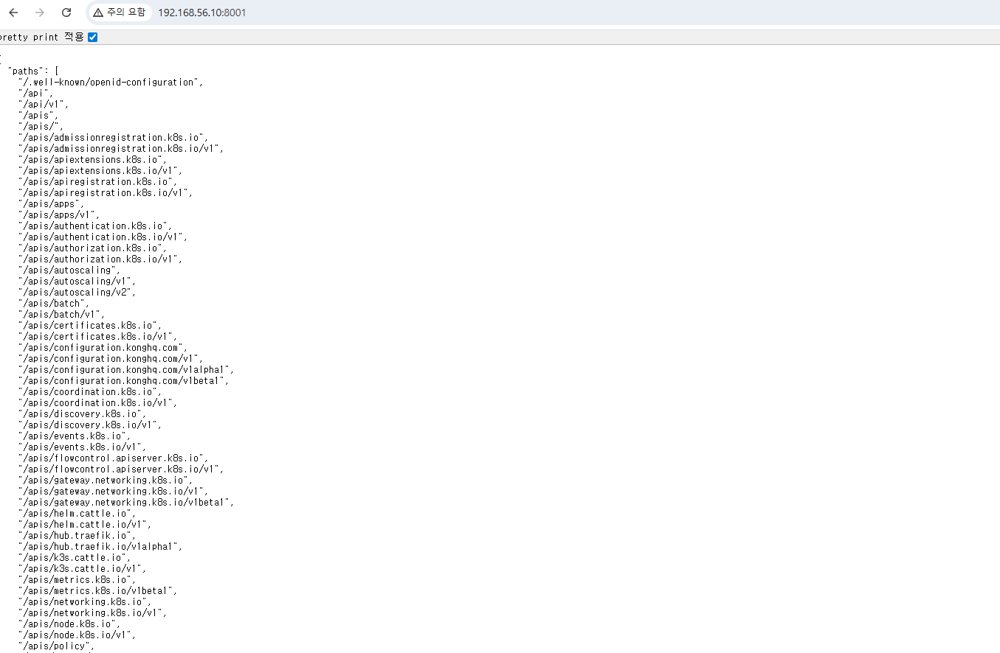
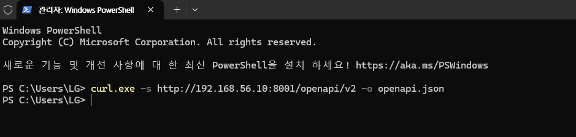
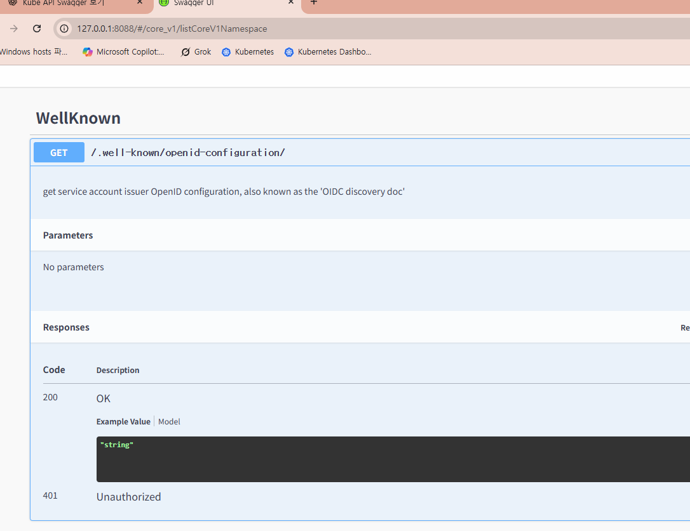
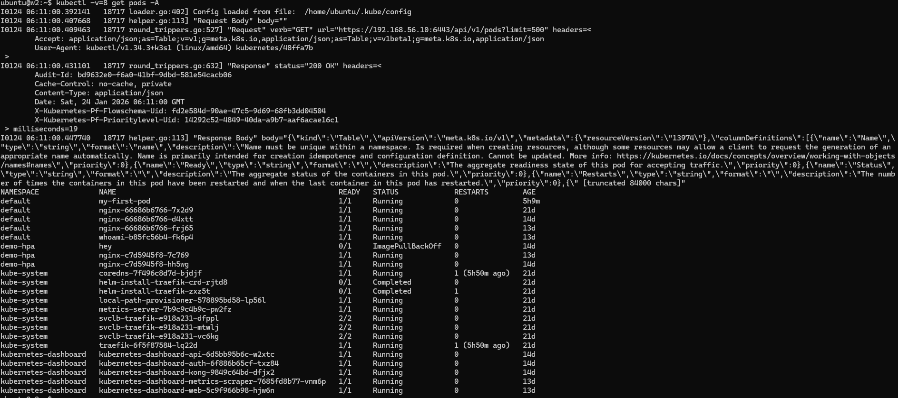
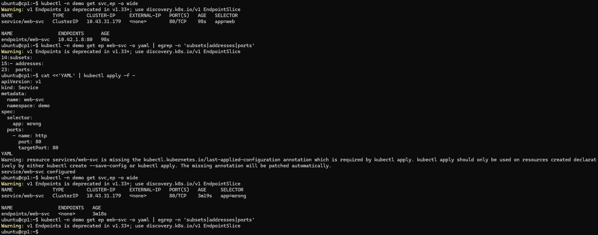
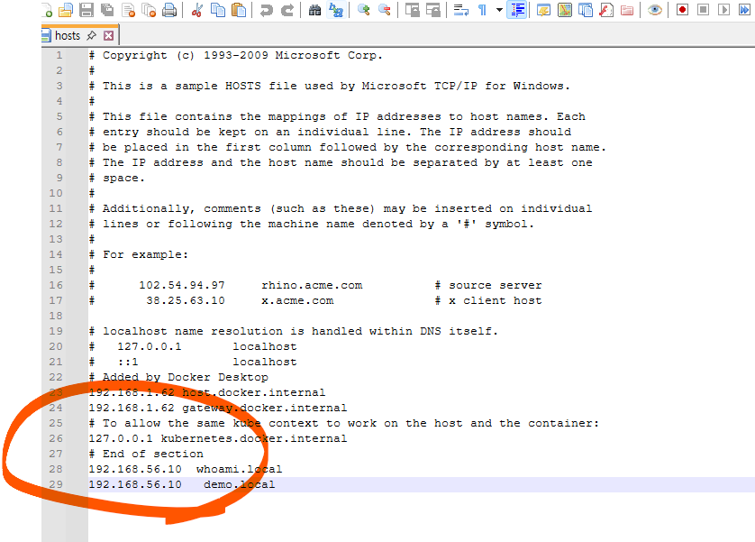

# Lecture 14 - Network, Ingress, Troubleshooting

> 이 README는 lecture14 폴더의 개별 MD를 통합한 강의 노트입니다.

## 강의 목표
- 노드/서비스 네트워크 구조 이해
- Ingress 라우팅 디버깅과 장애 분석 숙련

## 포함 문서
- 6.2 cp-node 간 설정문제 kubectl API 에 대해 좀더 확인.md
- 6.4 k3s_node_internal_clusterip_summary.md
- 7.1.1 k3s-traefik-ingress-routing-debug.md
- 7.1 k3s-edu-labs-troubleshooting.md

## 권장 순서
1. 네트워크 기초(6.4) 학습
2. 노드/설정 이슈 사례(6.2) 확인
3. Ingress 디버깅(7.1.1) 및 종합 트러블슈팅(7.1) 적용

## 통합 문서 목록
- `6.2 cp-node 간 설정문제 kubectl API 에 대해 좀더 확인.md`
- `6.4 k3s_node_internal_clusterip_summary.md`
- `7.1 k3s-edu-labs-troubleshooting.md`
- `7.1.1 k3s-traefik-ingress-routing-debug.md`

---

# K3s 노드(w3) NotReady + INTERNAL-IP 오인(중복/아이덴티티 꼬임) 정리

## 1) 관찰된 증상

### (1) cp1에서 본 노드 상태
- `cp1`만 **Ready**
- `w1 / w2 / w3`는 **NotReady**

```
ubuntu@cp1:~$ kubectl get nodes -o wide 
NAME STATUS ROLES AGE VERSION INTERNAL-IP EXTERNAL-IP OS-IMAGE KERNEL-VERSION CONTAINER-RUNTIME 
cp1 Ready control-plane 4d4h v1.34.3+k3s1 192.168.56.10 <none> Ubuntu 22.04.5 LTS 5.15.0-164-generic containerd://2.1.5-k3s1 
w1 NotReady <none> 4d4h v1.34.3+k3s1 192.168.56.11 <none> Ubuntu 22.04.5 LTS 5.15.0-164-generic containerd://2.1.5-k3s1 
w2 NotReady <none> 4d4h v1.34.3+k3s1 192.168.56.12 <none> Ubuntu 22.04.5 LTS 5.15.0-164-generic containerd://2.1.5-k3s1 
w3 NotReady <none> 33m v1.34.3+k3s1 192.168.56.11 <none> Ubuntu 22.04.5 LTS 5.15.0-164-generic containerd://2.1.5-k3s1
```

- 위에서 w1 NotReady <none> 4d4h v1.34.3+k3s1 192.168.56.11 ... 과 w3 NotReady <none> 33m v1.34.3+k3s1 192.168.56.11 동일 
- `kubectl get nodes -o wide`에서 **w3의 INTERNAL-IP가 `192.168.56.11`로 표시**됨  
  → 이 값은 `w1`의 IP와 동일하게 보임 (충돌/오인 가능)

### (2) w3에서 본 실제 네트워크 상태
- `ip -br a` 결과: `enp0s8`가 **`192.168.56.13/24`로 정상**
- `/etc/netplan/*.yaml`도 `192.168.56.13/24`로 설정되어 있음

✅ 결론적으로, **w3 자체 IP는 정상인데 클러스터가 w3를 `192.168.56.11`(w1)로 “착각”**하는 상태로 보임.

---

## 2) 가장 유력한 원인(거의 확정)

### “노드 아이덴티티(식별 정보) 복제/재사용” 또는 “노드 등록 정보 꼬임”
VM을 클론했거나 네트워크/디스크를 복제한 환경에서 아래가 **w1과 동일하게 복제**되면 자주 발생합니다.

- `/etc/hostname` (hostname)
- `/etc/machine-id` (machine-id)
```
cd /etc
ls -al

-r--r--r--  1 root root      33 Jan  1 06:15 machine-id

ubuntu@cp1:/etc$ cat ./machine-id
912972408d93480fbc4263ea5c041eab
```

- k3s agent가 이전 노드의 인증서/상태를 들고 재조인

이 경우, **서버(cp1)가 w3를 새 노드로 인식하지 못하고 기존 노드(w1)의 정체성을 덮어쓰거나 공유**하게 되어,
`kubectl get nodes`에 **IP가 엉뚱하게 표시 + NotReady**가 지속될 수 있습니다.

---

## 3) 원인 확정용 빠른 체크(10초)

w3에서 아래를 실행해 **w1과 동일한지 비교**합니다.

```bash
hostname
cat /etc/hostname
cat /etc/machine-id
cat /var/lib/dbus/machine-id 2>/dev/null || true
```

- hostname이 `w1`로 나오거나
- machine-id가 w1과 동일하면  
→ **100% 복제/아이덴티티 문제**입니다.

---

## 4) 해결(가장 확실): w3를 “깨끗하게 제거 후 재조인(join)”

> 목표: **w3의 hostname + machine-id + k3s agent 상태를 모두 새로** 만들어  
> cp1이 w3를 진짜 “새 노드”로 정상 등록하게 하기

### Step A) cp1에서 w3 노드 삭제
```bash
kubectl delete node w3
```

> (선택) w3가 삭제가 안 되거나 노드 레코드가 꼬였으면, 상황에 따라 w1도 정리 대상이 될 수 있음.

---

### Step B) w3에서 k3s-agent 완전 제거/초기화
```bash
sudo /usr/local/bin/k3s-agent-uninstall.sh
sudo rm -rf /etc/rancher /var/lib/rancher
```

---

### Step C) w3 hostname을 유니크하게 설정
```bash
sudo hostnamectl set-hostname w3
```

---

### Step D) machine-id 재생성(클론 VM에서 핵심)
```bash
sudo rm -f /etc/machine-id /var/lib/dbus/machine-id
sudo systemd-machine-id-setup
sudo reboot
```

---

### Step E) 재부팅 후 w3 재조인(join)

#### 1) cp1에서 토큰 확인
```bash
sudo cat /var/lib/rancher/k3s/server/node-token
```

#### 2) w3에서 agent 설치/실행
(서버 URL은 cp1: `192.168.56.10:6443` 기준)

```bash
curl -sfL https://get.k3s.io |   K3S_URL=https://192.168.56.10:6443   K3S_TOKEN='<위 토큰>'   sh -

sudo systemctl enable --now k3s-agent
```

---

## 5) 정상 복구 확인

cp1에서:

```bash
kubectl get nodes -o wide
```

정상 기준:
- `w3`가 **Ready**
- `w3`의 INTERNAL-IP가 **`192.168.56.13`으로 정확히 표시**

---

## 6) 추가 점검(노드 NotReady / Pod Pending 원인 확인)

### (1) 워커 노드에서 agent 상태/로그 확인
각 워커(w1/w2/w3)에서:

```bash
sudo systemctl status k3s-agent
sudo journalctl -u k3s-agent -n 200 --no-pager
```

### (2) Pod가 Pending/스케줄 실패 확인
cp1에서:

```bash
kubectl get pods -A -o wide | egrep "Pending|Terminating|CrashLoop|demo-hpa|kube-system" -n
kubectl -n demo-hpa get events --sort-by=.lastTimestamp | tail -n 50
```

---

## 7) 핵심 요약(한 줄 결론)

w3의 네트워크/IP 자체 문제라기보다,  
**클러스터가 w3를 w1로 오인하는 “노드 아이덴티티( hostname/machine-id/k3s 상태 ) 꼬임”**이 핵심이며,  
**w3를 완전 초기화 → hostname/machine-id 재생성 → k3s-agent 재조인**이 가장 확실한 해결책입니다.


---
---

# docker run vs kubectl: 동작 방식과 Kubernetes API 목록 확인 방법 정리

> 이 문서는 다음을 정리합니다.

- **docker run**은 왜 “로컬에서 즉시 실행”인지  
- **kubectl**은 왜 “클러스터 API(Server)에 리소스를 요청”하는 것인지  
- kubectl 실행 시 **Kubernetes API Server가 제공하는 API(리소스/엔드포인트/스키마)** 를 **목록으로 확인하는 방법**

---

## 1) docker run은 “로컬 엔진”에 직접 명령

### 명령을 받는 대상
- 내 PC/서버의 **Docker Engine(dockerd)**

### docker run이 하는 일(로컬에서 즉시 수행)
- 이미지 pull(필요 시)  
- 컨테이너 생성  
- 컨테이너 실행  
- 로컬 프로세스/네임스페이스/네트워크 등을 Docker가 직접 관리

✅ 결론: **docker run은 “내 머신에서 바로 실행”** 입니다.

---

## 2) kubectl은 “클러스터 API”에 리소스를 요청하는 클라이언트

# kubectl이 명령을 보내는 대상
- **Kubernetes API Server**

### kubectl run/create/apply가 하는 일(본질)
- “Pod/Deployment 같은 Kubernetes 리소스(선언)를 만들어줘” 라는 **API 요청**

### 그 다음 실제 실행 흐름(클러스터 내부)
1. (API Server) 요청을 받아 리소스 오브젝트를 저장/관리  
2. (컨트롤러) 원하는 상태를 맞추기 위해 ReplicaSet/Pod 등을 생성/조정  
3. (스케줄러) Pod를 실행할 Node를 선택  
4. (kubelet) 해당 Node에서 Pod 실행 지시를 받고 처리  
5. (컨테이너 런타임: containerd/CRI-O 등) 실제 컨테이너를 실행

### kubelet -> Readme.md 파일에서 다시 확인

✅ 결론: **kubectl은 컨테이너를 직접 실행하는 도구가 아니라**  
클러스터에 **“이런 상태로 운영해”** 라고 요청하는 **클라이언트**입니다.

---

## 3) 왜 kubectl run이 docker run처럼 보이나?

- 초기 학습/테스트 편의로 `kubectl run nginx --image=nginx` 같은 UX를 제공
- 하지만 이는 “컨테이너를 로컬에서 즉시 실행”이 아니라  
  **Pod/Deployment 생성 요청(선언)** 입니다.

---

## 4) 구현 언어(오해 정리)

- **kubectl**: Kubernetes 공식 CLI, **Go 언어** 기반
- Docker CLI/생태계도 Go 중심 컴포넌트가 많음
- 즉, “kubectl이 파이썬으로 docker run을 개조한 것”이 아닙니다.

---

## 5) 한 줄 비교

- **docker run** = 로컬 런타임에 즉시 실행  
- **kubectl run/apply** = API Server에 리소스 생성 요청 → 컨트롤러/스케줄러/kubelet이 실행

---

# Kubernetes API Server의 API “목록” 보는 방법

“목록”은 크게 두 종류가 있습니다.

1) **쿠버네티스가 제공하는 리소스(API 오브젝트) 목록**  
2) **API Server가 실제로 노출하는 HTTP 엔드포인트 경로(/api, /apis …) 목록**

---

## A. 쿠버네티스 리소스(API 오브젝트) 목록 보기

### 1) 전체 리소스 목록
```sh
kubectl api-resources
```
- `pods`, `services`, `deployments` 같은 리소스 이름
- `GROUP`(예: apps), `VERSION`(예: v1), `KIND`(예: Deployment)
- Namespaced 여부도 함께 표시

### 2) 특정 API 그룹만 보기 (예: apps)
```sh
kubectl api-resources --api-group=apps
```
```
ubuntu@cp1:/etc$ kubectl api-resources --api-group=apps
NAME                  SHORTNAMES   APIVERSION   NAMESPACED   KIND
controllerrevisions                apps/v1      true         ControllerRevision
daemonsets            ds           apps/v1      true         DaemonSet
deployments           deploy       apps/v1      true         Deployment
replicasets           rs           apps/v1      true         ReplicaSet
statefulsets          sts          apps/v1      true         StatefulSet
```

### 3) 지원하는 API 버전 목록
```sh
kubectl api-versions
```
```
ubuntu@cp1:/etc$ kubectl api-versions
admissionregistration.k8s.io/v1
apiextensions.k8s.io/v1
apiregistration.k8s.io/v1
apps/v1
authentication.k8s.io/v1
authorization.k8s.io/v1
autoscaling/v1
autoscaling/v2
batch/v1
certificates.k8s.io/v1
configuration.konghq.com/v1
configuration.konghq.com/v1alpha1
configuration.konghq.com/v1beta1
coordination.k8s.io/v1
discovery.k8s.io/v1
events.k8s.io/v1
flowcontrol.apiserver.k8s.io/v1
gateway.networking.k8s.io/v1
gateway.networking.k8s.io/v1beta1
helm.cattle.io/v1
hub.traefik.io/v1alpha1
k3s.cattle.io/v1
metrics.k8s.io/v1beta1
networking.k8s.io/v1
node.k8s.io/v1
policy/v1
rbac.authorization.k8s.io/v1
resource.k8s.io/v1
scheduling.k8s.io/v1
storage.k8s.io/v1
traefik.io/v1alpha1
v1
```

---

## B. API Server의 “실제 HTTP API 경로” 목록 보기

> `kubectl get --raw`는 API Server에 raw 요청을 보내고 JSON을 그대로 받습니다.

### 1) 코어 API 루트 (legacy core)
```sh
kubectl get --raw /api
```
```
ubuntu@cp1:/etc$ kubectl get --raw /api
{"kind":"APIVersions","versions":["v1"],"serverAddressByClientCIDRs":[{"clientCIDR":"0.0.0.0/0","serverAddress":"192.168.56.10:6443"}]}
```

### CP 에서 API 서버로서 Swagger 로 보기
```sh
kubectl proxy --address='0.0.0.0' --port=8001 --accept-hosts='^.*$'
```
```
ubuntu@cp1:/etc$ kubectl proxy --address='0.0.0.0' --port=8001 --accept-hosts='^.*$'
Starting to serve on [::]:8001
```
### 위와 같이 웹 데몬 실행 중이고, 웹 브라우저로 접속


---
---
## 나의 PC 호스트에서 해당 json 다운로드

---

```sh
c:\temp 등의 간단히 디렉토리 생성 후
curl.exe -s http://192.168.56.10:8001/openapi/v2 -o openapi.json
```
---

```sh
PS C:\temp> ls
    디렉터리: C:\temp
Mode                 LastWriteTime         Length Name
----                 -------------         ------ ----
-a----      2026-01-23   오후 3:31        3543638 openapi.json
```
---
### Docker 로 올려 보기 - 파워셸에서 실행
```sh
docker run --rm -p 8088:8080 `
  -e SWAGGER_JSON=/spec/openapi.json `
  -v "${PWD}\openapi.json:/spec/openapi.json:ro" `
  swaggerapi/swagger-ui
```
---
### 내 PC 에서 띄운 컨테이너 이므로 브라우저에서 http://127.0.0.1:8088/ 으로 볼것. 단, 실시간 데이타가 아닌 json 의 파싱 형태임



### 2) API 그룹 목록
```sh
kubectl get --raw /apis
```

### 3) 특정 그룹의 버전 보기 (예: apps)
```sh
kubectl get --raw /apis/apps
```

### 4) 특정 그룹/버전의 리소스 보기 (예: apps/v1)
```sh
kubectl get --raw /apis/apps/v1
```

📌 `/apis/apps/v1` 출력 JSON에는 `resources` 배열이 있고  
그 안에 `deployments`, `replicasets` 등 리소스 경로가 나옵니다.

---
---


## C. OpenAPI 스펙으로 “전체 API 스키마” 받기

### OpenAPI v2 스키마 저장
```sh
kubectl get --raw /openapi/v2 > openapi.json
ls -al openapi.json
```
---
```sh
ubuntu@w2:~$ kubectl get --raw /openapi/v2 > openapi.json
ubuntu@w2:~$ ls -al
total 3492
drwxr-x--- 5 ubuntu ubuntu    4096 Jan 24 06:09 .
drwxr-xr-x 3 root   root      4096 Jan  1 06:28 ..
-rw------- 1 ubuntu ubuntu     335 Jan 24 02:07 .bash_history
-rw-r--r-- 1 ubuntu ubuntu       0 Jan  6  2022 .bash_logout
-rw-r--r-- 1 ubuntu ubuntu       0 Jan  6  2022 .bashrc
drwx------ 2 ubuntu ubuntu    4096 Jan  1 06:31 .cache
drwxrwxr-x 3 ubuntu ubuntu    4096 Jan 24 05:58 .kube
-rw-r--r-- 1 ubuntu ubuntu       0 Jan  6  2022 .profile
drwx------ 2 ubuntu ubuntu    4096 Jan 24 02:42 .ssh
-rw-r--r-- 1 ubuntu ubuntu       0 Jan  3 01:44 .sudo_as_admin_successful
-rw------- 1 ubuntu ubuntu     725 Jan 24 05:54 .viminfo
-rw-rw-r-- 1 ubuntu ubuntu 3543638 Jan 24 06:09 openapi.json
```

### (가능하면) OpenAPI v3 확인
```sh
kubectl get --raw /openapi/v3 | head
```
※ 클러스터/권한/버전에 따라 v3 제공 여부가 다를 수 있습니다.

---

## D. kubectl이 “실제로 어떤 URL을 호출했는지” 로그로 보기

```sh
kubectl -v=8 get pods -A
kubectl -v=8 get deploy -A
```


- 출력에 `GET https://.../api/v1/...` 또는 `.../apis/apps/v1/...` 형태로  
  실제 호출 URL/흐름이 보입니다.
- 더 자세히: `-v=9`


---

### k3s 포함 “내 클러스터에서 API 목록 확인” 추천 커맨드 세트

### 연결 확인
```sh
kubectl cluster-info
kubectl config view --minify
```

### 리소스/버전 목록
```sh
kubectl api-resources
kubectl api-resources --namespaced=true
kubectl api-resources --namespaced=false
kubectl api-resources --api-group=apps
kubectl api-versions
```

### 엔드포인트 트리 확인
```sh
kubectl get --raw /api | head
kubectl get --raw /apis | head
kubectl get --raw /apis/apps | head
kubectl get --raw /apis/apps/v1 | head
```

### 스키마 저장
```sh
kubectl get --raw /openapi/v2 > openapi.json
ls -al openapi.json
```

### 실제 호출 URL 보기
```sh
kubectl -v=8 get pods -A
kubectl -v=8 get deploy -A
```

### 리소스 스펙 필드 구조 확인
```sh
kubectl explain deployment
kubectl explain deployment.spec
kubectl explain deployment.spec.template.spec.containers
```

---

## 참고: “목록”을 보는 목적에 따른 빠른 선택

- **리소스 타입(Kind) 뭐 있나?** → `kubectl api-resources`
- **API 그룹/버전 뭐 지원하나?** → `kubectl api-versions`
- **API Server의 실제 REST 경로 트리?** → `kubectl get --raw /api`, `/apis`
- **전체 API 스키마(필드까지) 받고 싶다** → `/openapi/v2`

- **kubectl이 실제로 때린 URL 보고 싶다** → `kubectl -v=8 ...`
### 위의 내용 예시
```
ubuntu@cp1:/etc$ kubectl -v=8 get nodes -o wide
I0126 07:15:48.185193   48885 loader.go:402] Config loaded from file:  /etc/rancher/k3s/k3s.yaml
I0126 07:15:48.210139   48885 helper.go:113] "Request Body" body=""
I0126 07:15:48.213159   48885 round_trippers.go:527] "Request" verb="GET" url="https://127.0.0.1:6443/api/v1/nodes?limit=500" headers=<
        Accept: application/json;as=Table;v=v1;g=meta.k8s.io,application/json;as=Table;v=v1beta1;g=meta.k8s.io,application/json
        User-Agent: kubectl/v1.34.3+k3s1 (linux/amd64) kubernetes/48ffa7b
 >
I0126 07:15:48.228665   48885 round_trippers.go:632] "Response" status="200 OK" headers=<
        Audit-Id: 70e26430-ff1d-4f79-813c-75cc16ebac95
        Cache-Control: no-cache, private
        Content-Type: application/json
        Date: Mon, 26 Jan 2026 07:15:48 GMT
        X-Kubernetes-Pf-Flowschema-Uid: fd2e584d-90ae-47c5-9d69-68fb3dd04504
        X-Kubernetes-Pf-Prioritylevel-Uid: 14292c52-4849-40da-a9b7-aaf6acae16c1
 > milliseconds=10
I0126 07:15:48.235903   48885 helper.go:113] "Response Body" body="{\"kind\":\"Table\",\"apiVersion\":\"meta.k8s.io/v1\",\"metadata\":{\"resourceVersion\":\"21764\"},\"columnDefinitions\":[{\"name\":\"Name\",\"type\":\"string\",\"format\":\"name\",\"description\":\"Name must be unique within a namespace. Is required when creating resources, although some resources may allow a client to request the generation of an appropriate name automatically. Name is primarily intended for creation idempotence and configuration definition. Cannot be updated. More info: https://kubernetes.io/docs/concepts/overview/working-with-objects/names#names\",\"priority\":0},{\"name\":\"Status\",\"type\":\"string\",\"format\":\"\",\"description\":\"The status of the node\",\"priority\":0},{\"name\":\"Roles\",\"type\":\"string\",\"format\":\"\",\"description\":\"The roles of the node\",\"priority\":0},{\"name\":\"Age\",\"type\":\"string\",\"format\":\"\",\"description\":\"CreationTimestamp is a timestamp representing the server time when this object was created. It is not guaranteed to be set in happens-before order across separate operations. Clients may not set this value. It is rep [truncated 12279 chars]"
NAME   STATUS                     ROLES           AGE   VERSION        INTERNAL-IP     EXTERNAL-IP   OS-IMAGE             KERNEL-VERSION       CONTAINER-RUNTIME
cp1    Ready                      control-plane   23d   v1.34.3+k3s1   192.168.56.10   <none>        Ubuntu 22.04.5 LTS   5.15.0-164-generic   containerd://2.1.5-k3s1
w1     Ready,SchedulingDisabled   <none>          23d   v1.34.3+k3s1   192.168.56.11   <none>        Ubuntu 22.04.5 LTS   5.15.0-164-generic   containerd://2.1.5-k3s1
w2     Ready                      <none>          23d   v1.34.3+k3s1   192.168.56.12   <none>        Ubuntu 22.04.5 LTS   5.15.0-164-generic   containerd://2.1.5-k3s1
```
---
```
ubuntu@cp1:/etc$ kubectl -v=8 -n kube-system get pods \
  --field-selector=status.phase!=Running \
  -o wide
I0126 07:16:57.153803   48921 loader.go:402] Config loaded from file:  /etc/rancher/k3s/k3s.yaml
I0126 07:16:57.170226   48921 helper.go:113] "Request Body" body=""
I0126 07:16:57.174057   48921 round_trippers.go:527] "Request" verb="GET" url="https://127.0.0.1:6443/api/v1/namespaces/kube-system/pods?fieldSelector=status.phase%21%3DRunning&limit=500" headers=<
        Accept: application/json;as=Table;v=v1;g=meta.k8s.io,application/json;as=Table;v=v1beta1;g=meta.k8s.io,application/json
        User-Agent: kubectl/v1.34.3+k3s1 (linux/amd64) kubernetes/48ffa7b
 >
I0126 07:16:57.183078   48921 round_trippers.go:632] "Response" status="200 OK" headers=<
        Audit-Id: ad97ff41-b1be-42b0-b9b1-1695f4edc45c
        Cache-Control: no-cache, private
        Content-Type: application/json
        Date: Mon, 26 Jan 2026 07:16:57 GMT
        X-Kubernetes-Pf-Flowschema-Uid: fd2e584d-90ae-47c5-9d69-68fb3dd04504
        X-Kubernetes-Pf-Prioritylevel-Uid: 14292c52-4849-40da-a9b7-aaf6acae16c1
 > milliseconds=6
I0126 07:16:57.187844   48921 helper.go:113] "Response Body" body="{\"kind\":\"Table\",\"apiVersion\":\"meta.k8s.io/v1\",\"metadata\":{\"resourceVersion\":\"21798\"},\"columnDefinitions\":[{\"name\":\"Name\",\"type\":\"string\",\"format\":\"name\",\"description\":\"Name must be unique within a namespace. Is required when creating resources, although some resources may allow a client to request the generation of an appropriate name automatically. Name is primarily intended for creation idempotence and configuration definition. Cannot be updated. More info: https://kubernetes.io/docs/concepts/overview/working-with-objects/names#names\",\"priority\":0},{\"name\":\"Ready\",\"type\":\"string\",\"format\":\"\",\"description\":\"The aggregate readiness state of this pod for accepting traffic.\",\"priority\":0},{\"name\":\"Status\",\"type\":\"string\",\"format\":\"\",\"description\":\"The aggregate status of the containers in this pod.\",\"priority\":0},{\"name\":\"Restarts\",\"type\":\"string\",\"format\":\"\",\"description\":\"The number of times the containers in this pod have been restarted and when the last container in this pod has restarted.\",\"priority\":0},{\" [truncated 12600 chars]"
NAME                             READY   STATUS      RESTARTS   AGE   IP          NODE   NOMINATED NODE   READINESS GATES
helm-install-traefik-crd-rjtd8   0/1     Completed   0          23d   10.42.0.2   cp1    <none>           <none>
helm-install-traefik-zxz5t       0/1     Completed   1          23d   10.42.0.6   cp1    <none>           <none>
```
### kubectl describe / kubectl logs / kubectl exec도 URL 확인 가능
```
kubectl -v=8 describe node w3
```
```
kubectl get pods -o wide
kubectl -v=8 exec -it pod/nginx-66686b6766-frj65 -- sh
```
## 주의사항 exec -it 으로 컨테이너의 리눅스에 접속한 상태 이므로, exit 로 빠져 나오거나, 계속 남아 헛돌면, ssh 접속 종료 필요
---

# 노드 IP / Internal IP / Cluster IP 정리 (k3s + VirtualBox 실습 환경)

작성 기준: 사용자가 제공한 출력(`kubectl get nodes -o wide`, `ip -br a`, `ip route`, `kubectl get svc -A -o wide`)을 토대로 설명합니다.

---

## 1. 용어부터 한 번에 정리

### 1) Node IP (노드 IP)
- **의미:** 각 노드(서버/VM) 자체가 가진 IP (네트워크 인터페이스에 실제로 붙는 IP)
- **역할:** 노드에 SSH 접속, 노드 OS 레벨 통신, (NodePort/HostNetwork 등에서) 외부 접근의 “입구”가 될 수 있음
- **특징:** 노드에는 NIC가 여러 개일 수 있어 **Node IP가 여러 개**일 수 있음 (예: NAT용, Host-Only용)

### 2) Internal IP (노드의 Internal IP)
- **의미:** Kubernetes가 노드를 식별/통신할 때 대표로 쓰는 **노드의 IP**
- **어디서 보나:** `kubectl get nodes -o wide` 의 `INTERNAL-IP`
- **누가 쓰나:** 컨트롤 플레인 ↔ 워커 통신, kubelet 통신, 노드 간 통신 등
- **핵심:** Internal IP는 **노드 레벨 IP**이며, Service의 ClusterIP와 완전히 다른 개념

### 3) ClusterIP (서비스의 ClusterIP)
- **의미:** `Service`(특히 ClusterIP 타입)에 할당되는 **클러스터 내부 전용 가상 IP(VIP)**
- **역할:** 여러 Pod(Endpoints) 앞에서 **로드밸런싱 + 고정 접점** 제공
- **접근 범위:** 기본적으로 **클러스터 내부에서만 접근**
- **핵심:** ClusterIP는 노드 NIC에 붙는 IP가 아니라, kube-proxy(iptables/ipvs) 규칙으로 구현되는 **논리적(가상) IP**

---

# kube-proxy(iptables/IPVS) 규칙으로 구현되는 논리적(가상) IP 상세 정리

> 주제: **Kubernetes Service의 가상(논리) IP(특히 ClusterIP)가 kube-proxy의 iptables 또는 IPVS 규칙으로 어떻게 “실제처럼” 동작하는가**

---

## 1) “가상(논리) IP”란?

Kubernetes에서 Service를 만들면 보통 아래와 같은 IP/진입점이 생깁니다.

- **ClusterIP**: `10.43.x.x` 같은 **클러스터 내부용 가상 IP**
- **NodePort**: 모든 노드의 `:3xxxx` 포트를 열어주는 “노드 단” 진입점
- (환경에 따라) **LoadBalancer External IP**, **Ingress VIP** 등

핵심은 다음입니다.

- **ClusterIP는 어떤 NIC(네트워크 인터페이스)에도 실제로 할당되지 않는 IP**입니다.
- 그런데도 `ClusterIP:Port`로 트래픽을 보내면 Pod로 연결되는 이유는,
  **kube-proxy가 커널 레벨 규칙(iptables/IPVS)을 설정해 “패킷을 다른 곳으로 바꿔치기”** 하기 때문입니다.

즉, ClusterIP는 “물리/실재 IP”가 아니라 **논리적으로만 존재하는 가상 IP**입니다.

---

## 2) kube-proxy의 역할 (한 줄 요약)

kube-proxy는 계속 Watch 하면서:

- **Service**(ClusterIP/Port)
- **EndpointSlice**(또는 Endpoints: 실제 Pod IP:Port 목록)

이 둘을 바탕으로 노드 커널에

- **iptables 규칙(NAT/필터 체인)** 또는
- **IPVS 가상 서버/리얼 서버 규칙**

을 구성해서 다음 동작을 구현합니다.

> `ServiceIP:ServicePort` → `PodIP:TargetPort` 로 트래픽을 분산/전달

---

## 3) iptables 모드: “NAT 규칙으로 가상 IP를 실현”

### 3-1. ClusterIP가 “살아있는 것처럼” 동작하는 이유

클러스터 내부에서 어떤 Pod가 `ClusterIP:Port`(예: `10.43.31.179:80`)로 접속하면:

1. 패킷이 노드의 네트워크 스택으로 들어옴
2. iptables의 **nat 테이블 PREROUTING/OUTPUT** 구간에서
3. kube-proxy가 만들어둔 규칙이 매칭되면
4. **DNAT** 발생  
   - 목적지(`dst`)가 `ClusterIP:80` → `선택된 PodIP:80` 으로 변경
5. 이후 라우팅은 “PodIP” 기준으로 진행되어 실제 Pod로 전달됨

즉, ClusterIP가 “실제로 존재해서 연결되는” 게 아니라  
**목적지 IP/포트를 바꿔치기(Destination NAT)해서 연결되는 것**입니다.

### 3-2. 로드밸런싱(분산)은 어떻게?

iptables는 “L4 로드밸런서” 자체는 아니므로 kube-proxy는 보통 다음 방식으로 분산합니다.

- 여러 Endpoint로 향하는 규칙을 만들어두고
- 새 연결이 들어올 때 확률 기반(statistic) 등으로 엔드포인트를 선택

그리고 한 번 연결이 성립되면(특히 TCP):

- 리눅스 **conntrack(연결 추적)** 이 해당 흐름을 기억해
- 같은 커넥션의 패킷은 같은 Pod로 계속 전달됩니다.

> 정리: **새 연결 시점에만** 엔드포인트를 고르고, 이후는 conntrack이 유지합니다.

---

## 4) IPVS 모드: “커널 내 L4 로드밸런서로 구현”

IPVS 모드는 개념적으로 “정통 L4 LB”에 가깝습니다.

- **Virtual Server**: `ClusterIP:Port` 를 가상 서버로 등록
- **Real Server**: 실제 PodIP:Port들을 리얼 서버로 등록
- 스케줄링 알고리즘도 사용 가능  
  (예: rr(라운드로빈), lc(least-conn) 등)

패킷이 `ClusterIP:80`으로 들어오면,

- 커널의 IPVS가 리얼 서버(Pod)를 선택해 전달합니다.

> iptables 모드: 규칙 집합 기반 NAT 분산  
> IPVS 모드: 커널이 제공하는 L4 LB 기능 활용


## 6) “왜 가상 IP라고 부르나?” (핵심 결론)

ClusterIP는 라우터나 NIC가 가진 실제 IP가 아닙니다.

- **커널 규칙이 “그 IP로 온 패킷을 가로채서 다른 IP(PodIP)로 바꾸는 방식”**으로만 존재합니다.

따라서 네트워크 관점에서 ClusterIP는:

- **존재하지 않는 IP를 존재하는 것처럼 보이게 만드는**
- **논리적(가상) IP**

입니다.

---

## 7) 트래픽 흐름 예시(ClusterIP 기준)

예: `web-svc`  
- ClusterIP: `10.43.31.179`
- Service Port: `80`
- Endpoints: `10.42.1.8:80`, `10.42.2.4:80`

Pod A가 `http://10.43.31.179:80`으로 접속할 때:

1. Pod A에서 `dst=10.43.31.179:80`으로 패킷 생성
2. 노드 커널로 들어옴
3. nat OUTPUT/PREROUTING에서 “10.43.31.179:80” 규칙 매칭
4. kube-proxy 규칙이 Endpoint 하나 선택
5. DNAT: 목적지 → `10.42.1.8:80` (예시)
6. 라우팅: CNI/overlay를 통해 해당 Pod로 전달
7. 응답: conntrack에 의해 흐름이 유지되며 왕복 성립

---

## (선택) 실습에서 눈으로 확인하고 싶다면

- iptables 규칙 확인(iptables 모드)
  - `iptables -t nat -S | grep KUBE-`
- IPVS 테이블 확인(IPVS 모드)
  - `ipvsadm -Ln`
- conntrack 확인(연결 고정/추적)
  - `conntrack -L`

> k3s 환경이라면 구성(iptables/IPVS)과 CNI 방식에 따라 출력 형태가 조금 달라질 수 있습니다.


---

## 2. 사용자 환경 출력으로 “실제 값” 매핑하기

아래 값들은 **cp1 노드 기준**이며, 사용자가 제공한 출력에서 그대로 가져왔습니다.

---

## 3. 노드(서버/VM) 관점: Node IP & Internal IP

### 3.1 `kubectl get nodes -o wide` (Internal IP 확인)
```
NAME   STATUS   ROLES           AGE   VERSION        INTERNAL-IP     EXTERNAL-IP
cp1    Ready    control-plane   21d   v1.34.3+k3s1   192.168.56.10   <none>
w1     Ready    <none>          21d   v1.34.3+k3s1   192.168.56.11   <none>
w2     Ready    <none>          21d   v1.34.3+k3s1   192.168.56.12   <none>
```

- cp1 Internal IP: **192.168.56.10**
- w1 Internal IP: **192.168.56.11**
- w2 Internal IP: **192.168.56.12**
- `EXTERNAL-IP`는 `<none>` → 공인 IP(클라우드 Public IP) 같은 것이 붙어 있지 않은 실습 구성

✅ 결론  
- 이 환경에서 Kubernetes가 노드 대표 주소로 쓰는 Internal IP는 **192.168.56.0/24 대역**입니다.

---

### 3.2 `ip -br a` (노드에 실제로 붙은 IP 확인)
```
enp0s3  UP  10.0.2.15/24 ...
enp0s8  UP  192.168.56.10/24 ...
```

- `enp0s8: 192.168.56.10/24`  
  - 실습에서 흔한 **VirtualBox Host-Only** 대역  
  - Kubernetes가 `INTERNAL-IP`로 선택한 값

- `enp0s3: 10.0.2.15/24`  
  - VirtualBox 기본 **NAT** 대역인 경우가 많음  
  - “인터넷(외부)로 나갈 때” 기본 경로로 쓰이는 NIC

✅ 결론  
- 노드(cp1)는 실제로 IP가 2개(= Node IP가 2개)이고,  
  Kubernetes Internal IP는 그중 **192.168.56.10(enp0s8)** 쪽으로 잡혀 있습니다.

---

### 3.3 `ip route` (기본 게이트웨이/라우팅 확인)
```
default via 10.0.2.2 dev enp0s3 src 10.0.2.15
192.168.56.0/24 dev enp0s8 src 192.168.56.10
```

- `default via 10.0.2.2 dev enp0s3`  
  → cp1이 외부로 나갈 때 기본 경로는 **enp0s3(NAT)**

- `192.168.56.0/24 dev enp0s8`  
  → 노드 간 통신(Host-Only)은 **enp0s8**로 직접 연결

✅ 결론  
- **클러스터 내부(노드 간) 대표 IP = 192.168.56.x**
- **외부로 나가는 기본 길 = 10.0.2.x (NAT)**

---

## 4. Pod 네트워크 관점: Pod IP (10.42.x.x)

`ip -br a` / `ip route`에서 다음이 보였습니다.

### 4.1 인터페이스
- `cni0: 10.42.0.1/24`
- `flannel.1: 10.42.0.0/32`

### 4.2 라우팅
```
10.42.0.0/24 dev cni0 src 10.42.0.1
10.42.1.0/24 via 10.42.1.0 dev flannel.1 onlink
10.42.2.0/24 via 10.42.2.0 dev flannel.1 onlink
```

✅ 해석
- **10.42.x.x**는 Pod 네트워크 대역(Pod IP)
- 보통 노드별로 /24씩 쪼개어 할당되는 패턴이 많습니다.
  - cp1 노드: 10.42.0.0/24
  - w1 노드: 10.42.1.0/24
  - w2 노드: 10.42.2.0/24
- 노드 간 Pod 통신은 `flannel.1` 같은 오버레이 인터페이스를 통해 라우팅됩니다.

---
---
### 데모 web-svc 추가 - 이미 있다면 이미 있음 오류 무시
```
ubuntu@cp1:~$ kubectl create namespace demo
Error from server (AlreadyExists): namespaces "demo" already exists
```

```
apiVersion: apps/v1
kind: Deployment
metadata:
  name: web
  namespace: demo
  labels:
    app: web
spec:
  replicas: 2
  selector:
    matchLabels:
      app: web
  template:
    metadata:
      labels:
        app: web
    spec:
      containers:
        - name: nginx
          image: nginx:1.27-alpine
---
apiVersion: v1
kind: Service
metadata:
  name: web-svc
  namespace: demo
spec:
  selector:
    app: web
  ports:
    - port: 80
      targetPort: 80
  type: ClusterIP
```
---
```
ubuntu@cp1:~$ kubectl apply -f web.yaml
Warning: resource deployments/web is missing the kubectl.kubernetes.io/last-applied-configuration annotation which is required by kubectl apply. kubectl apply should only be used on resources created declaratively by either kubectl create --save-config or kubectl apply. The missing annotation will be patched automatically.
deployment.apps/web configured
service/web-svc configured
```
---
```
ubuntu@cp1:~$ kubectl -n demo get deploy,pod,svc -o wide
kubectl -n demo describe deploy web | sed -n '1,120p'
NAME                  READY   UP-TO-DATE   AVAILABLE   AGE   CONTAINERS   IMAGES              SELECTOR
deployment.apps/web   2/2     2            2           26h   nginx        nginx:1.27-alpine   app=web

NAME                       READY   STATUS    RESTARTS   AGE   IP           NODE   NOMINATED NODE   READINESS GATES
pod/web-79ffc79c64-7lczb   1/1     Running   0          70s   10.42.2.14   w2     <none>           <none>
pod/web-79ffc79c64-wgc5c   1/1     Running   0          26h   10.42.1.8    w1     <none>           <none>

NAME              TYPE        CLUSTER-IP     EXTERNAL-IP   PORT(S)   AGE   SELECTOR
service/web-svc   ClusterIP   10.43.31.179   <none>        80/TCP    26h   app=web
Name:                   web
Namespace:              demo
CreationTimestamp:      Sat, 24 Jan 2026 06:49:08 +0000
Labels:                 app=web
Annotations:            deployment.kubernetes.io/revision: 1
Selector:               app=web
Replicas:               2 desired | 2 updated | 2 total | 2 available | 0 unavailable
StrategyType:           RollingUpdate
MinReadySeconds:        0
RollingUpdateStrategy:  25% max unavailable, 25% max surge
Pod Template:
  Labels:  app=web
  Containers:
   nginx:
    Image:         nginx:1.27-alpine
    Port:          <none>
    Host Port:     <none>
    Environment:   <none>
    Mounts:        <none>
  Volumes:         <none>
  Node-Selectors:  <none>
  Tolerations:     <none>
Conditions:
  Type           Status  Reason
  ----           ------  ------
  Progressing    True    NewReplicaSetAvailable
  Available      True    MinimumReplicasAvailable
OldReplicaSets:  <none>
NewReplicaSet:   web-79ffc79c64 (2/2 replicas created)
Events:
  Type    Reason             Age   From                   Message
  ----    ------             ----  ----                   -------
  Normal  ScalingReplicaSet  71s   deployment-controller  Scaled up replica set web-79ffc79c64 from 1 to 2

```


## 5. Service 관점: ClusterIP (10.43.x.x)

사용자가 제공한 `kubectl get svc -A -o wide` 출력:

```
default   kubernetes                 ClusterIP    10.43.0.1
default   my-helloworld-rs-service   NodePort     10.43.45.254   80:31885/TCP
demo      web-svc                    ClusterIP    10.43.31.179   80/TCP
kube-system kube-dns                 ClusterIP    10.43.0.10     53/UDP,53/TCP,...
kube-system traefik                  LoadBalancer 10.43.121.230  ... 80:31300,443:31309
...
```

✅ 결론
- 이 k3s 환경의 Service ClusterIP 대역은 **10.43.x.x**
- ClusterIP는 “서비스 VIP”이므로:
  - 노드 NIC에 IP로 붙지 않고
  - 보통 `ip a` 출력에 직접 보이지 않는 것이 정상입니다.

---

## 6. NodePort / LoadBalancer 서비스의 “외부 접근” 포인트

### 6.1 NodePort 예시: `my-helloworld-rs-service`
- TYPE: **NodePort**
- CLUSTER-IP: **10.43.45.254**
- PORT(S): **80:31885/TCP**

`80:31885` 의미
- 서비스 포트(Service Port): **80**
- 노드에서 열리는 포트(NodePort): **31885**

외부(내 PC)에서 접근 예시
- `http://192.168.56.10:31885` (cp1)
- `http://192.168.56.11:31885` (w1)
- `http://192.168.56.12:31885` (w2)

> NodePort는 기본적으로 “모든 노드에 포트가 열리고”, kube-proxy가 실제 Pod로 트래픽을 전달합니다.

---

### 6.2 LoadBalancer 예시: `kube-system/traefik`
- TYPE: **LoadBalancer**
- CLUSTER-IP: **10.43.121.230**
- EXTERNAL-IP: **192.168.56.10,192.168.56.11,192.168.56.12**
- PORT(S): **80:31300/TCP, 443:31309/TCP**

해석 포인트
- 클라우드(AWS ELB 등)처럼 “진짜 LB 장비 IP”가 생긴 것이 아니라,
  실습 환경에서는 `EXTERNAL-IP`가 **노드 IP들**로 보이는 형태가 흔합니다.
- 실제 접근은 다음처럼 NodePort 포트로 들어가는 형태로 보입니다.
  - `http://192.168.56.10:31300`
  - `https://192.168.56.10:31309`
  - (다른 노드 IP도 동일)

---

## 7. 한 장 요약(현재 환경 기준)

- **노드 Internal IP(= k8s가 쓰는 노드 대표 IP)**
  - cp1: **192.168.56.10**
  - w1: **192.168.56.11**
  - w2: **192.168.56.12**

- **노드 NAT IP(인터넷 나갈 때 주 경로)**
  - cp1: **10.0.2.15** (default route가 enp0s3로 잡힘)

- **Pod IP 대역**
  - **10.42.x.x** (cni0 / flannel 기반 라우팅)

- **Service ClusterIP 대역**
  - **10.43.x.x** (`kubectl get svc`의 CLUSTER-IP)

---

## 8. 통신 흐름 예시

### 8.1 클러스터 내부 (Pod → Service)
- Pod → `web-svc`(DNS) 또는 `10.43.31.179:80`
- kube-proxy 규칙(iptables/ipvs) → 실제 Pod들(10.42.x.x)로 전달

### 8.2 클러스터 외부 (내 PC → NodePort)
- 내 PC → `192.168.56.10:31885`
- NodePort → (내부적으로) Service/Endpoints → Pod(10.42.x.x)

---

## 9. 추가로 자주 쓰는 확인 명령

```bash
# 노드 대표 IP / 역할 확인
kubectl get nodes -o wide

# 서비스 ClusterIP / NodePort / LoadBalancer 확인
kubectl get svc -A -o wide

# 특정 서비스가 어떤 Pod로 연결되는지(실제 엔드포인트 확인)
kubectl get endpoints -n <ns> <svc-name> -o wide
kubectl describe svc -n <ns> <svc-name>

# Pod IP가 실제로 어떻게 잡혔는지 확인
kubectl get pods -A -o wide
```

---

## 10. 결론(질문에 대한 최종 답)

- **Node IP**: 노드(서버/VM)에 실제로 붙은 IP(여러 개일 수 있음).  
  - cp1 예: `10.0.2.15(enp0s3)`, `192.168.56.10(enp0s8)`

- **Internal IP**: Kubernetes가 노드를 대표로 식별/통신하기 위해 사용하는 노드 IP.  
  - cp1/w1/w2: `192.168.56.10/11/12`

- **ClusterIP**: Service에 할당되는 클러스터 내부 전용 VIP(가상 IP).  
  - 예: `10.43.31.179(web-svc)`, `10.43.45.254(my-helloworld-rs-service)` 등


### 예시
```
ubuntu@cp1:~$ kubectl get nodes -o wide
ip -br a
ip route
NAME   STATUS   ROLES           AGE   VERSION        INTERNAL-IP     EXTERNAL-IP   OS-IMAGE             KERNEL-VERSION       CONTAINER-RUNTIME
cp1    Ready    control-plane   21d   v1.34.3+k3s1   192.168.56.10   <none>        Ubuntu 22.04.5 LTS   5.15.0-164-generic   containerd://2.1.5-k3s1
w1     Ready    <none>          21d   v1.34.3+k3s1   192.168.56.11   <none>        Ubuntu 22.04.5 LTS   5.15.0-164-generic   containerd://2.1.5-k3s1
w2     Ready    <none>          21d   v1.34.3+k3s1   192.168.56.12   <none>        Ubuntu 22.04.5 LTS   5.15.0-164-generic   containerd://2.1.5-k3s1
lo               UNKNOWN        127.0.0.1/8 ::1/128
enp0s3           UP             10.0.2.15/24 metric 100 fd17:625c:f037:2:a00:27ff:fe37:bfeb/64 fe80::a00:27ff:fe37:bfeb/64
enp0s8           UP             192.168.56.10/24 fe80::a00:27ff:fecf:7117/64
flannel.1        UNKNOWN        10.42.0.0/32 fe80::681b:72ff:fea5:9ba8/64
cni0             UP             10.42.0.1/24 fe80::ccd7:19ff:fe13:16d2/64
veth675a5d1b@if2 UP             fe80::c839:f4ff:fe16:8158/64
vethee10f9e1@if2 UP             fe80::1009:24ff:fe69:a22e/64
veth91827fd9@if2 UP             fe80::d44e:d5ff:fee3:1fb3/64
veth6d347fc0@if2 UP             fe80::9416:83ff:fefe:62c1/64
vetha7e3eebb@if2 UP             fe80::f4a4:82ff:fe7e:3cc/64
veth01f551b6@if2 UP             fe80::a4ad:22ff:fe8d:9ddd/64
vethefd14248@if2 UP             fe80::f028:96ff:feac:8c6d/64
veth2cdf935d@if2 UP             fe80::474:a9ff:fe2f:ad2/64
veth509c9e6b@if2 UP             fe80::84e5:97ff:fe23:ebc1/64
veth52e1df60@if2 UP             fe80::9866:5fff:fe0d:e1b8/64
veth5e7fe53f@if2 UP             fe80::4de:2cff:fecd:576c/64
veth5ae33433@if2 UP             fe80::546f:6cff:fe1f:198a/64
veth4cf47cf6@if2 UP             fe80::8c46:edff:fe34:35b0/64
vethb0320466@if2 UP             fe80::4064:c6ff:fe21:3e0c/64
veth18aeb522@if2 UP             fe80::cc3:e7ff:febd:2b7/64
veth406296eb@if2 UP             fe80::3c2e:f0ff:fe64:6b47/64
veth1c22cfe9@if2 UP             fe80::d401:d5ff:fe46:755c/64
veth5db60446@if2 UP             fe80::58db:d4ff:fe28:d380/64
vethd36a4227@if2 UP             fe80::58c4:2eff:fece:f442/64
default via 10.0.2.2 dev enp0s3 proto dhcp src 10.0.2.15 metric 100
10.0.2.0/24 dev enp0s3 proto kernel scope link src 10.0.2.15 metric 100
10.0.2.2 dev enp0s3 proto dhcp scope link src 10.0.2.15 metric 100
10.42.0.0/24 dev cni0 proto kernel scope link src 10.42.0.1
10.42.1.0/24 via 10.42.1.0 dev flannel.1 onlink
10.42.2.0/24 via 10.42.2.0 dev flannel.1 onlink
164.124.101.2 via 10.0.2.2 dev enp0s3 proto dhcp src 10.0.2.15 metric 100
192.168.56.0/24 dev enp0s8 proto kernel scope link src 192.168.56.10
203.248.252.2 via 10.0.2.2 dev enp0s3 proto dhcp src 10.0.2.15 metric 100
```
---
```
1) Node Internal IP = 192.168.56.10 (노드가 클러스터에서 쓰는 대표 IP)

kubectl get nodes -o wide에서:

cp1 INTERNAL-IP: 192.168.56.10

w1 INTERNAL-IP: 192.168.56.11

w2 INTERNAL-IP: 192.168.56.12

이게 **Kubernetes 입장에서 “노드 주소”**입니다.
실습 환경에선 보통 VirtualBox Host-Only(또는 내부망) NIC에 붙은 IP가 여기로 잡혀요.

✅ 특징

노드 간 통신/클러스터 운영에 사용

NodePort로 외부에서 들어올 때도 흔히 이 IP를 씀 (예: http://192.168.56.10:nodePort)

2) ip -br a에 보이는 2개의 “노드 IP”의 성격 차이

네 cp1에는 NIC가 2개라서 노드 IP가 2개가 있습니다.

(1) enp0s8 192.168.56.10/24

Host-Only 쪽 IP (너의 노드 INTERNAL-IP로 채택된 것)

클러스터 노드들이 서로 붙어있는 “실습용 내부망” 역할

(2) enp0s3 10.0.2.15/24

NAT 쪽 IP

ip route에서 default via 10.0.2.2 dev enp0s3 라고 나오는 것처럼,
인터넷(외부) 나갈 때 기본 게이트웨이로 쓰는 경로

✅ 요약하면:

클러스터 내부 통신 대표 = 192.168.56.10 (enp0s8)

바깥으로 나가는 길 = 10.0.2.15 (enp0s3, NAT)

3) Pod IP 대역 = 10.42.x.x (파드들이 쓰는 내부 IP)

출력에서:

cni0 UP 10.42.0.1/24

flannel.1 ... 10.42.0.0/32

라우팅에 10.42.1.0/24, 10.42.2.0/24가 flannel.1 통해 잡힘

이게 Pod 네트워크(오버레이) 대역입니다.

✅ 의미

cp1 노드 위의 파드는 주로 10.42.0.0/24

w1 노드 위의 파드는 주로 10.42.1.0/24

w2 노드 위의 파드는 주로 10.42.2.0/24

노드 간 Pod 통신은 flannel.1(VXLAN 같은 오버레이)로 라우팅

4) ClusterIP(서비스 IP)는 여기 출력엔 “안 보임” (Service 목록에서 봐야 함)

너가 붙여준 출력은 kubectl get nodes, ip a, ip route라서 Service의 ClusterIP(보통 10.43.x.x) 는 안 나옵니다.

ClusterIP는 이렇게 확인합니다:

kubectl get svc -A -o wide


여기서 CLUSTER-IP 컬럼에 10.43.x.x 같은 게 뜨면 그게 클러스터 내부 전용 VIP입니다.

왜 ip a/ip route에 안 보이냐?
ClusterIP는 노드에 “인터페이스로 붙는 IP”가 아니라, kube-proxy가 만든 iptables/ipvs 규칙으로 구현되는 가상 IP라서 보통 NIC 목록에 안 떠요.

한 눈에 정리 (너 출력 기준)

Internal IP(노드 대표 IP): 192.168.56.10 (cp1), 192.168.56.11 (w1), 192.168.56.12 (w2)

다른 노드 IP(외부로 나가는 NAT): 10.0.2.15 (cp1 enp0s3)

Pod IP 대역: 10.42.0.0/24(cp1), 10.42.1.0/24(w1), 10.42.2.0/24(w2)

ClusterIP(서비스 VIP): kubectl get svc -A -o wide에서 보이는 CLUSTER-IP (대개 10.43.x.x)
```
---
---
```
ubuntu@cp1:~$ kubectl get svc -A -o wide
NAMESPACE              NAME                                   TYPE           CLUSTER-IP      EXTERNAL-IP                                 PORT(S)                      AGE     SELECTOR
default                kubernetes                             ClusterIP      10.43.0.1       <none>                                      443/TCP                      21d     <none>
default                my-helloworld-rs-service               NodePort       10.43.45.254    <none>                                      80:31885/TCP                 96m     app=my-helloworld
default                whoami                                 ClusterIP      10.43.69.242    <none>                                      80/TCP                       21d     app=whoami
demo-hpa               nginx-svc                              ClusterIP      10.43.174.216   <none>                                      80/TCP                       14d     app=nginx
demo                   web-svc                                ClusterIP      10.43.31.179    <none>                                      80/TCP                       5h57m   app=web
kube-system            kube-dns                               ClusterIP      10.43.0.10      <none>                                      53/UDP,53/TCP,9153/TCP       21d     k8s-app=kube-dns
kube-system            metrics-server                         ClusterIP      10.43.49.227    <none>                                      443/TCP                      21d     k8s-app=metrics-server
kube-system            traefik                                LoadBalancer   10.43.121.230   192.168.56.10,192.168.56.11,192.168.56.12   80:31300/TCP,443:31309/TCP   21d     app.kubernetes.io/instance=traefik-kube-system,app.kubernetes.io/name=traefik
kubernetes-dashboard   kubernetes-dashboard-api               ClusterIP      10.43.110.114   <none>                                      8000/TCP                     20d     app.kubernetes.io/instance=kubernetes-dashboard,app.kubernetes.io/name=kubernetes-dashboard-api,app.kubernetes.io/part-of=kubernetes-dashboard
kubernetes-dashboard   kubernetes-dashboard-auth              ClusterIP      10.43.70.251    <none>                                      8000/TCP                     20d     app.kubernetes.io/instance=kubernetes-dashboard,app.kubernetes.io/name=kubernetes-dashboard-auth,app.kubernetes.io/part-of=kubernetes-dashboard
kubernetes-dashboard   kubernetes-dashboard-kong-proxy        ClusterIP      10.43.21.190    <none>                                      443/TCP                      20d     app.kubernetes.io/component=app,app.kubernetes.io/instance=kubernetes-dashboard,app.kubernetes.io/name=kong
kubernetes-dashboard   kubernetes-dashboard-metrics-scraper   ClusterIP      10.43.170.27    <none>                                      8000/TCP                     20d     app.kubernetes.io/instance=kubernetes-dashboard,app.kubernetes.io/name=kubernetes-dashboard-metrics-scraper,app.kubernetes.io/part-of=kubernetes-dashboard
kubernetes-dashboard   kubernetes-dashboard-web               ClusterIP      10.43.122.190   <none>                                      8000/TCP                     20d     app.kubernetes.io/instance=kubernetes-dashboard,app.kubernetes.io/name=kubernetes-dashboard-web,app.kubernetes.io/part-of=kubernetes-dashboard
```
---
```
1) ClusterIP = 10.43.x.x (Service가 가진 “클러스터 내부 전용 VIP”)

너 출력에서 CLUSTER-IP 컬럼이 전부 10.43.. 대역이죠.

예)

default/kubernetes → 10.43.0.1:443 (API Server 앞의 기본 서비스)

demo/web-svc → 10.43.31.179:80

kube-system/kube-dns → 10.43.0.10:53

demo-hpa/nginx-svc → 10.43.174.216:80

✅ 의미

Pod들이 “서비스 이름/DNS 또는 10.43.x.x”로 접속하면 트래픽이 해당 서비스의 Pod들로 로드밸런싱됨

이 IP는 노드 NIC에 붙은 IP가 아니라 가상 VIP라서 ip a에 보통 안 뜸

기본적으로 클러스터 밖(내 PC) 에서는 10.43.x.x로 직접 접근 못하는 게 정상

2) NodePort = “노드 IP(Internal IP)에 포트가 열리는 방식”

너 출력에 NodePort가 딱 하나 있네요:

default/my-helloworld-rs-service

TYPE: NodePort

CLUSTER-IP: 10.43.45.254

PORT(S): 80:31885/TCP

여기서 80:31885 의미:

서비스 포트(ClusterIP/서비스 내부): 80

노드에서 열리는 포트(NodePort): 31885

✅ 접근 방법 (클러스터 외부/내 PC에서)
노드 IP가 3개였죠:

cp1: 192.168.56.10

w1: 192.168.56.11

w2: 192.168.56.12

그래서 아래 어느 걸로 해도 들어갈 수 있습니다(노드가 살아있고 방화벽 없다는 가정):

http://192.168.56.10:31885

http://192.168.56.11:31885

http://192.168.56.12:31885

왜 워커로 접속해도 되나?
NodePort는 기본적으로 “모든 노드에 포트를 열고” kube-proxy가 실제 Pod로 보내주기 때문입니다.

3) LoadBalancer (k3s에서의 “특이 케이스”) = Traefik 서비스

너 출력에서:

kube-system/traefik

TYPE: LoadBalancer

CLUSTER-IP: 10.43.121.230

EXTERNAL-IP: 192.168.56.10,192.168.56.11,192.168.56.12

PORT(S): 80:31300, 443:31309

여기서 중요한 포인트:

(1) “EXTERNAL-IP가 노드 Internal IP들로 보임”

클라우드(AWS ELB 같은)처럼 진짜 로드밸런서 장비 IP가 생긴 게 아니라,
k3s 실습 환경에선 클러스터가 “외부 IP”라고 광고하는 값이 노드 IP로 잡혀 보일 수 있어요.

(2) 실제 외부 접근은 결국 NodePort 형태로도 같이 열려 있음

PORT(S)에 80:31300, 443:31309 라고 되어 있으니,
외부(내 PC)에서 접근은 이런 식으로 됩니다:

http://192.168.56.10:31300

https://192.168.56.10:31309
(다른 노드 IP로도 동일)

4) 네 환경을 한 장으로 “흐름” 정리
클러스터 내부 (Pod → Service)

Pod → web-svc(DNS) 또는 10.43.31.179:80
→ kube-proxy 규칙 → 실제 Pod들(10.42.x.x)로 전달

클러스터 외부 (내 PC → NodePort)

내 PC → 192.168.56.10:31885
→ NodePort → (내부에서) Service/Endpoints → Pod(10.42.x.x)

너가 지금 가진 IP들의 역할을 딱 찍어 말하면

192.168.56.10/11/12 = 노드 Internal IP(=NodePort로 외부에서 때리는 주소)

10.42.x.x = Pod IP(파드끼리 통신)

10.43.x.x = Service ClusterIP(서비스 VIP, 내부 전용)

10.0.2.15(cp1 enp0s3) = NAT 쪽 노드 IP(인터넷 나갈 때 주로 사용)

원하면, my-helloworld-rs-service가 실제 어떤 Pod로 연결되는지까지 “실제 엔드포인트(10.42.x.x)”를 찍어서 완성해볼까요? 아래만 치면 됩니다:

kubectl describe svc my-helloworld-rs-service
```
```
ubuntu@cp1:~$ kubectl describe svc my-helloworld-rs-service
Name:                     my-helloworld-rs-service
Namespace:                default
Labels:                   app=my-helloworld
Annotations:              <none>
Selector:                 app=my-helloworld
Type:                     NodePort
IP Family Policy:         SingleStack
IP Families:              IPv4
IP:                       10.43.45.254
IPs:                      10.43.45.254
Port:                     <unset>  80/TCP
TargetPort:               8080/TCP
NodePort:                 <unset>  31885/TCP
Endpoints:                10.42.1.10:8080,10.42.0.24:8080,10.42.2.12:8080 + 3 more...
Session Affinity:         None
External Traffic Policy:  Cluster
Internal Traffic Policy:  Cluster
Events:                   <none>
```
---
```
kubectl get endpoints my-helloworld-rs-service -o wide
```
```
ubuntu@cp1:~$ kubectl get endpoints my-helloworld-rs-service -o wide
Warning: v1 Endpoints is deprecated in v1.33+; use discovery.k8s.io/v1 EndpointSlice
NAME                       ENDPOINTS                                                     AGE
my-helloworld-rs-service   10.42.0.23:8080,10.42.0.24:8080,10.42.1.10:8080 + 3 more...   21h
```
---
```
kubectl get pods -l app=my-helloworld -o wide
```
```
ubuntu@cp1:~$ kubectl get pods -l app=my-helloworld -o wide
NAME                     READY   STATUS    RESTARTS   AGE   IP           NODE   NOMINATED NODE   READINESS GATES
my-helloworld-rs-hdqsn   1/1     Running   0          25h   10.42.2.12   w2     <none>           <none>
my-helloworld-rs-jq8v2   1/1     Running   0          25h   10.42.2.11   w2     <none>           <none>
my-helloworld-rs-mn9cd   1/1     Running   0          25h   10.42.1.10   w1     <none>           <none>
my-helloworld-rs-qhbv4   1/1     Running   0          25h   10.42.0.23   cp1    <none>           <none>
my-helloworld-rs-shhpc   1/1     Running   0          25h   10.42.0.24   cp1    <none>           <none>
my-helloworld-rs-vswg5   1/1     Running   0          25h   10.42.1.9    w1     <none>           <none>
```
---

# k3s 교육 실습 랩: Pod 장애 분석 / 서비스 라우팅 / HPA / Ingress(Traefik)

> 통합본: `7.1 k3s-edu-labs-troubleshooting.md` + `7.4 k8s_beginner_troubleshooting_playbook.md`

## 기존 문서 1

---

# Ingress와 Traefik의 차이 (Kubernetes 관점)

> 한 줄 요약: **Ingress는 “규칙(리소스)”, Traefik은 그 규칙을 실제로 적용해 트래픽을 라우팅하는 “컨트롤러/프록시(구현체)”** 입니다.

---

## 1) Ingress란?

**Ingress**는 Kubernetes의 **리소스(Resource) 오브젝트**로, 클러스터 외부(또는 다른 네트워크)에서 들어오는 HTTP/HTTPS 트래픽을 **어떤 Service로, 어떤 규칙으로** 보낼지 정의합니다.

- 무엇을 정의하나?
  - 호스트 기반 라우팅: `example.com` → `service-a`
  - 경로 기반 라우팅: `/api` → `service-api`, `/web` → `service-web`
  - TLS(HTTPS) 종료: 인증서(secret) 연결
- 무엇을 “하지” 않나?
  - Ingress 자체는 트래픽을 실제로 프록시하지 않습니다.
  - **실제 동작은 Ingress Controller**가 합니다.

즉, Ingress는 “정책/규칙” 문서(선언)이고, 실제로 그걸 실행하는 엔진이 필요합니다.

---

## 2) Traefik이란?

**Traefik**은 (주로) Kubernetes에서 쓰이는 **Ingress Controller(컨트롤러)** 이자 **리버스 프록시/로드밸런서** 입니다.

- Kubernetes API를 감시(watch)하면서
  - `Ingress` / `Service` / `Endpoint` / (선택) `IngressRoute` 같은 리소스를 읽고
- 그 정보를 바탕으로
  - 실제 프록시 라우팅 설정을 동적으로 구성하고
  - 외부 트래픽을 내부 서비스로 전달합니다.

즉, Traefik은 “Ingress 규칙을 실제로 실행하는 구현체”에 해당합니다.

---

## 3) 핵심 차이: 개념 vs 구현

| 구분 | Ingress | Traefik |
|---|---|---|
| 정체 | Kubernetes **리소스(규격/객체)** | Ingress Controller **소프트웨어(프록시)** |
| 역할 | “이 호스트/경로는 이 Service로”라는 **라우팅 규칙 선언** | 그 규칙을 읽고 **실제로 트래픽을 라우팅** |
| 동작 주체 | 혼자선 동작 X (컨트롤러 필요) | 스스로 동작 (컨트롤러/프록시) |
| 범위 | 표준(일반적인 기능 위주) | 제품/프로젝트별 기능 확장 가능 |
| 예 | `kind: Ingress` YAML | Traefik 배포(Deployment/DaemonSet) + 설정/CRD |

**정리:**  
- Ingress = “표준 API 리소스(규칙 문서)”
- Traefik = “그 규칙을 적용하는 컨트롤러/프록시”

---

## 4) Ingress Controller란?

Ingress가 실제로 작동하려면 **Ingress Controller**가 있어야 합니다.

대표적인 Ingress Controller:
- **Traefik**
- NGINX Ingress Controller
- HAProxy Ingress
- Istio/Envoy 기반 Gateway 등(엄밀히는 Ingress 대체/확장)

컨트롤러는 `Ingress` 리소스를 감시하고, 라우팅 설정을 갱신하며, 요청을 프록시합니다.

---

## 5) Traefik이 Ingress “말고도” 하는 것들

Traefik은 Ingress를 지원하는 것 외에도 다양한 기능을 제공합니다(설치/설정에 따라 다름).

- 대시보드(라우팅/서비스 상태 확인)
- 미들웨어(Middleware)
  - 리다이렉트(HTTP→HTTPS)
  - 경로 재작성(Rewrite)
  - BasicAuth / IP allowlist
  - Rate limit 등
- Let’s Encrypt(ACME)로 TLS 자동 발급/갱신(구성 시)
- Kubernetes CRD 기반 확장 리소스 지원
  - `IngressRoute`, `Middleware`, `TLSOption`, `TraefikService` 등

> 표준 Ingress로 표현하기 어려운 세밀한 제어를 Traefik CRD로 제공하는 경우가 많습니다.

---

## 6) 예시: 표준 Ingress로 Traefik에 라우팅 규칙 적용

아래는 **표준 Ingress** YAML입니다.  
Traefik이 Ingress Controller로 동작 중이면, 이 규칙을 읽고 라우팅을 구성합니다.

```yaml
apiVersion: networking.k8s.io/v1
kind: Ingress
metadata:
  name: web-ing
  namespace: default
  annotations:
    kubernetes.io/ingress.class: traefik  # (환경에 따라) traefik이 이 Ingress를 처리하도록 지정
spec:
  rules:
  - host: demo.example.com
    http:
      paths:
      - path: /
        pathType: Prefix
        backend:
          service:
            name: web-svc
            port:
              number: 80
```

- 위 YAML은 “규칙”이고,
- Traefik은 이를 읽어 실제 트래픽을 `web-svc:80`으로 전달합니다.

---

## 7) 예시: Traefik CRD(IngressRoute)로 더 세밀하게

Traefik을 CRD 모드로 쓰면, 아래처럼 **IngressRoute** 리소스를 사용하기도 합니다.

```yaml
apiVersion: traefik.io/v1alpha1
kind: IngressRoute
metadata:
  name: web-route
  namespace: default
spec:
  entryPoints:
    - web
  routes:
    - match: Host(`demo.example.com`) && PathPrefix(`/`)
      kind: Rule
      services:
        - name: web-svc
          port: 80
```

- 표준 Ingress보다 Traefik 고유 기능을 쓰기 쉬운 장점이 있습니다.
- 다만 “표준성”은 낮아져서, 컨트롤러 교체 시 마이그레이션 비용이 늘 수 있습니다.

---

## 8) 언제 Ingress(표준)만 쓰고, 언제 Traefik CRD를 쓰나?

**표준 Ingress 위주(권장 시작점)**
- 단순 호스트/경로 라우팅 + TLS 정도면 충분
- 다른 컨트롤러로 바꿀 가능성이 있음(이식성 중요)
- 팀 표준을 Kubernetes 표준 리소스로 유지하고 싶음

**Traefik CRD까지 활용**
- 미들웨어/인증/리라이트/세밀한 라우팅 정책이 많이 필요
- Traefik 고유 기능(대시보드/동적 설정/옵션)을 적극 활용
- 컨트롤러를 Traefik으로 고정해도 괜찮음

---

## 9) k3s 환경에서 자주 보는 포인트 (실습/교육용)

k3s는 배포 옵션에 따라 **기본 Ingress Controller가 Traefik인 경우가 많습니다.**  
따라서 “Ingress를 만들었는데 잘 된다”면, 뒤에서 Traefik이 동작 중일 확률이 높습니다.

확인 예시:
```bash
kubectl -n kube-system get pods | grep -i traefik
kubectl get ingress -A
kubectl describe ingress -A
```

---

## 10) 자주 헷갈리는 질문 정리

### Q1. “Ingress가 있으면 Traefik은 없어도 되나요?”
아니요. **Ingress는 규칙일 뿐이라**, 반드시 이를 처리하는 **Ingress Controller(예: Traefik, NGINX 등)** 가 필요합니다.

### Q2. “Traefik을 쓰면 Ingress를 안 써도 되나요?”
가능은 합니다. Traefik CRD(`IngressRoute`)를 쓰면 표준 Ingress 없이도 라우팅을 정의할 수 있습니다.  
다만 표준성과 이식성을 생각하면 **Ingress부터 시작**하는 경우가 많습니다.

### Q3. “Ingress vs LoadBalancer vs NodePort 관계는?”
- **Ingress**: L7(HTTP/HTTPS) 라우팅 규칙
- **Service NodePort/LoadBalancer**: L4 수준에서 외부 접근 경로 제공(포트/로드밸런서)
- 실제 현장에선 보통:
  - 외부 → (LoadBalancer/NodePort) → Ingress Controller(Traefik) → Service → Pod

---

## 11) 체크리스트(문제 발생 시)

- Ingress Controller가 떠 있나?
  - `kubectl -n kube-system get pods | grep -i traefik`
- IngressClass / annotation 지정이 맞나?
  - 환경에 따라 `ingressClassName` 또는 annotation 필요
- Service/Port가 맞나?
  - backend service name, port number 확인
- DNS/Host가 맞나?
  - `Host` 기반이면 실제 요청 Host 헤더가 일치해야 함
- TLS secret/인증서가 맞나?
  - `kubectl get secret -n <ns>`

---

## 결론

- **Ingress**: Kubernetes 표준 리소스로 “라우팅 규칙”을 선언한다.
- **Traefik**: 그 규칙을 읽어 실제로 트래픽을 프록시하는 “Ingress Controller/리버스 프록시”다.

둘은 경쟁 관계가 아니라, 보통은 **Ingress(규칙)** + **Traefik(실행 엔진)** 처럼 함께 사용됩니다.

---


> 대상: k3s 클러스터(기본 Traefik), 교육/실습용  
> 목표: **일부러 문제를 만들고 → 진단 → 해결**까지 “손에 익는” 흐름으로 반복

---

## 0) 실습 공통 준비

### 0-1. 네임스페이스 생성
```sh
kubectl create ns demo
```
(이미 있으면 에러 나도 무시 OK)

### 0-2. 기본 앱 배포(nginx) + 서비스
```sh
kubectl -n demo create deploy web --image=nginx:1.27-alpine
kubectl -n demo expose deploy web --port=80 --target-port=80 --name=web-svc
kubectl -n demo get deploy,pod,svc -o wide
```
---
```
ubuntu@cp1:~$ kubectl create ns demo
namespace/demo created
ubuntu@cp1:~$ kubectl -n demo create deploy web --image=nginx:1.27-alpine
deployment.apps/web created
ubuntu@cp1:~$ kubectl -n demo expose deploy web --port=80 --target-port=80 --name=web-svc
service/web-svc exposed
ubuntu@cp1:~$ kubectl -n demo get deploy,pod,svc -o wide
NAME                  READY   UP-TO-DATE   AVAILABLE   AGE   CONTAINERS   IMAGES              SELECTOR
deployment.apps/web   1/1     1            1           23s   nginx        nginx:1.27-alpine   app=web

NAME                       READY   STATUS    RESTARTS   AGE   IP          NODE   NOMINATED NODE   READINESS GATES
pod/web-79ffc79c64-wgc5c   1/1     Running   0          23s   10.42.1.8   w1     <none>           <none>

NAME              TYPE        CLUSTER-IP     EXTERNAL-IP   PORT(S)   AGE   SELECTOR
service/web-svc   ClusterIP   10.43.31.179   <none>        80/TCP    11s   app=web
ubuntu@cp1:~$
```
---

### 0-3. 편의 변수(선택)
```sh
NS=demo
APP=web
SVC=web-svc
```
---
```
ubuntu@cp1:~$ NS=demo
ubuntu@cp1:~$ echo $NS
demo
```

---

## 1) LAB-01: Service 라우팅 장애(Endpoints 비어있음) 만들기 & 해결하기
> 핵심 학습: **Service selector ↔ Pod label 불일치** → Endpoints 없음 → 접속 실패

### 1-A. 정상 상태 확인(Endpoints가 존재해야 함)
```sh
kubectl -n demo get svc,ep -o wide
```
---
ubuntu@cp1:~$ kubectl -n demo get svc,ep -o wide
Warning: v1 Endpoints is deprecated in v1.33+; use discovery.k8s.io/v1 EndpointSlice
NAME              TYPE        CLUSTER-IP     EXTERNAL-IP   PORT(S)   AGE   SELECTOR
service/web-svc   ClusterIP   10.43.31.179   <none>        80/TCP    98s   app=web

NAME                ENDPOINTS      AGE
endpoints/web-svc   10.42.1.8:80   98s

---

```
kubectl -n demo get ep web-svc -o yaml | egrep -n 'subsets|addresses|ports'
```
---
```
ubuntu@cp1:~$ kubectl -n demo get ep web-svc -o yaml | egrep -n 'subsets|addresses|ports'
Warning: v1 Endpoints is deprecated in v1.33+; use discovery.k8s.io/v1 EndpointSlice
14:subsets:
15:- addresses:
23:  ports:
```

### 1-B. 장애 만들기: Service selector를 일부러 틀리게 바꾸기
아래 YAML로 **selector를 app=wrong**으로 변경합니다.

```sh
cat <<'YAML' | kubectl apply -f -
apiVersion: v1
kind: Service
metadata:
  name: web-svc
  namespace: demo
spec:
  selector:
    app: wrong
  ports:
    - name: http
      port: 80
      targetPort: 80
YAML
```
---
```
service/web-svc configured
```
---

### 1-C. 증상 확인
```sh
kubectl -n demo get svc,ep -o wide
kubectl -n demo get ep web-svc -o yaml | egrep -n 'subsets|addresses|ports'
```


- 기대 결과: **Endpoints가 비어 있음**

클러스터 내부에서 curl 테스트(실패해야 정상)

```sh
kubectl run -n demo tmp --rm -it --image=curlimages/curl -- sh -lc "curl -sv http://web-svc:80/ 2>&1 | head -n 40"
```
---
```
ubuntu@cp1:~$ kubectl run -n demo tmp --rm -it --image=curlimages/curl -- sh -lc "curl -sv http://web-svc:80/ 2>&1 | head -n 40"
Error from server (AlreadyExists): pods "tmp" already exists
```
---
```
ubuntu@cp1:~$ kubectl run -n demo tmp --rm -it --image=curlimages/curl -- sh -lc "curl -sS http://web-svc:80/ | head"
Error from server (AlreadyExists): pods "tmp" already exists

ubuntu@cp1:~$ kubectl -n demo delete pod tmp --force --grace-period=0
Warning: Immediate deletion does not wait for confirmation that the running resource has been terminated. The resource may continue to run on the cluster indefinitely.
pod "tmp" force deleted from demo namespace
ubuntu@cp1:~$ kubectl -n demo get pod tmp
Error from server (NotFound): pods "tmp" not found
```

### 위의 과정 다시
```
ubuntu@cp1:~$ cat <<'YAML' | kubectl apply -f -
apiVersion: v1
kind: Service
metadata:
  name: web-svc
  namespace: demo
spec:
  selector:
    app: wrong
  ports:
    - name: http
      port: 80
      targetPort: 80
YAML
service/web-svc configured
ubuntu@cp1:~$ kubectl -n demo get ep web-svc -o wide
Warning: v1 Endpoints is deprecated in v1.33+; use discovery.k8s.io/v1 EndpointSlice
NAME      ENDPOINTS   AGE
web-svc   <none>      12m
```
---


### 1-D. 원인 진단(정답 루트)
```sh
kubectl -n demo get svc web-svc -o jsonpath='{.spec.selector}'; echo
```
---

```sh
ubuntu@cp1:~$ kubectl -n demo get svc web-svc -o jsonpath='{.spec.selector}'; echo
{"app":"wrong"}
```
---

```sh
kubectl -n demo get pod --show-labels
```
---

```sh
ubuntu@cp1:~$ kubectl -n demo get pod --show-labels
NAME                   READY   STATUS             RESTARTS      AGE     LABELS
tmp                    0/1     CrashLoopBackOff   3 (49s ago)   106s    run=tmp
web-79ffc79c64-wgc5c   1/1     Running            0             6m17s   app=web,pod-template-hash=79ffc79c64
```
---
### 1-E. 해결: Service selector를 원래대로(app=web) 복구
```sh
cat <<'YAML' | kubectl apply -f -
apiVersion: v1
kind: Service
metadata:
  name: web-svc
  namespace: demo
spec:
  selector:
    app: web
  ports:
    - name: http
      port: 80
      targetPort: 80
YAML
```

### 1-F. 해결 검증
```sh
kubectl -n demo get ep web-svc -o wide
kubectl run -n demo tmp --rm -it --image=curlimages/curl -- sh -lc "curl -sS http://web-svc:80/ | head"
```
---
```
ubuntu@cp1:~$ kubectl -n demo get ep web-svc -o wide
Warning: v1 Endpoints is deprecated in v1.33+; use discovery.k8s.io/v1 EndpointSlice
NAME      ENDPOINTS   AGE
web-svc   <none>      12m
ubuntu@cp1:~$ cat <<'YAML' | kubectl apply -f -
apiVersion: v1
kind: Service
metadata:
  name: web-svc
  namespace: demo
spec:
  selector:
    app: web
  ports:
    - name: http
      port: 80
      targetPort: 80
YAML
service/web-svc configured
ubuntu@cp1:~$ kubectl -n demo get ep web-svc -o wide
Warning: v1 Endpoints is deprecated in v1.33+; use discovery.k8s.io/v1 EndpointSlice
NAME      ENDPOINTS      AGE
web-svc   10.42.1.8:80   14m
```

---

## 2) LAB-02: Pod CrashLoopBackOff 만들기 & 해결하기
> 핵심 학습: **describe 이벤트 → logs/previous → exec로 내부 확인**

---
# Pod CrashLoopBackOff 정리 (원인·진단·해결)

> 한 줄 요약: **컨테이너가 반복적으로 “시작 → 즉시 종료(크래시)”를 하자, kubelet이 재시작 간격을 점점 늘리며(backoff) 재시도하는 상태**가 `CrashLoopBackOff` 입니다.

---

## 1) CrashLoopBackOff란?

- Kubernetes에서 Pod 안의 **컨테이너가 계속 실패(비정상 종료)하여 재시작을 반복**할 때 나타나는 상태입니다.
- “BackOff”는 **재시작을 바로바로 하지 않고 점점 대기 시간을 늘리는(지수형 backoff) 동작**을 의미합니다.
- 즉,
  - 컨테이너가 죽음 → (restartPolicy에 따라) kubelet이 재시작 시도 → 또 죽음 → 재시작 간격 증가 → `CrashLoopBackOff`

---

## 2) 어떻게 발생하나? (대표 원인)

### A. 애플리케이션이 즉시 종료됨
- 프로세스가 실행되자마자 끝나는 경우(예: 배치 커맨드를 잘못 구성, 데몬이 아님)
- 엔트리포인트/커맨드 오류 (`command`/`args` 잘못 지정)

### B. 설정/환경 문제
- 환경변수 누락, 설정 파일 경로 오류
- Secret/ConfigMap 값 누락 또는 잘못된 키

### C. 의존성 연결 실패
- DB/Redis/외부 API 접속 실패 시 즉시 종료하도록 구현되어 있음
- DNS 문제, 네트워크 정책/방화벽 차단

### D. 파일/권한 문제
- 마운트 경로/파일 권한(읽기/쓰기) 오류
- 실행 권한 없음(예: 쉘 스크립트 `Permission denied`)

### E. 리소스 문제 - OOM(Out Of Memory)
- **OOMKilled(메모리 부족)** 로 종료 → 재시작 반복
- CPU/메모리 제한이 너무 낮아 초기 부팅 중 종료

# F. 프로브(Probe) 실패로 재시작 --> 7.2 내용 참고
- `livenessProbe`가 계속 실패해서 kubelet이 컨테이너를 죽이고 재시작
- (주의) readinessProbe는 “트래픽 제외”이지 보통 “재시작”은 아닙니다. 재시작은 주로 liveness/startupProbe 실패가 원인.

---

## 3) 실습에서 자주 보는 케이스 (kubectl run 임시 Pod)

`kubectl run -it --rm ...`로 만든 임시 Pod에서:
- 서비스 Endpoint가 없어서 `curl`이 오래 대기하다가
- `^C`로 끊거나 컨테이너가 비정상 종료하면
- Pod가 **깨끗하게 삭제되지 않고 남거나**, **재시작**하면서 CrashLoop처럼 보일 수 있습니다.

---

## 4) 진단: “무엇이 죽이는가?” 빠르게 찾는 순서

### Step 1) Pod 이벤트부터 보기 (가장 중요)
```bash
kubectl -n <ns> describe pod <pod>
```
아래 키워드를 찾습니다:
- `Back-off restarting failed container`
- `Error`, `Exit Code`, `OOMKilled`
- 이미지 풀 실패(`ImagePullBackOff`)는 CrashLoop와 다름(아예 실행을 못함)

### Step 2) 현재/이전 로그 확인
CrashLoop는 “재시작”이므로 **직전 실행 로그**가 중요합니다.
```bash
kubectl -n <ns> logs <pod> -c <container>
kubectl -n <ns> logs <pod> -c <container> --previous
```

### Step 3) 종료 코드(Exit Code) 확인
```bash
kubectl -n <ns> get pod <pod> -o jsonpath='{.status.containerStatuses[0].lastState.terminated.exitCode}'; echo
kubectl -n <ns> get pod <pod> -o jsonpath='{.status.containerStatuses[0].lastState.terminated.reason}'; echo
```

### Step 4) 리소스/OOM 확인
```bash
kubectl -n <ns> describe pod <pod> | egrep -i 'oom|killed|memory|cpu|limit|request'
kubectl top pod -n <ns>
```

### Step 5) 프로브 확인
```bash
kubectl -n <ns> get pod <pod> -o yaml | egrep -n 'livenessProbe|readinessProbe|startupProbe'
kubectl -n <ns> describe pod <pod> | egrep -n 'Liveness|Readiness|Startup|probe|Unhealthy'
```

---

## 5) 해결 패턴(원인별 처방)

### A. 커맨드/엔트리포인트 문제
- `command/args` 오타, 실행 파일 경로 확인
- 컨테이너 안에서 직접 실행 확인:
```bash
kubectl -n <ns> exec -it <pod> -- sh
# 또는 (Pod가 바로 죽어 exec가 안 되면) 이미지로 별도 디버그 Pod 실행
kubectl -n <ns> run debug --rm -it --restart=Never --image=<image> -- sh
```

### B. 환경변수/ConfigMap/Secret 문제
- 누락 여부 점검:
```bash
kubectl -n <ns> get cm,secret
kubectl -n <ns> describe deploy/<name>
```
- 앱이 “설정 없으면 즉시 종료”하는지 코드/설정 확인

### C. 의존 서비스 연결 실패
- 서비스 DNS/포트 확인:
```bash
kubectl -n <ns> get svc,ep
kubectl -n <ns> run net --rm -it --restart=Never --image=curlimages/curl -- sh -lc \
"nslookup <svc> && curl -sv http://<svc>:<port>/ 2>&1 | head"
```

### D. OOMKilled(메모리 부족)
- limits/requests 조정, 앱 메모리 사용량 최적화
- 임시로 limit 상향 후 재현 여부 확인

### E. livenessProbe 실패
- startup 시간이 긴 앱이면:
  - `startupProbe` 도입
  - livenessProbe `initialDelaySeconds`, `failureThreshold`, `timeoutSeconds` 완화
- 실제로 “앱이 살아있는데” 프로브가 너무 빡빡하면 계속 재시작됩니다.

---

## 6) CrashLoopBackOff vs 비슷한 상태들

| 상태 | 의미 | 핵심 |
|---|---|---|
| CrashLoopBackOff | 실행은 되지만 계속 죽어서 재시작/백오프 | **Exit code/로그/이벤트** 봐야 함 |
| ImagePullBackOff | 이미지 풀 실패 | 레지스트리/태그/인증 문제 |
| ErrImagePull | 이미지 다운로드 자체 실패 | 동일 |
| CreateContainerConfigError | 설정 문제로 컨테이너 생성 불가 | env/secret/volume 등 |
| RunContainerError | 런타임 레벨 에러 | 노드/런타임 로그 필요 |

---

## 7) 실습용 “재현” 예시(이해를 위한)

### (1) 즉시 종료되는 컨테이너 → CrashLoop
```bash
kubectl -n demo run crash --image=busybox --restart=Always -- sh -lc "exit 1"
kubectl -n demo get pod crash -w
kubectl -n demo describe pod crash
kubectl -n demo logs crash --previous
```

---

## 8) “바로 해결” 체크리스트

1. `kubectl describe pod`에서 **Events** 확인  
2. `kubectl logs --previous`로 **직전 로그** 확인  
3. `ExitCode / Reason(OOMKilled 등)` 확인  
4. 프로브/리소스/설정/의존성 중 어디 문제인지 분류  
5. 수정 후 재배포(`kubectl rollout restart deploy/<name>`) 또는 Pod 재생성  

---

## 9) (당신 실습 로그 기준) 핵심 포인트

- `kubectl run ... tmp`가 `AlreadyExists`로 막힌 것은 **tmp Pod가 이미 남아있기 때문**입니다.
- CrashLoopBackOff 상태의 임시 Pod는 아래처럼 정리하는 게 깔끔합니다:
```bash
kubectl -n demo delete pod tmp --force --grace-period=0
kubectl -n demo run --rm -it --restart=Never --image=curlimages/curl curltest- -- sh -lc \
"curl -sS http://web-svc:80/ | head"
```

---

## 결론

`CrashLoopBackOff`는 “앱(컨테이너)이 계속 죽는다”는 신호입니다.  
가장 빠른 해결은 **Events + --previous 로그 + 종료코드** 3가지를 보고 원인을 좁히는 것입니다.

---

### 2-A. 장애 만들기: 존재하지 않는 명령으로 컨테이너 시작
(컨테이너가 바로 죽어서 CrashLoopBackOff 발생)
```sh
cat <<'YAML' | kubectl apply -f -
apiVersion: apps/v1
kind: Deployment
metadata:
  name: crash-app
  namespace: demo
spec:
  replicas: 1
  selector:
    matchLabels:
      app: crash-app
  template:
    metadata:
      labels:
        app: crash-app
    spec:
      containers:
        - name: app
          image: busybox:1.36
          command: ["sh","-lc","not-a-real-command"]
YAML
```

### 2-B. 증상 확인
```sh
kubectl -n demo get pod -l app=crash-app -w
```
(잠깐 기다리면 STATUS가 CrashLoopBackOff로 변함)

### 2-C. 원인 진단 루틴(실전 순서)
1) Events(가장 빠름)
```sh
POD=$(kubectl -n demo get pod -l app=crash-app -o jsonpath='{.items[0].metadata.name}')
kubectl -n demo describe pod "$POD" | egrep -n 'Events|Warning|Back-off|Failed|Error'
```

2) logs / previous
```sh
kubectl -n demo logs "$POD" --tail=200
kubectl -n demo logs "$POD" --previous --tail=200
```

### 2-D. 해결: 정상 command로 변경(무한 대기)
```sh
cat <<'YAML' | kubectl apply -f -
apiVersion: apps/v1
kind: Deployment
metadata:
  name: crash-app
  namespace: demo
spec:
  replicas: 1
  selector:
    matchLabels:
      app: crash-app
  template:
    metadata:
      labels:
        app: crash-app
    spec:
      containers:
        - name: app
          image: busybox:1.36
          command: ["sh","-lc","echo ok; sleep 3600"]
YAML
```

### 2-E. 해결 검증
```sh
kubectl -n demo get pod -l app=crash-app -w
kubectl -n demo logs -l app=crash-app --tail=50
```
---
---


# HPA 실습(사전 조건 점검 → 부하 → 스케일)
> 주의: k3s는 환경에 따라 metrics-server가 없을 수 있습니다.  
> **HPA/`kubectl top`이 안 되면 먼저 metrics부터.**

### 3-A. metrics API 동작 확인
```sh
kubectl get apiservices | grep metrics
```
---
ubuntu@cp1:~$ kubectl get apiservices | grep metrics
v1beta1.metrics.k8s.io              kube-system/metrics-server   True        27d
```
---
```
kubectl top node 2>&1 | head
```
---
```
ubuntu@cp1:~$ kubectl top node 2>&1 | head
NAME   CPU(cores)   CPU(%)   MEMORY(bytes)   MEMORY(%)
cp1    207m         20%      2301Mi          58%
w1     38m          3%       942Mi           47%
w2     73m          7%       995Mi           50%
```

- `kubectl top`이 에러면: metrics-server가 없거나 동작 문제가 있을 수 있음

#### (선택) metrics-server 존재/로그 점검
```sh
kubectl -n kube-system get deploy | grep metrics
kubectl -n kube-system logs deploy/metrics-server --tail=200 | egrep -i 'error|fail|x509|timeout'
```
---
```
E0110 09:29:14.140394       1 scraper.go:149] "Failed to scrape node" err="Get \"https://192.168.56.11:10250/metrics/resource\": dial tcp 192.168.56.11:10250: connect: no route to host" node="w1"
E0110 09:29:14.140444       1 scraper.go:149] "Failed to scrape node" err="Get \"https://192.168.56.12:10250/metrics/resource\": dial tcp 192.168.56.12:10250: connect: no route to host" node="w2"
```
---
#### 위와 같이 10250 포트 막힐 경우 metrics-server 실행 노드 확인, 해당 netshoot pod 실행
```
timeout 2 bash -lc '</dev/tcp/192.168.56.11/10250' && echo "OK: w1:10250 open" || echo "FAIL: w1:10250"
timeout 2 bash -lc '</dev/tcp/192.168.56.12/10250' && echo "OK: w2:10250 open" || echo "FAIL: w2:10250"

OK: w1:10250 open
OK: w2:10250 open
```
---


### 3-B. HPA 대상 앱 준비(요청량 requests 설정 포함)
```sh
cat <<'YAML' | kubectl apply -f -
apiVersion: apps/v1
kind: Deployment
metadata:
  name: hpa-app
  namespace: demo
spec:
  replicas: 1
  selector:
    matchLabels:
      app: hpa-app
  template:
    metadata:
      labels:
        app: hpa-app
    spec:
      containers:
      - name: app
        image: nginx:1.27-alpine
        ports:
        - containerPort: 80
        resources:
          requests:
            cpu: "50m"
            memory: "64Mi"
          limits:
            cpu: "200m"
            memory: "128Mi"
---
apiVersion: v1
kind: Service
metadata:
  name: hpa-svc
  namespace: demo
spec:
  selector:
    app: hpa-app
  ports:
  - port: 80
    targetPort: 80
YAML
```

### 3-C. HPA 생성(예: CPU 50% 목표)
```sh
kubectl -n demo autoscale deploy hpa-app --cpu-percent=50 --min=1 --max=5
```
---
```
ubuntu@cp1:~$ kubectl -n demo autoscale deploy hpa-app --cpu-percent=50 --min=1 --max=5
Flag --cpu-percent has been deprecated, Use --cpu with percentage or resource quantity format (e.g., '70%' for utilization or '500m' for milliCPU).
horizontalpodautoscaler.autoscaling/hpa-app autoscaled
```
---
```
kubectl -n demo get hpa
```
---
```
ubuntu@cp1:~$ kubectl -n demo get hpa
NAME      REFERENCE            TARGETS       MINPODS   MAXPODS   REPLICAS   AGE
hpa-app   Deployment/hpa-app   cpu: 0%/50%   1         5         1          32s
```

---

지금 출력은 HPA가 정상 생성됐고, 대상 Deployment(hpa-app)도 붙었으며, 현재는 스케일할 만큼 CPU 사용량이 없어서(0%) replicas=1로 유지 중이라는 뜻이에요.

출력 해석

REFERENCE: Deployment/hpa-app
→ HPA가 이 디플로이먼트를 감시/조절

TARGETS: cpu: 0%/50%
→ 현재 CPU 사용률 0%, 목표는 50% (기본은 요청(request) 대비 사용률)

MINPODS / MAXPODS: 1 ~ 5
→ 최소 1개, 최대 5개까지 늘릴 수 있음

REPLICAS: 1
→ 지금은 스케일 조건이 안 되어 1개 유지

---

### 3-D. 부하 생성(내부에서 반복 요청)
```sh
kubectl run -n demo load --rm -it --image=busybox:1.36 -- sh -lc \
"while true; do wget -qO- http://hpa-svc:80/ >/dev/null; done"
```

다른 터미널에서 스케일 추적
```sh
kubectl -n demo get hpa -w
```
---
```
ubuntu@cp1:~$ kubectl -n demo get hpa -w
NAME      REFERENCE            TARGETS        MINPODS   MAXPODS   REPLICAS   AGE
hpa-app   Deployment/hpa-app   cpu: 30%/50%   1         5         1          2m22s
hpa-app   Deployment/hpa-app   cpu: 44%/50%   1         5         1          2m30s
hpa-app   Deployment/hpa-app   cpu: 42%/50%   1         5         1          3m30s
hpa-app   Deployment/hpa-app   cpu: 44%/50%   1         5         1          3m45s
hpa-app   Deployment/hpa-app   cpu: 40%/50%   1         5         1          4m
hpa-app   Deployment/hpa-app   cpu: 44%/50%   1         5         1          4m15s
```
또 다른 터미날에서 
```
ubuntu@cp1:~$ kubectl top nodes
NAME   CPU(cores)   CPU(%)   MEMORY(bytes)   MEMORY(%)
cp1    568m         56%      2380Mi          60%
w1     42m          4%       947Mi           48%
w2     742m         74%      915Mi           46%
```
---
```
kubectl -n demo get pod -l app=hpa-app -w
```

### 3-E. 해석 포인트(교육용)
- **requests가 없으면** CPU 기반 HPA가 이상하게 동작/불가능할 수 있음
- 스케일은 즉시가 아니라 metrics 수집 주기/안정화에 따라 지연될 수 있음
- 부하를 끊으면 scale down은 더 느리게(안정화) 일어나는 게 일반적

---
---

# Ingress(Traefik) 404/라우팅 문제 만들기 & 해결하기
> k3s 기본 Traefik 가정  
> 핵심 학습: **Host 헤더 기반 라우팅**, **Ingress → Service → Endpoints**로 내려가는 디버깅

### 4-A. Traefik 동작 확인
```sh
kubectl -n kube-system get pod | grep traefik
```
---
```
ubuntu@cp1:~$ kubectl -n kube-system get pod | grep traefik
helm-install-traefik-crd-rjtd8            0/1     Completed   0               27d
helm-install-traefik-zxz5t                0/1     Completed   1               27d
svclb-traefik-e918a231-dfppl              2/2     Running     0               27d
svclb-traefik-e918a231-mtwlj              2/2     Running     0               27d
svclb-traefik-e918a231-vc6kg              2/2     Running     0               27d
traefik-6f5f87584-lq22d                   1/1     Running     1 (6d22h ago)   27d
```
---
```
kubectl -n kube-system get svc | grep traefik
```
---
```
ubuntu@cp1:~$ kubectl -n kube-system get svc | grep traefik
traefik          LoadBalancer   10.43.121.230   192.168.56.10,192.168.56.11,192.168.56.12   80:31300/TCP,443:31309/TCP   27d
```

### 4-B. (사전) Ingress가 가리킬 서비스 준비
LAB-00에서 만든 `web-svc`를 사용합니다.

```sh
kubectl -n demo get svc web-svc -o wide
```
---
```
ubuntu@cp1:~$ kubectl -n demo get svc web-svc -o wide
NAME      TYPE        CLUSTER-IP     EXTERNAL-IP   PORT(S)   AGE     SELECTOR
web-svc   ClusterIP   10.43.31.179   <none>        80/TCP    6d16h   app=web
```

### 4-C. 장애 만들기: Host를 지정해놓고 Host 헤더 없이 접속하기(→ 404)
Ingress 생성(Host: `demo.local`)

```sh
cat <<'YAML' | kubectl apply -f -
apiVersion: networking.k8s.io/v1
kind: Ingress
metadata:
  name: web-ing
  namespace: demo
spec:
  rules:
  - host: demo.local
    http:
      paths:
      - path: /
        pathType: Prefix
        backend:
          service:
            name: web-svc
            port:
              number: 80
YAML
```
---
```
ingress.networking.k8s.io/web-ing created
```

Ingress 확인
```sh
kubectl -n demo get ingress
```
---
```
ubuntu@cp1:~$ kubectl -n demo get ingress
NAME      CLASS     HOSTS        ADDRESS                                     PORTS   AGE
web-ing   traefik   demo.local   192.168.56.10,192.168.56.11,192.168.56.12   80      32s
```
---
```
kubectl -n demo describe ingress web-ing | egrep -n 'Rules|Host|Path|Backend|Events'
```
---
```
ubuntu@cp1:~$ kubectl -n demo describe ingress web-ing | egrep -n 'Rules|Host|Path|Backend|Events'
7:Rules:
8:  Host        Path  Backends
13:Events:       <none>
```

### 4-D. Traefik 서비스 노출 방식 확인(NodePort가 흔함)
```sh
kubectl -n kube-system get svc traefik -o wide
```
---
```
ubuntu@cp1:~$ kubectl -n kube-system get svc traefik -o wide
NAME      TYPE           CLUSTER-IP      EXTERNAL-IP                                 PORT(S)                      AGE   SELECTOR
traefik   LoadBalancer   10.43.121.230   192.168.56.10,192.168.56.11,192.168.56.12   80:31300/TCP,443:31309/TCP   27d   app.kubernetes.io/instance=traefik-kube-system,app.kubernetes.io/name=traefik
```
---
```
kubectl -n kube-system describe svc traefik | egrep -n 'Type:|NodePort|LoadBalancer|Ports'
```

> 아래에서 `<NODEIP>`는 노드 IP(예: k3s 서버 IP), `<NODEPORT>`는 traefik의 80 포트 NodePort를 넣으세요.

### 4-E. “Host 헤더 없이” 접속(의도적으로 404가 나오는지 확인)
```sh
curl -i "http://<NODEIP>:<NODEPORT>/" | head -n 30
```
---
```
ubuntu@cp1:~$ curl -i "http://192.168.56.10:80/" | head -n 30
  % Total    % Received % Xferd  Average Speed   Time    Time     Time  Current
                                 Dload  Upload   Total   Spent    Left  Speed
100    19  100    19    0     0    950      0 --:--:-- --:--:-- --:--:--  1055
HTTP/1.1 404 Not Found
Content-Type: text/plain; charset=utf-8
X-Content-Type-Options: nosniff
Date: Fri, 30 Jan 2026 23:14:55 GMT
Content-Length: 19

404 page not found
```
### 4-F. 해결: Host 헤더를 넣어 접속(정상 라우팅)
```sh
curl -i -H "Host: demo.local" "http://<NODEIP>:<NODEPORT>/" | head -n 30
```
---
```
ubuntu@cp1:~$ curl -i -H "Host: demo.local" "http://192.168.56.10:80/" | head -n 30
  % Total    % Received % Xferd  Average Speed   Time    Time     Time  Current
                                 Dload  Upload   Total   Spent    Left  Speed
100   615  100   615    0     0   5500      0 --:--:-- --:--:-- --:--:--  5590
HTTP/1.1 200 OK
Accept-Ranges: bytes
Content-Length: 615
Content-Type: text/html
Date: Fri, 30 Jan 2026 23:15:49 GMT
Etag: "67ffa8c6-267"
Last-Modified: Wed, 16 Apr 2025 12:55:34 GMT
Server: nginx/1.27.5

<!DOCTYPE html>
<html>
<head>
<title>Welcome to nginx!</title>
<style>
html { color-scheme: light dark; }
body { width: 35em; margin: 0 auto;

중간 생략

<a href="http://nginx.org/">nginx.org</a>.<br/>
Commercial support is available at
<a href="http://nginx.com/">nginx.com</a>.</p>

<p><em>Thank you for using nginx.</em></p>
```

### 4-G. 502/504가 뜬다면(백엔드 문제) → 아래로 내려가며 점검
1) Service/Endpoints
```sh
kubectl -n demo get svc,ep -o wide
```
---
```
ubuntu@cp1:~$ kubectl -n demo get svc,ep -o wide
Warning: v1 Endpoints is deprecated in v1.33+; use discovery.k8s.io/v1 EndpointSlice
NAME              TYPE        CLUSTER-IP     EXTERNAL-IP   PORT(S)   AGE     SELECTOR
service/web-svc   ClusterIP   10.43.31.179   <none>        80/TCP    6d16h   app=web

NAME                ENDPOINTS                    AGE
endpoints/web-svc   10.42.1.8:80,10.42.2.14:80   6d16h
```

2) Pod 상태/Readiness
```sh
kubectl -n demo get pod -o wide
```
---
ubuntu@cp1:~$ kubectl -n demo get pod -o wide
NAME                   READY   STATUS    RESTARTS   AGE     IP           NODE   NOMINATED NODE   READINESS GATES
web-79ffc79c64-7lczb   1/1     Running   0          5d14h   10.42.2.14   w2     <none>           <none>
web-79ffc79c64-wgc5c   1/1     Running   0          6d16h   10.42.1.8    w1     <none>           <none>
```
---
```
kubectl -n demo describe pod -l app=web | egrep -n 'Ready|Readiness|probe|Events'
```
3) Traefik 로그(오류가 있다면 찾기)
```sh
kubectl -n kube-system logs -l app.kubernetes.io/name=traefik --tail=200 | egrep -i 'error|warn|service|router|timeout'
```

## 기존 설정한 whoami.local
```
ubuntu@cp1:~$ curl -i -H "Host: whoami.local" "http://192.168.56.10:80/" | head -n 30
  % Total    % Received % Xferd  Average Speed   Time    Time     Time  Current
                                 Dload  Upload   Total   Spent    Left  Speed
100   401  100   401    0     0   5246      0 --:--:-- --:--:-- --:--:--  5346
HTTP/1.1 200 OK
Content-Length: 401
Content-Type: text/plain; charset=utf-8
Date: Fri, 30 Jan 2026 23:25:55 GMT

Hostname: whoami-b85fc56b4-fk6p4
IP: 127.0.0.1
IP: ::1
IP: 10.42.0.18
IP: fe80::5034:31ff:fef7:4f83
RemoteAddr: 10.42.0.8:60968
GET / HTTP/1.1
Host: whoami.local
User-Agent: curl/7.81.0
Accept: */*
Accept-Encoding: gzip
X-Forwarded-For: 10.42.0.1
X-Forwarded-Host: whoami.local
X-Forwarded-Port: 80
X-Forwarded-Proto: http
X-Forwarded-Server: traefik-6f5f87584-lq22d
X-Real-Ip: 10.42.0.1
```

## hosts 파일 설정


## ingress 설정
```
ubuntu@cp1:~$ kubectl -n demo get ingress
NAME      CLASS     HOSTS        ADDRESS                                     PORTS   AGE
web-ing   traefik   demo.local   192.168.56.10,192.168.56.11,192.168.56.12   80      18m
ubuntu@cp1:~$ kubectl get ingress
NAME         CLASS     HOSTS          ADDRESS                                     PORTS   AGE
whoami-ing   traefik   whoami.local   192.168.56.10,192.168.56.11,192.168.56.12   80      27d
ubuntu@cp1:~$ kubectl get ingress -A
NAMESPACE   NAME         CLASS     HOSTS          ADDRESS                                     PORTS   AGE
default     whoami-ing   traefik   whoami.local   192.168.56.10,192.168.56.11,192.168.56.12   80      27d
demo        web-ing      traefik   demo.local     192.168.56.10,192.168.56.11,192.168.56.12   80      19m
```

---
---

## 5) 정리: “K8s vs Linux” 구분 포인트(실습 관찰용)

- `kubectl get/describe/logs/exec/apply` → **K8s API(클러스터 리소스)**
- `| grep/egrep/awk/sort/head/tail` → **Linux 쉘(출력 텍스트 가공)**
- `kubectl exec POD -- <cmd>` 의 `<cmd>` → **Pod 내부 Linux**
- `curl`/`wget` → **네트워크 테스트(Linux)**  
  - Ingress는 특히 `-H "Host: ..."`가 핵심

---

## 6) 실습 리셋/정리(원할 때)
```sh
kubectl delete ns demo
```
(전부 삭제 후 재시작)


### GO 언어의 k3s,k8s 내용과 traefik 컨트롤러 배경
https://chatgpt.com/share/697c671a-55f8-8007-8888-f0275ee3daba

### traefik 사용 예시
https://chatgpt.com/share/697c6936-7a58-8007-bca1-00398b56a283
---

## 기존 문서 2

> 구성:  
> 1) **1장 체크리스트(명령어 15개)**  
> 2) **장애 유형별 예시 출력 + 해석 + 해결**  
> 3) **실습용 트러블 시나리오 10개 문제집(망가뜨리기/복구)**

---

## 1) 명령어 15개로 끝내는 트러블슈팅 1장 체크리스트 (k3s/Traefik)

### 0) 내가 지금 어느 클러스터/네임스페이스?
1) 컨텍스트/기본 ns
```bash
kubectl config current-context
kubectl config view --minify
```

2) 전체에서 찾기(“어디에 만들었지?”)
```bash
kubectl get all -A | grep -i <name>
```

---

## A. Pod가 이상하다 (Pending/CrashLoop/ImagePull/Running인데 서비스 안됨)

3) Pod 상태 빠르게 보기
```bash
kubectl get pod -A -o wide
```

4) Pod 원인 1순위(Events 포함)
```bash
kubectl describe pod <pod> -n <ns>
```

5) 로그(CrashLoop이면 필수)
```bash
kubectl logs <pod> -n <ns> --tail=200
kubectl logs <pod> -n <ns> --previous --tail=200
```

6) 이벤트 “최신순” (대부분 여기서 답 나옴)
```bash
kubectl get events -n <ns> --sort-by=.lastTimestamp | tail -n 30
```

7) 노드/리소스 부족 확인(Pending에서 자주)
```bash
kubectl get nodes -o wide
kubectl top nodes
```

---

## B. Service가 안 붙는다 (selector/port/endpoints/DNS)

8) Service/포트/타입 확인
```bash
kubectl get svc -n <ns> -o wide
kubectl describe svc <svc> -n <ns>
```

9) 엔드포인트(없으면 selector 라벨부터 의심)
```bash
kubectl get endpoints <svc> -n <ns> -o yaml
kubectl get pod -n <ns> --show-labels
```

10) 클러스터 내부에서 서비스 테스트(가장 확실)
```bash
kubectl -n <ns> run dns --rm -it --restart=Never --image=busybox:1.36 -- sh
# inside:
nslookup <svc>
nslookup <svc>.<ns>.svc.cluster.local
wget -qO- http://<svc>.<ns>.svc.cluster.local:<port>/
```

---

## C. Ingress / Traefik이 이상하다 (404/라우팅/호스트)

11) Ingress 전체 확인
```bash
kubectl get ingress -A
kubectl describe ingress <ing> -n <ns>
```

12) Traefik 상태/로그
```bash
kubectl -n kube-system get pods | grep -i traefik
kubectl -n kube-system logs deploy/traefik --tail=200
```

13) (k3s에서 가끔) LoadBalancer처럼 보이는 svclb 확인
```bash
kubectl -n kube-system get pods | grep -i svclb
kubectl -n kube-system describe pod <svclb-pod>
```

---

## D. “내가 들어간 셸이 컨테이너인지?” 확인

14) 컨테이너 셸에서 확인
```sh
hostname
ip a
cat /proc/1/cgroup | head
```
- 보통 **hostname이 pod처럼 보이고**, 네트워크가 **10.42.x** 대역이면 컨테이너일 확률이 큼

---

## E. 노드 유지보수(drain)에서 막힘

15) DaemonSet 때문에 drain 막힐 때(실습용)
```bash
kubectl drain <node> --ignore-daemonsets --delete-emptydir-data
```

---

### “증상 → 바로 쓰는 조합” 초단축 맵
- **Pending** → `describe pod` + `top nodes` + `describe node`
- **CrashLoopBackOff** → `logs --previous` + `describe pod`
- **ImagePullBackOff** → `describe pod (Events)` + 이미지명/레지스트리/시크릿
- **서비스 접속 안됨** → `describe svc` + `endpoints` + `pod labels` + 내부 busybox 테스트
- **Ingress 404** → `describe ingress` + `traefik logs`

---

## 2) 장애 유형별 예시 출력 + 해석 + 해결 (샘플)

### 2-1) Pod `Pending` (스케줄링 실패)
**예시**
```bash
kubectl get pod -n demo -o wide
NAME                  READY   STATUS    NODE
web-7c7b8c9d8-9xk2m   0/1     Pending   <none>
```

```bash
kubectl describe pod web-7c7b8c9d8-9xk2m -n demo
...
Events:
  Warning  FailedScheduling   0/3 nodes are available: 3 Insufficient cpu.
```

**해석 포인트**
- `NODE <none>` + `FailedScheduling` → **스케줄러가 배치 못함**
- `Insufficient cpu/memory` → **리소스 부족**

**해결**
```bash
kubectl top nodes
kubectl top pod -A | head
```

---

### 2-2) `ImagePullBackOff` (이미지 다운로드 실패)
**예시**
```bash
kubectl describe pod api-... -n demo
...
Events:
  Normal   Pulling    Pulling image "ngnix:1.27"
  Warning  Failed     Failed to pull image "ngnix:1.27": not found
  Warning  BackOff    Back-off pulling image "ngnix:1.27"
```

**해석 포인트**
- `not found` → **오타/태그 없음**
- `unauthorized`면 → **사설 레지스트리 인증 문제**

**해결**
- 이미지명/태그 수정
- 사설 레지스트리면 `imagePullSecrets` 구성

---

### 2-3) `CrashLoopBackOff` (컨테이너가 계속 죽음)
**예시**
```bash
kubectl get pod -n demo
NAME      READY   STATUS             RESTARTS
web-...   0/1     CrashLoopBackOff   5
```

```bash
kubectl logs web-... -n demo --previous --tail=50
Error: listen tcp :8080: bind: address already in use
```

**해석 포인트**
- **제일 먼저 `logs --previous`** 봐야 “죽기 직전 로그”가 나옴
- 흔한 원인: 포트 충돌, ENV 누락, 설정 파일 경로 오류, 프로브 실패

**해결**
- 앱 실행 옵션/환경변수/포트 점검
- 프로브 완화(초기지연 증가, 실패 임계치 조정)

---

### 2-4) `Running`인데 서비스 접속 불가 (Service selector/port/endpoints)
**예시**
```bash
kubectl get pod -n demo --show-labels
web-...  Running  app=web

kubectl describe svc web-svc -n demo
Selector: app=weeb

kubectl get endpoints web-svc -n demo
ENDPOINTS: <none>
```

**해석 포인트**
- Endpoints `<none>` = **Service가 연결할 Pod를 못 찾음**
- 대부분 **selector 라벨 오타**

**해결**
```bash
kubectl edit svc web-svc -n demo
# selector를 app=web로 수정
```

---

### 2-5) DNS 조회에서 NXDOMAIN이 섞여 나옴
**예시**
```sh
nslookup web-svc
** server can't find web-svc.svc.cluster.local: NXDOMAIN
Name: web-svc.demo.svc.cluster.local
Address: 10.43.31.179
```

**해석 포인트**
- 검색 도메인 순서에 따라 여러 후보를 시도하다 NXDOMAIN이 찍힐 수 있음
- 핵심은 **원하는 FQDN이 정상 해석되는지**

**해결**
```sh
nslookup web-svc.demo.svc.cluster.local
```

---

### 2-6) Ingress 404 / 라우팅 안 됨 (Traefik)
**예시(로그 힌트)**
```bash
kubectl -n kube-system logs deploy/traefik --tail=200
... msg="service not found" serviceName=whoami namespace=default
```

**해석 포인트**
- `service not found` → ingress backend 서비스명/namespace/port 불일치 가능성

**해결**
```bash
kubectl get svc -n <ns>
kubectl describe svc <svc> -n <ns>
kubectl describe ingress <ing> -n <ns>
```

---

### 2-7) `kubectl drain` 실패 (DaemonSet)
**예시**
```bash
kubectl drain w1
error: cannot delete DaemonSet-managed Pods ...
```

**해석 포인트**
- DaemonSet Pod는 노드 상주 목적 → 기본 drain이 삭제 못 함

**해결(실습용)**
```bash
kubectl drain w1 --ignore-daemonsets --delete-emptydir-data
```

---

### 2-8) “내가 지금 컨테이너 안 셸인가?”
**확인**
```sh
hostname
ip a
cat /proc/1/cgroup | head
```

---

## 3) 실습용 트러블 시나리오 10개 문제집 (망가뜨리기/복구)

### 사전 준비(공통)
네임스페이스 `demo` 기준.

```bash
kubectl create ns demo
```

기본 웹(nginx) + svc
```yaml
# 00-good.yaml
apiVersion: apps/v1
kind: Deployment
metadata:
  name: web
  namespace: demo
spec:
  replicas: 2
  selector:
    matchLabels: { app: web }
  template:
    metadata:
      labels: { app: web }
    spec:
      containers:
      - name: nginx
        image: nginx:1.27-alpine
        ports:
        - containerPort: 80
---
apiVersion: v1
kind: Service
metadata:
  name: web-svc
  namespace: demo
spec:
  selector:
    app: web
  ports:
  - port: 80
    targetPort: 80
```

```bash
kubectl apply -f 00-good.yaml
```

---

### 시나리오 1) Service selector 오타 → Endpoints 없음
**망가뜨리기**
```bash
kubectl -n demo patch svc web-svc -p '{"spec":{"selector":{"app":"weeb"}}}'
```

**증상**
```bash
kubectl -n demo get endpoints web-svc
# ENDPOINTS <none>
```

**고치기**
```bash
kubectl -n demo patch svc web-svc -p '{"spec":{"selector":{"app":"web"}}}'
```

---

### 시나리오 2) targetPort 틀림 → 연결은 되는데 접속 실패
**망가뜨리기**
```bash
kubectl -n demo patch svc web-svc -p '{"spec":{"ports":[{"port":80,"targetPort":81}]}}'
```

**확인(내부에서 테스트)**
```bash
kubectl -n demo run bb --rm -it --restart=Never --image=busybox:1.36 -- sh
# inside:
wget -qO- http://web-svc:80/
```

**고치기**
```bash
kubectl -n demo patch svc web-svc -p '{"spec":{"ports":[{"port":80,"targetPort":80}]}}'
```

---

### 시나리오 3) 네임스페이스 착각 → “없는 리소스”로 보임
**실수 유도**
```bash
kubectl get svc web-svc
# NotFound
```

**고치기**
```bash
kubectl -n demo get svc web-svc
kubectl get svc -A | grep web-svc
```

---

### 시나리오 4) ImagePullBackOff (이미지 오타)
**망가뜨리기**
```bash
kubectl -n demo set image deploy/web nginx=ngnix:1.27
```

**확인**
```bash
kubectl -n demo get pod
kubectl -n demo describe pod <pod> | sed -n '/Events/,$p'
```

**고치기**
```bash
kubectl -n demo set image deploy/web nginx=nginx:1.27-alpine
```

---

### 시나리오 5) CrashLoopBackOff (명령어로 강제 종료시키기)
**망가뜨리기**
```bash
kubectl -n demo patch deploy web --type='json' -p='[
{"op":"add","path":"/spec/template/spec/containers/0/command","value":["sh","-c","echo boom; exit 1"]}
]'
```

**확인**
```bash
kubectl -n demo get pod
kubectl -n demo logs <pod> --previous --tail=50
```

**고치기**
```bash
kubectl -n demo rollout undo deploy/web
```

---

### 시나리오 6) ReadinessProbe 실패 → Pod Running인데 READY 0/1
**망가뜨리기**
```bash
kubectl -n demo patch deploy web --type='json' -p='[
{"op":"add","path":"/spec/template/spec/containers/0/readinessProbe",
 "value":{"httpGet":{"path":"/not-exist","port":80},"initialDelaySeconds":3,"periodSeconds":5}}
]'
```

**확인**
```bash
kubectl -n demo get pod
kubectl -n demo describe pod <pod> | sed -n '/Readiness/,$p'
```

**고치기**
```bash
kubectl -n demo rollout undo deploy/web
```

---

### 시나리오 7) Pending (리소스 요청 과하게) → 스케줄링 실패
**망가뜨리기**
```bash
kubectl -n demo patch deploy web --type='json' -p='[
{"op":"add","path":"/spec/template/spec/containers/0/resources",
 "value":{"requests":{"cpu":"100","memory":"100Gi"}}}
]'
```

**확인**
```bash
kubectl -n demo get pod
kubectl -n demo describe pod <pod> | sed -n '/Events/,$p'
```

**고치기**
```bash
kubectl -n demo rollout undo deploy/web
```

---

### 시나리오 8) DNS/FQDN 헷갈림 → NXDOMAIN 혼란
**실수 유도**
```bash
kubectl -n default run bb --rm -it --restart=Never --image=busybox:1.36 -- sh
# inside:
nslookup web-svc
```

**정답(고치기)**
```sh
nslookup web-svc.demo.svc.cluster.local
```

---

### 시나리오 9) Ingress 404 (Host 헤더/호스트 룰 문제)
**Ingress 예시**
```yaml
# 09-ing.yaml
apiVersion: networking.k8s.io/v1
kind: Ingress
metadata:
  name: web-ing
  namespace: demo
spec:
  ingressClassName: traefik
  rules:
  - host: web.local
    http:
      paths:
      - path: /
        pathType: Prefix
        backend:
          service:
            name: web-svc
            port:
              number: 80
```

**적용**
```bash
kubectl apply -f 09-ing.yaml
kubectl get ingress -n demo
```

**고치기(Host 헤더 포함 호출)**
```bash
curl -H "Host: web.local" http://<INGRESS_IP>/
```

---

### 시나리오 10) Ingress backend 서비스명 오타 → Traefik에 service not found
**망가뜨리기**
```bash
kubectl -n demo patch ingress web-ing --type='json' -p='[
{"op":"replace","path":"/spec/rules/0/http/paths/0/backend/service/name","value":"web-svcc"}
]'
```

**확인**
```bash
kubectl -n kube-system logs deploy/traefik --tail=200
kubectl -n demo describe ingress web-ing
```

**고치기**
```bash
kubectl -n demo patch ingress web-ing --type='json' -p='[
{"op":"replace","path":"/spec/rules/0/http/paths/0/backend/service/name","value":"web-svc"}
]'
```

---

## 4) 원인 즉시 판별 “3종 세트” (암기용)
```bash
kubectl describe pod <pod> -n <ns>
kubectl logs <pod> -n <ns> --previous --tail=200
kubectl get events -n <ns> --sort-by=.lastTimestamp | tail -n 30
```

---

# k3s Traefik Ingress 라우팅(404/502) 이해 & 디버깅 정리

> 통합본: `7.1.1 k3s-traefik-ingress-routing-debug.md` + `7.1.2 test-local-apache-ingress.md`

## 기존 문서 1

> 환경 가정: **k3s 기본 Traefik(Ingress Controller)** 사용  
> 핵심: **Host 헤더 기반 라우팅**, 그리고 **Ingress → Service → Endpoints(EndpointSlice) → Pod** 순서로 디버깅

---

## 1) 결론 요약

- `Ingress.spec.rules[].host` 는 **요청의 Host 헤더가 특정 값일 때만** 해당 Ingress 규칙을 적용한다.
- `hosts` 파일에 `whoami.local` 등을 등록한다는 의미는:
  - **도메인 문자열을 특정 IP로 해석**(DNS 대체)하게 하여,
  - 브라우저/클라이언트가 `http://whoami.local` 로 접속할 때 **Host 헤더도 `whoami.local`** 로 들어가게 만든다는 뜻이다.
- Traefik은 **Ingress Controller 1개(또는 소수)** 가 클러스터 전체의 Ingress를 감시하며,
  - 들어오는 요청을 **규칙(EntryPoint/Host/Path 등)** 으로 매칭하여
  - 해당 Ingress가 가리키는 **Service** 로 전달하고,
  - Service가 가진 **Endpoints(또는 EndpointSlice)** 로 실제 Pod에 프록시한다.

---

## 2) “Traefik 하나로 여러 Ingress를 처리하나?”

네. 아래처럼 `default/whoami-ing` 와 `demo/web-ing` 가 모두 `CLASS: traefik` 인 경우:

```bash
kubectl get ingress -A
NAMESPACE   NAME         CLASS     HOSTS          ADDRESS                                     PORTS   AGE
default     whoami-ing   traefik   whoami.local   192.168.56.10,192.168.56.11,192.168.56.12   80      27d
demo        web-ing      traefik   demo.local     192.168.56.10,192.168.56.11,192.168.56.12   80      19m
```

---
# k3s에서 Ingress YAML에 traefik를 안 적었는데도 CLASS: traefik로 연결되는 이유

> 질문: `default/whoami-ing` 와 `demo/web-ing` 가 둘 다 `CLASS: traefik`로 보이는데  
> Ingress YAML에는 `traefik`를 지정한 적이 없다. **서로 어떻게 연결되는가?**

---

## 1) 결론 요약

Ingress가 Traefik으로 “연결”되는 고리는 **IngressClass**(명시 또는 기본값)와 **Traefik의 Ingress Provider 설정**이다.

- Ingress에 `spec.ingressClassName`을 안 적어도,
  - 클러스터에 **기본(default) IngressClass**가 `traefik`로 지정되어 있으면,
  - 해당 Ingress는 자동으로 **Traefik이 처리할 대상으로 간주**된다.
- 또는 Traefik 설정에 따라 **클래스가 비어있는 Ingress까지** Traefik이 처리하도록 구성될 수 있다.

---

## 2) 왜 `kubectl get ingress`에 CLASS가 `traefik`로 찍히나?

대표적으로 아래 2가지 케이스가 있다.

### (A) `IngressClass/traefik`가 “기본(default)”으로 지정된 경우 (가장 흔함)

k3s는 기본으로 Traefik을 설치하면서 `IngressClass traefik`를 만들고, 이를 **default class**로 표시하는 구성이 흔하다.

- 그래서 Ingress YAML에 아무것도 안 적어도,
- Kubernetes는 “IngressClass를 지정 안 했네? 그럼 default class를 적용하자”
- 결과적으로 `CLASS: traefik`로 표시된다.

#### 확인 명령

```bash
kubectl get ingressclass
kubectl describe ingressclass traefik
```

`describe` 출력에서 아래와 같은 힌트가 보이면 default class로 동작한다.

- `ingressclass.kubernetes.io/is-default-class: "true"`

> 환경/버전에 따라 표현은 조금 다를 수 있으나 핵심은 “traefik class가 기본값이냐”이다.

---

### (B) Traefik이 “IngressClass 지정 없는 Ingress도 처리”하도록 설정된 경우

Traefik은 Kubernetes Ingress provider 설정에 따라

- 특정 class만 처리하거나,
- class가 비어있는 Ingress도 함께 처리하도록

동작할 수 있다. k3s 기본 설치는 Traefik을 “기본 컨트롤러”처럼 쓰게 구성하는 경우가 많아서, Ingress에 class를 안 적어도 Traefik이 잡는 일이 흔하다.

#### 확인 힌트(배포 스펙 args)

```bash
kubectl -n kube-system get deploy traefik -o yaml \
  | egrep -n "kubernetesingress|ingressclass|--providers"
```

---

## 3) “서로 어떻게 연결”되나? (동작 흐름)

Ingress와 Traefik이 연결되는 실제 동작 순서는 다음과 같다.

1. Traefik(컨트롤러)이 Kubernetes API에서 Ingress 리소스들을 **Watch(감시)**
2. Ingress가 생성되면 Traefik은 해당 Ingress가
   - `spec.ingressClassName`으로 지정된 클래스인지,
   - 아니면 default class로 해석되는지,
   - 또는 class가 비어있어도 처리 대상으로 보는지
   를 기준으로 “내가 처리할 리소스인지” 결정
3. 처리 대상이면 Traefik 내부에 **라우터(규칙: Host/Path)** 를 등록
4. 요청이 들어오면 Host/Path 매칭으로 어느 Ingress로 갈지 결정 후,
5. Ingress가 가리키는 backend **Service**로 프록시
6. Service가 가진 **Endpoints/EndpointSlice**를 통해 실제 Pod로 전달

즉 연결 고리는:

**Ingress → (IngressClass 매칭) → Traefik이 룰로 로드 → Service → Endpoints → Pod**

---

## 4) 명시적으로 `traefik`를 박고 싶다면(권장 방식)

최근/정석(v1) 방식은 `spec.ingressClassName`을 사용하는 것이다.

```yaml
apiVersion: networking.k8s.io/v1
kind: Ingress
metadata:
  name: web-ing
  namespace: demo
spec:
  ingressClassName: traefik
  rules:
  - host: demo.local
    http:
      paths:
      - path: /
        pathType: Prefix
        backend:
          service:
            name: web-svc
            port:
              number: 80
```

---

## 5) (호환) annotation 방식(구버전 스타일)

일부 환경에서는 아래 annotation을 사용하는 방식이 남아있다.

```yaml
metadata:
  annotations:
    kubernetes.io/ingress.class: traefik
```

> 신규 구성은 `ingressClassName` 권장.

---

## 6) 내 Ingress가 실제로 무엇으로 잡혔는지 바로 확인

### 6.1 Ingress에 class가 명시되어 있는지 확인

```bash
kubectl -n demo get ingress web-ing -o yaml \
  | egrep -n "ingressClassName|kubernetes.io/ingress.class"

kubectl -n default get ingress whoami-ing -o yaml \
  | egrep -n "ingressClassName|kubernetes.io/ingress.class"
```

- 아무것도 안 나오는데도 `CLASS: traefik`가 찍힌다면 → **default IngressClass** 가능성이 높다.

### 6.2 IngressClass 목록 확인

```bash
kubectl get ingressclass -o wide
```

---

## 7) 한 줄 정리

**Ingress YAML에 Traefik를 적지 않아도, 클러스터의 default IngressClass(traefik) 또는 Traefik의 처리 정책 때문에 Traefik이 Ingress를 자동으로 가져가서 룰로 등록한다.**

---


**하나의 Traefik(컨트롤러)** 가 두 Ingress 모두를 “룰”로 로드하고, 요청이 들어오면:

- `Host: whoami.local` → `default/whoami-ing` 매칭 → `default/Service whoami` → Endpoints → Pod
- `Host: demo.local` → `demo/web-ing` 매칭 → `demo/Service web-svc` → Endpoints → Pod

> Ingress는 네임스페이스 리소스이므로 `demo/web-ing` 가 참조하는 backend `Service/web-svc` 는 **demo 네임스페이스**의 Service다.  
> `default/whoami-ing` 는 **default 네임스페이스**의 Service를 참조한다.

---

## 3) 요청 흐름(아키텍처)

```
Client (Browser/curl)
  → (노드 IP / LB IP:PORT)
  → Traefik Service
  → Traefik Pod (Ingress Controller)
  → Ingress Rule 매칭 (Host/Path)
  → Service (ClusterIP)
  → Endpoints / EndpointSlice
  → Pod IP:containerPort
```

---

## 4) Host 기반 라우팅의 핵심

### 4.1 Ingress 예시

```yaml
apiVersion: networking.k8s.io/v1
kind: Ingress
metadata:
  name: whoami-ing
spec:
  rules:
  - host: whoami.local
    http:
      paths:
      - path: /
        pathType: Prefix
        backend:
          service:
            name: whoami
            port:
              number: 80
```

- 위 설정은 “**Host 헤더가 `whoami.local` 인 요청**”만 매칭된다.
- `path: /` + `Prefix` 이므로 `/`, `/abc`, `/anything` 모두 매칭된다.

### 4.2 hosts 파일 등록 의미

`whoami.local` 을 hosts에 등록한다는 건:

- `whoami.local` → `Traefik이 실제로 받는 IP(노드/LB IP)` 로 **이름 해석**을 맞춘다는 의미
- 브라우저에서 `http://whoami.local/` 로 접속하면 **Host 헤더가 whoami.local** 로 자동 설정되므로 Ingress host 조건이 만족된다.

예: (Windows)
`C:\Windows\System32\drivers\etc\hosts`

```txt
192.168.56.10  whoami.local
192.168.56.10  demo.local
```

> **중요:** hosts에 넣는 IP는 “Ingress 리소스의 ADDRESS” 그 자체가 아니라, 실제로 **Traefik(또는 그 Service)이 트래픽을 받는 IP** 여야 한다.

---

## 5) 404 장애 만들기 & 해결하기(Host 헤더)

### 5.1 장애: Host를 지정해놓고 Host 헤더 없이 접속

Ingress 생성(Host: `demo.local`)

```bash
cat <<'YAML' | kubectl apply -f -
apiVersion: networking.k8s.io/v1
kind: Ingress
metadata:
  name: web-ing
  namespace: demo
spec:
  rules:
  - host: demo.local
    http:
      paths:
      - path: /
        pathType: Prefix
        backend:
          service:
            name: web-svc
            port:
              number: 80
YAML
```

Host 헤더 없이 접속(의도적으로 404):

```bash
curl -i "http://<NODEIP>:<NODEPORT>/" | head -n 30
```

#### 404의 의미(중요!)
- 이 404는 보통 **앱(nginx)이 아니라 Traefik이 내는 404**다.
- 뜻: **Ingress 규칙(Host/Path)에 매칭되는 라우터가 없다.**
- 즉, Traefik까지는 도달했으나 **Host 조건이 불만족**일 가능성이 매우 큼.

### 5.2 해결: Host 헤더를 넣어 접속

```bash
curl -i -H "Host: demo.local" "http://<NODEIP>:<NODEPORT>/" | head -n 30
```

- 성공하면 증명되는 것:
  - Traefik이 Ingress 룰을 읽었고,
  - Host 매칭이 되었고,
  - backend Service로 프록시를 붙여서
  - 응답을 정상 반환한다.

---

## 6) 502/504가 뜬다면(백엔드 문제) 체크 순서

> 404는 대개 “Ingress 매칭 실패”  
> 502/504는 대개 “backend(Service/Endpoints/Pod) 문제”

### 6.1 Service/Endpoints(EndpointSlice) 확인

```bash
kubectl -n demo get svc,ep -o wide
```

- Endpoints가 비어있으면:
  - Service selector 라벨 불일치 (가장 흔함)
  - Pod가 Ready가 아님 (Readiness 실패)
  - 혹은 Port가 맞지 않아 endpoints가 형성되지 않음

> 최신에서는 `Endpoints` 대신 `EndpointSlice` 를 더 권장:
```bash
kubectl -n demo get endpointslice
```

### 6.2 Pod 상태/Readiness 확인

```bash
kubectl -n demo get pod -o wide
kubectl -n demo describe pod -l app=web | egrep -n 'Ready|Readiness|probe|Events'
```

- `Running`이어도 `Ready=false` 면 트래픽 대상으로 제외될 수 있다.
- readinessProbe 설정 오류/지연, 리소스 부족, 앱 부팅 지연 등이 원인.

### 6.3 Traefik 로그에서 원인 단서 찾기

```bash
kubectl -n kube-system logs -l app.kubernetes.io/name=traefik --tail=200 \
  | egrep -i 'error|warn|service|router|timeout'
```

자주 보이는 힌트들:
- `service not found` : backend 서비스명/namespace 틀림
- `no endpoints found` : endpoints 비어있음(라벨/ready 문제)
- `connect: connection refused` : 포트 불일치/앱 미기동
- `i/o timeout` / `deadline exceeded` : 네트워크/CNI/리소스 문제 가능

---

## 7) “증명용” 빠른 테스트 명령(추천)

### 7.1 같은 IP로 Host만 바꿔서 라우팅 확인

```bash
curl -i -H "Host: demo.local"   http://192.168.56.10/ | head
curl -i -H "Host: whoami.local" http://192.168.56.10/ | head
```

### 7.2 Ingress가 어느 Service를 바라보는지 확인

```bash
kubectl -n demo describe ingress web-ing
kubectl -n default describe ingress whoami-ing
```

### 7.3 Service가 실제 endpoints를 갖고 있는지 확인

```bash
kubectl -n demo get ep web-svc -o wide
kubectl -n default get ep whoami -o wide
```

### 7.4 클러스터 내부에서 Service DNS로 직접 때려보기(백엔드 자체 점검)

```bash
kubectl -n demo run t --rm -it --image=busybox:1.36 -- sh -lc \
  "wget -qO- http://web-svc:80/ | head"
```

---

## 8) 주의사항(실무 함정)

- Host/Path가 겹치는 Ingress를 여러 개 만들면 Traefik 라우터 우선순위에 의해 **의도치 않은 서비스로 갈 수 있음**
- 지금처럼 Host를 명확히 분리(`demo.local`, `whoami.local`)하면 충돌 위험이 크게 줄어듦.

---

## 9) 한 줄 정리

**Traefik 하나가 모든 Ingress를 룰로 로드하고, 요청의 Host/Path 조건에 맞는 Ingress를 골라 해당 Service의 Endpoints로 프록시한다.**  
`hosts` 등록은 “그 Host로 접속할 때 Host 헤더가 맞게 들어가도록 IP 해석을 맞추는 과정”이다.

---

## 기존 문서 2

> 목표  
> - 네임스페이스: `test`  
> - Apache(httpd) 컨테이너 포트: `80`  
> - Service: `apache-svc` (ClusterIP 80)  
> - Ingress: `Host: test.local` + `/` Prefix → `apache-svc:80`  
> - Ingress Controller: k3s 기본 Traefik 가정 (`ingressClassName: traefik`)

---

## 1) 올인원 YAML (Namespace + Deployment/Pod + Service + Ingress)

아래 내용을 파일로 저장 후 적용하세요. 예: `test-apache-ingress.yaml`

```yaml
apiVersion: v1
kind: Namespace
metadata:
  name: test
---
apiVersion: apps/v1
kind: Deployment
metadata:
  name: apache
  namespace: test
  labels:
    app: apache
spec:
  replicas: 2
  selector:
    matchLabels:
      app: apache
  template:
    metadata:
      labels:
        app: apache
    spec:
      containers:
        - name: apache
          image: httpd:2.4-alpine
          ports:
            - name: http
              containerPort: 80
          readinessProbe:
            httpGet:
              path: /
              port: 80
            initialDelaySeconds: 3
            periodSeconds: 5
          livenessProbe:
            httpGet:
              path: /
              port: 80
            initialDelaySeconds: 10
            periodSeconds: 10
---
apiVersion: v1
kind: Service
metadata:
  name: apache-svc
  namespace: test
  labels:
    app: apache
spec:
  type: ClusterIP
  selector:
    app: apache
  ports:
    - name: http
      port: 80
      targetPort: 80
---
apiVersion: networking.k8s.io/v1
kind: Ingress
metadata:
  name: apache-ing
  namespace: test
spec:
  ingressClassName: traefik
  rules:
    - host: test.local
      http:
        paths:
          - path: /
            pathType: Prefix
            backend:
              service:
                name: apache-svc
                port:
                  number: 80
```

---

## 2) 적용 & 리소스 확인

### 2.1 적용

```bash
kubectl apply -f test-apache-ingress.yaml
```

---
```
ubuntu@cp1:~$ kubectl apply -f ./test-apache-ingress.yaml
namespace/test created
deployment.apps/apache created
service/apache-svc created
ingress.networking.k8s.io/apache-ing created
```

### 2.2 생성/상태 확인

```bash
kubectl -n test get deploy,pod,svc,ingress -o wide
kubectl -n test get ep apache-svc -o wide
kubectl -n kube-system get svc traefik -o wide
```
---
```
ubuntu@cp1:~$ kubectl -n test get deploy,pod,svc,ingress -o wide
kubectl -n test get ep apache-svc -o wide
kubectl -n kube-system get svc traefik -o wide
NAME                     READY   UP-TO-DATE   AVAILABLE   AGE   CONTAINERS   IMAGES             SELECTOR
deployment.apps/apache   2/2     2            2           45s   apache       httpd:2.4-alpine   app=apache

NAME                          READY   STATUS    RESTARTS   AGE   IP           NODE   NOMINATED NODE   READINESS GATES
pod/apache-744bf56f7c-527bd   1/1     Running   0          44s   10.42.2.17   w2     <none>           <none>
pod/apache-744bf56f7c-t8s7t   1/1     Running   0          44s   10.42.0.25   cp1    <none>           <none>

NAME                 TYPE        CLUSTER-IP      EXTERNAL-IP   PORT(S)   AGE   SELECTOR
service/apache-svc   ClusterIP   10.43.117.129   <none>        80/TCP    45s   app=apache

NAME                                   CLASS     HOSTS        ADDRESS                                     PORTS   AGE
ingress.networking.k8s.io/apache-ing   traefik   test.local   192.168.56.10,192.168.56.11,192.168.56.12   80      44s
Warning: v1 Endpoints is deprecated in v1.33+; use discovery.k8s.io/v1 EndpointSlice
NAME         ENDPOINTS                     AGE
apache-svc   10.42.0.25:80,10.42.2.17:80   45s
NAME      TYPE           CLUSTER-IP      EXTERNAL-IP                                 PORT(S)                      AGE   SELECTOR
traefik   LoadBalancer   10.43.121.230   192.168.56.10,192.168.56.11,192.168.56.12   80:31300/TCP,443:31309/TCP   27d   app.kubernetes.io/instance=traefik-kube-system,app.kubernetes.io/name=traefik
```
---

정상 기대값:
- `apache` Pod 2개가 `Running` / `READY 1/1`
- `apache-svc` 의 endpoints가 `10.42.x.x:80` 형태로 채워짐
- `apache-ing` 의 `HOSTS` 에 `test.local` 표시

---

## 3) 접속 방법 (당신 환경 기준: Traefik EXTERNAL-IP=192.168.56.10/.11/.12, NodePort=31300)

당신이 앞에서 확인한 Traefik 서비스 형태(예시):

- `EXTERNAL-IP: 192.168.56.10, 192.168.56.11, 192.168.56.12`
- `PORTS: 80:31300/TCP`

즉 아래 두 가지 방식 중 하나로 접근 가능합니다. (환경에 따라 A만 되거나 B도 될 수 있음)

---

### A안) 정석/보편: NodePort로 접속

```bash
curl -i -H "Host: test.local" http://192.168.56.10:31300/ | head -n 20
```

---

### B안) 환경에 따라 80으로 바로 접속 가능

```bash
curl -i -H "Host: test.local" http://192.168.56.10:80/ | head -n 20
```

---

```
ubuntu@cp1:~$ curl -i -H "Host: test.local" http://192.168.56.10:80/ | head -n 20
  % Total    % Received % Xferd  Average Speed   Time    Time     Time  Current
                                 Dload  Upload   Total   Spent    Left  Speed
100   191  100   191    0     0   6945      0 --:--:-- --:--:-- --:--:--  7346
HTTP/1.1 200 OK
Accept-Ranges: bytes
Content-Length: 191
Content-Type: text/html
Date: Fri, 30 Jan 2026 23:49:07 GMT
Etag: "bf-642fce432f300"
Last-Modified: Fri, 07 Nov 2025 08:23:08 GMT
Server: Apache/2.4.66 (Unix)

<!DOCTYPE HTML PUBLIC "-//W3C//DTD HTML 4.01//EN" "http://www.w3.org/TR/html4/strict.dtd">
<html>
<head>
<title>It works! Apache httpd</title>
</head>
<body>
<p>It works!</p>
</body>
</html>
ubuntu@cp1:~$
```

> 둘 중 하나만 성공해도 정상입니다.  
> (k3s/klipper-lb/iptables 구성에 따라 80이 직접 열릴 수도 있고 아닐 수도 있습니다.)

---

## 4) 브라우저에서 `http://test.local` 로 접속하려면 hosts 등록

### 4.1 Windows hosts 파일 위치
- `C:\Windows\System32\drivers\etc\hosts` (관리자 권한 필요)

### 4.2 내용 추가(예: Traefik으로 들어가는 노드 IP를 사용)

```txt
192.168.56.10  test.local
```

### 4.3 접속
- 브라우저: `http://test.local/`
- 또는 CLI:
```bash
curl -i http://test.local/ | head -n 20
```

---

## 5) 자주 겪는 증상과 의미

### 5.1 404가 뜬다
대부분 아래 이유입니다.

- **Host 헤더 없이** IP로 직접 접속해서 라우터 매칭이 실패  
  (Ingress에 `host: test.local`이 설정되어 있으면, Host가 맞지 않으면 404 가능)

예: (Host 없이 접속)
```bash
curl -i http://192.168.56.10:31300/ | head -n 20
```

해결(Host 헤더 추가)
```bash
curl -i -H "Host: test.local" http://192.168.56.10:31300/ | head -n 20
```

---

### 5.2 502/504가 뜬다
Ingress 매칭은 되었지만 **backend 쪽 문제**일 가능성이 큽니다.

가장 먼저 확인:
```bash
kubectl -n test get ep apache-svc -o wide
kubectl -n test get pod -o wide
```

- endpoints가 비어있으면: selector/label 불일치 또는 Pod Ready 문제 가능성

---

## 6) 참고: Ingress ADDRESS에 노드 IP가 여러 개 찍히는 이유

k3s/Traefik(klipper-lb) 환경에서는 Ingress가 진입점 주소로 **노드 IP 목록**을 보여주는 경우가 흔합니다.  
실제 트래픽은 “Traefik이 받는 노드 IP/포트(80 또는 NodePort)”를 통해 들어오게 됩니다.
