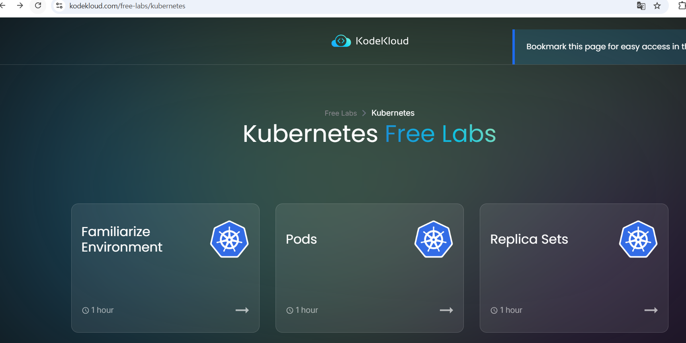

# Kubernetes(k8s) kubectl 명령어 연습용 Sandbox 사이트

k8s **명령어(kubectl) 위주로 연습**하기 좋은 “브라우저 기반 sandbox(플레이그라운드)” 목록입니다.

---

## 1) Killercoda Kubernetes Playgrounds (가볍고 빠름)

- 브라우저에서 바로 **Kubernetes 환경 + 터미널**을 열어주고, 시나리오/실습도 많아서 `kubectl` 연습에 적합합니다.

**바로가기**
- https://killercoda.com/playgrounds/scenario/kubernetes

---

## 2) Play with Kubernetes (PWK) + PWK Classroom (Docker 제공)

- Docker에서 제공하는 **브라우저 기반 k8s 클러스터 실습장**입니다.  
- “Classroom”은 워크샵 형태로 따라가며 연습하기 좋아요.
- (참고) 커뮤니티 이슈로 **가끔 접속/동작이 불안정**하다는 피드백이 있어, 대안도 같이 알아두면 좋습니다.

**바로가기**
- https://labs.play-with-k8s.com/
- https://training.play-with-kubernetes.com/

---

## 3) KodeKloud (Free Labs / Public Playgrounds)

- “랩(가이드형)”으로 `Pod/Deployment/Service` 같은 핵심 명령을 단계별로 연습하기 좋고,
- 별도로 “playground(자유 실습)”도 운영합니다.

**바로가기**
- https://kodekloud.com/free-labs/kubernetes
- https://kodekloud.com/public-playgrounds

---

## 4) iximiuz Labs (Playgrounds + 튜토리얼 연동)

- Kubernetes 주제별 **Playground**가 잘 정리돼 있고,
- 튜토리얼에 딸린 실습 환경에서 그대로 `kubectl`을 쳐보는 흐름이 좋습니다.

**바로가기**
- https://labs.iximiuz.com/playgrounds?category=kubernetes&filter=all

---

## 5) (조금 다른 방식) GitHub Codespaces로 “내 전용” 브라우저 실습 환경 만들기

- 완전한 “공용 sandbox 사이트”라기보다는,
- 브라우저에서 **VS Code + 터미널**을 열고 그 안에 `k3d` 또는 `kind`로 k8s 클러스터를 띄워 쓰는 방식입니다.
- “매번 같은 환경으로 연습”하고 싶을 때 유리합니다. (계정/플랜에 따라 사용량 제한이 있을 수 있음)

**바로가기**
- https://github.com/features/codespaces

---

## 참고: Katacoda는 종료됨

- 예전에 유명했던 Katacoda 기반 실습은 **공식적으로 종료**되었습니다.

---

## 주소 모음(복사용)

```text
Killercoda Kubernetes Playgrounds: https://killercoda.com/playgrounds/scenario/kubernetes
Play with Kubernetes (PWK):       https://labs.play-with-k8s.com/
PWK Classroom:                    https://training.play-with-kubernetes.com/
KodeKloud Free Labs (K8s):        https://kodekloud.com/free-labs/kubernetes
KodeKloud Playgrounds:            https://kodekloud.com/public-playgrounds
iximiuz Labs K8s Playgrounds:     https://labs.iximiuz.com/playgrounds?category=kubernetes&filter=all
GitHub Codespaces:                https://github.com/features/codespaces
```


## https://kodekloud.com/free-labs/kubernetes 접속



### 위의 사이트에서 Pods 클릭 - 1시간 사용 가능한 환경 제공


```
kubectl api-resources

NAME                              SHORTNAMES   APIVERSION                        NAMESPACED   KIND
bindings                                       v1                                true         Binding
componentstatuses                 cs           v1                                false        ComponentStatus
configmaps                        cm           v1                                true         ConfigMap
endpoints                         ep           v1                                true         Endpoints
events                            ev           v1                                true         Event
limitranges                       limits       v1                                true         LimitRange
namespaces                        ns           v1                                false        Namespace
nodes                             no           v1                                false        Node
persistentvolumeclaims            pvc          v1                                true         PersistentVolumeClaim
persistentvolumes                 pv           v1                                false        PersistentVolume
pods                              po           v1                                true         Pod
podtemplates                                   v1                                true         PodTemplate
replicationcontrollers            rc           v1                                true         ReplicationController
resourcequotas                    quota        v1                                true         ResourceQuota
secrets                                        v1                                true         Secret
serviceaccounts                   sa           v1                                true         ServiceAccount
services                          svc          v1                                true         Service
mutatingwebhookconfigurations                  admissionregistration.k8s.io/v1   false        MutatingWebhookConfiguration
validatingwebhookconfigurations                admissionregistration.k8s.io/v1   false        ValidatingWebhookConfiguration
customresourcedefinitions         crd,crds     apiextensions.k8s.io/v1           false        CustomResourceDefinition
apiservices                                    apiregistration.k8s.io/v1         false        APIService
controllerrevisions                            apps/v1                           true         ControllerRevision
daemonsets                        ds           apps/v1                           true         DaemonSet
deployments                       deploy       apps/v1                           true         Deployment
replicasets                       rs           apps/v1                           true         ReplicaSet
statefulsets                      sts          apps/v1                           true         StatefulSet
selfsubjectreviews                             authentication.k8s.io/v1          false        SelfSubjectReview
tokenreviews                                   authentication.k8s.io/v1          false        TokenReview
localsubjectaccessreviews                      authorization.k8s.io/v1           true         LocalSubjectAccessReview
selfsubjectaccessreviews                       authorization.k8s.io/v1           false        SelfSubjectAccessReview
selfsubjectrulesreviews                        authorization.k8s.io/v1           false        SelfSubjectRulesReview
subjectaccessreviews                           authorization.k8s.io/v1           false        SubjectAccessReview
horizontalpodautoscalers          hpa          autoscaling/v2                    true         HorizontalPodAutoscaler
cronjobs                          cj           batch/v1                          true         CronJob
jobs                                           batch/v1                          true         Job
certificatesigningrequests        csr          certificates.k8s.io/v1            false        CertificateSigningRequest
leases                                         coordination.k8s.io/v1            true         Lease
endpointslices                                 discovery.k8s.io/v1               true         EndpointSlice
events                            ev           events.k8s.io/v1                  true         Event
flowschemas                                    flowcontrol.apiserver.k8s.io/v1   false        FlowSchema
prioritylevelconfigurations                    flowcontrol.apiserver.k8s.io/v1   false        PriorityLevelConfiguration
helmchartconfigs                               helm.cattle.io/v1                 true         HelmChartConfig
helmcharts                                     helm.cattle.io/v1                 true         HelmChart
addons                                         k3s.cattle.io/v1                  true         Addon
etcdsnapshotfiles                              k3s.cattle.io/v1                  false        ETCDSnapshotFile
nodes                                          metrics.k8s.io/v1beta1            false        NodeMetrics
pods                                           metrics.k8s.io/v1beta1            true         PodMetrics
ingressclasses                                 networking.k8s.io/v1              false        IngressClass
ingresses                         ing          networking.k8s.io/v1              true         Ingress
networkpolicies                   netpol       networking.k8s.io/v1              true         NetworkPolicy
runtimeclasses                                 node.k8s.io/v1                    false        RuntimeClass
poddisruptionbudgets              pdb          policy/v1                         true         PodDisruptionBudget
clusterrolebindings                            rbac.authorization.k8s.io/v1      false        ClusterRoleBinding
clusterroles                                   rbac.authorization.k8s.io/v1      false        ClusterRole
rolebindings                                   rbac.authorization.k8s.io/v1      true         RoleBinding
roles                                          rbac.authorization.k8s.io/v1      true         Role
priorityclasses                   pc           scheduling.k8s.io/v1              false        PriorityClass
csidrivers                                     storage.k8s.io/v1                 false        CSIDriver
csinodes                                       storage.k8s.io/v1                 false        CSINode
csistoragecapacities                           storage.k8s.io/v1                 true         CSIStorageCapacity
storageclasses                    sc           storage.k8s.io/v1                 false        StorageClass
volumeattachments                              storage.k8s.io/v1                 false        VolumeAttachment
ingressroutes                                  traefik.containo.us/v1alpha1      true         IngressRoute
ingressroutetcps                               traefik.containo.us/v1alpha1      true         IngressRouteTCP
ingressrouteudps                               traefik.containo.us/v1alpha1      true         IngressRouteUDP
middlewares                                    traefik.containo.us/v1alpha1      true         Middleware
middlewaretcps                                 traefik.containo.us/v1alpha1      true         MiddlewareTCP
serverstransports                              traefik.containo.us/v1alpha1      true         ServersTransport
tlsoptions                                     traefik.containo.us/v1alpha1      true         TLSOption
tlsstores                                      traefik.containo.us/v1alpha1      true         TLSStore
traefikservices                                traefik.containo.us/v1alpha1      true         TraefikService
ingressroutes                                  traefik.io/v1alpha1               true         IngressRoute
ingressroutetcps                               traefik.io/v1alpha1               true         IngressRouteTCP
ingressrouteudps                               traefik.io/v1alpha1               true         IngressRouteUDP
middlewares                                    traefik.io/v1alpha1               true         Middleware
middlewaretcps                                 traefik.io/v1alpha1               true         MiddlewareTCP
serverstransports                              traefik.io/v1alpha1               true         ServersTransport
serverstransporttcps                           traefik.io/v1alpha1               true         ServersTransportTCP
tlsoptions                                     traefik.io/v1alpha1               true         TLSOption
tlsstores                                      traefik.io/v1alpha1               true         TLSStore
traefikservices                                traefik.io/v1alpha1               true         TraefikService
```

