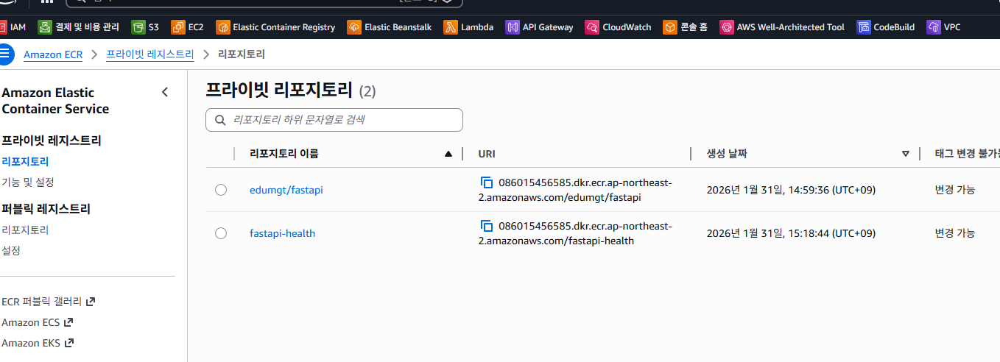

# livenessProbe 실패로 재시작되는 이유 (CrashLoopBackOff와의 관계)

## 1) 결론부터: livenessProbe는 “살아있는지” 검사이고, 실패하면 kubelet이 컨테이너를 **죽이고 재시작**한다

Kubernetes에서 `livenessProbe`는 컨테이너가 **정상적으로 살아있는지**(hung/deadlock/무한대기 등) 확인하기 위한 건강검사입니다.

- `livenessProbe`가 **연속으로 실패**하면 kubelet은 “이 컨테이너는 죽었다/응답 불능이다”라고 판단하고,
- 해당 컨테이너를 **강제로 종료(kill)** 한 다음,
- Pod의 `restartPolicy`가 `Always`(Deployment 기본)라면 **즉시 재시작**합니다.

이 과정이 반복되면, 컨테이너가 계속 재시작되면서 `CrashLoopBackOff` 상태로 보이게 됩니다.

---

## 2) kubelet의 동작 흐름 (왜 “재시작”이 일어나나)

`livenessProbe` 실패 → kubelet은 컨테이너 런타임(containerd 등)에 종료를 요청합니다.

1. kubelet이 주기적으로 livenessProbe 실행
2. probe가 실패(HTTP/exec/tcp 실패)  
3. 실패 횟수가 `failureThreshold`에 도달하면:
   - kubelet이 컨테이너를 **Restart 대상으로 판단**
4. kubelet이 컨테이너 종료(SIGTERM → 유예시간 후 SIGKILL) 처리
5. `restartPolicy=Always`이면 컨테이너를 다시 실행
6. 다시 livenessProbe 실행 → 또 실패하면 반복
7. 반복이 심하면 kubelet이 재시작 간격을 늘리며(backoff) → `CrashLoopBackOff`

---

## 3) 자주 발생하는 원인 (livenessProbe “설정이 너무 빡빡한” 케이스)

### A. 앱이 “느리게 뜨는”데 livenessProbe가 너무 빨리 검사함
예: Spring Boot/Node 앱이 20~60초 걸려 뜨는데  
- `initialDelaySeconds`가 너무 짧고
- `timeoutSeconds`가 너무 짧고
- `failureThreshold`가 낮으면

앱이 정상 부팅 중인데도 “응답 없음”으로 판단해서 계속 재시작합니다.

✅ 해결:
- `startupProbe`를 추가하거나
- livenessProbe 시작을 늦추고(초기 지연),
- timeout/failureThreshold를 완화

---

### B. livenessProbe가 “실제 헬스체크 엔드포인트”가 아닌 곳을 찌름
- `/`가 아니라 `/healthz` 같은 전용 엔드포인트를 써야 하는데
- 인증 필요/리다이렉트/404가 나오는 경로를 검사함
- 혹은 앱이 특정 헤더 없으면 403을 주는 경로를 검사함

✅ 해결:
- 인증 불필요, 빠르고 가벼운 전용 health endpoint 사용
- HTTP status 200을 반환하도록 설계

---

### C. CPU/메모리 압박으로 응답이 순간적으로 늦어짐
- 부하 시 응답 지연 → probe timeout 발생 → 연속 실패 → 재시작

✅ 해결:
- `timeoutSeconds` 증가
- 리소스 requests/limits 조정
- 앱의 health endpoint는 매우 가볍게(의존성 호출 최소화)

---

### D. 헬스체크 엔드포인트가 “외부 의존성”까지 포함
예: `/health`가 DB/Redis/외부 API까지 체크해서  
DB가 잠깐만 느려도 liveness 실패 → 컨테이너 재시작

✅ 권장 설계:
- **liveness**: “프로세스가 살아있나?” (가벼움, 내부 상태 위주)
- **readiness**: “트래픽 받아도 되나?” (의존성 포함 가능)

---

## 4) readinessProbe와 차이 (매우 중요)

| 구분 | 실패 시 영향 | 목적 |
|---|---|---|
| livenessProbe | 컨테이너를 **죽이고 재시작** | 프로세스가 “살아있는지” |
| readinessProbe | Service Endpoint에서 **제외**(트래픽 차단) | “준비가 되었는지” |
| startupProbe | 앱 기동 중에는 liveness/readiness를 “대신” 담당 | 느린 기동 보호 |

- readiness 실패는 보통 재시작을 유발하지 않습니다.
- 재시작 루프를 만드는 건 주로 **liveness/startup** 쪽 문제입니다.

---

## 5) 현장에서 흔한 “권장 설정 패턴”

### (1) 느리게 뜨는 앱: startupProbe를 쓰고 liveness는 보수적으로
```yaml
startupProbe:
  httpGet:
    path: /healthz
    port: 8080
  failureThreshold: 30   # 30번까지 실패 허용
  periodSeconds: 2       # 2초마다 검사 => 최대 60초 부팅 허용

livenessProbe:
  httpGet:
    path: /healthz
    port: 8080
  initialDelaySeconds: 5
  periodSeconds: 10
  timeoutSeconds: 2
  failureThreshold: 3
```

### (2) readiness는 “트래픽 수용 가능 여부”에 집중
```yaml
readinessProbe:
  httpGet:
    path: /ready
    port: 8080
  periodSeconds: 5
  timeoutSeconds: 2
  failureThreshold: 3
```

---

## 6) 진단 커맨드: “probe 실패로 재시작 중인지” 확인

1) Pod 이벤트에서 Unhealthy / probe 메시지 확인
```bash
kubectl -n <ns> describe pod <pod> | egrep -n "Unhealthy|Liveness|Readiness|Startup|probe"
```

2) 컨테이너 재시작 횟수/상태 확인
```bash
kubectl -n <ns> get pod <pod> -o wide
kubectl -n <ns> get pod <pod> -o jsonpath='{.status.containerStatuses[0].restartCount}'; echo
```

3) (가능하면) 컨테이너 직전 로그 확인
```bash
kubectl -n <ns> logs <pod> --previous
```

---

## 7) 요약

- `livenessProbe`는 “살아있나?” 검사이고, **연속 실패하면 kubelet이 컨테이너를 죽이고 재시작**합니다.
- 설정이 너무 공격적이면 정상 부팅 중/일시적인 지연에도 재시작이 반복되어 `CrashLoopBackOff`로 이어질 수 있습니다.
- 느린 기동은 `startupProbe`로 보호하고,  
  `livenessProbe`는 가볍고 보수적으로,  
  `readinessProbe`는 트래픽 수용 여부에 맞추는 것이 안정적입니다.

---
---

# livenessProbe 실패로 재시작되는 이유 (CrashLoopBackOff와의 관계) + FastAPI 실습 (Python)

> 이 문서는 `livenessProbe` 실패가 **컨테이너 재시작**을 유발하는 이유와, 그 결과로 **CrashLoopBackOff**가 발생하는 흐름을 설명하고  
> FastAPI(Python) 기반으로 **재현 → 관찰 → 해결**까지 실습할 수 있는 예시를 제공합니다.

---

## 1) 결론: livenessProbe는 “살아있는지” 검사, 실패하면 kubelet이 **죽이고 재시작**

Kubernetes에서 `livenessProbe`는 컨테이너가 **정상적으로 살아있는지**(hung/deadlock/무한대기 등) 확인하기 위한 건강검사입니다.

- `livenessProbe`가 **연속으로 실패**하면 kubelet은 “이 컨테이너는 응답 불능이다”라고 판단하고
- 해당 컨테이너를 **강제로 종료(SIGTERM → 유예시간 후 SIGKILL)** 한 뒤
- Pod의 `restartPolicy=Always`(Deployment 기본)면 **즉시 재시작**합니다.

이 과정이 반복되면, 컨테이너가 계속 재시작되면서 `CrashLoopBackOff` 상태로 보이게 됩니다.

---

## 2) kubelet 동작 흐름: 왜 “재시작”이 발생하나

`livenessProbe` 실패 → kubelet은 컨테이너 런타임(containerd 등)에 종료를 요청합니다.

1. kubelet이 주기적으로 livenessProbe 실행
2. probe가 실패(HTTP/exec/tcp 실패)
3. 실패 횟수가 `failureThreshold`에 도달하면 컨테이너를 **Restart 대상으로 판단**
4. kubelet이 컨테이너 종료(SIGTERM → SIGKILL) 처리
5. `restartPolicy=Always`이면 컨테이너를 다시 실행
6. 다시 livenessProbe 실행 → 또 실패하면 반복
7. 반복이 심하면 kubelet이 재시작 간격을 늘리며(backoff) → `CrashLoopBackOff`

---

## 3) 자주 발생하는 원인 (livenessProbe 설정이 “너무 빡빡한” 케이스)

### A. 앱이 느리게 뜨는데, livenessProbe가 너무 빨리 검사
예: Spring Boot/Node/Python 앱이 20~60초 걸려 뜨는데  
- `initialDelaySeconds`가 너무 짧고
- `timeoutSeconds`가 너무 짧고
- `failureThreshold`가 낮으면

앱이 정상 부팅 중인데도 “응답 없음”으로 판단해서 계속 재시작합니다.

✅ 해결:
- `startupProbe`를 추가하거나
- livenessProbe 시작을 늦추고(초기 지연)
- timeout/failureThreshold를 완화

---

### B. livenessProbe가 실제 헬스체크 엔드포인트가 아닌 곳을 찌름
- `/`가 아니라 `/healthz` 같은 전용 엔드포인트를 써야 하는데
- 인증 필요/리다이렉트/404/403이 나는 경로를 검사함

✅ 해결:
- 인증 불필요, 빠르고 가벼운 전용 health endpoint 사용
- HTTP status 200을 반환하도록 설계

---

### C. CPU/메모리 압박으로 응답이 순간적으로 늦어짐
- 부하 시 응답 지연 → probe timeout 발생 → 연속 실패 → 재시작

✅ 해결:
- `timeoutSeconds` 증가
- 리소스 requests/limits 조정
- health endpoint는 매우 가볍게(의존성 호출 최소화)

---

### D. 헬스체크가 외부 의존성까지 포함
예: `/health`가 DB/Redis/외부 API까지 체크해서  
DB가 잠깐만 느려도 liveness 실패 → 컨테이너 재시작

✅ 권장 설계:
- **liveness**: “프로세스가 살아있나?” (가벼움, 내부 상태 위주)
- **readiness**: “트래픽 받아도 되나?” (의존성 포함 가능)

---

## 4) readinessProbe와 차이 (매우 중요)

| 구분 | 실패 시 영향 | 목적 |
|---|---|---|
| livenessProbe | 컨테이너를 **죽이고 재시작** | 프로세스가 “살아있는지” |
| readinessProbe | Service Endpoint에서 **제외**(트래픽 차단) | “준비가 되었는지” |
| startupProbe | 앱 기동 중에는 liveness/readiness를 “대신” 담당 | 느린 기동 보호 |

- readiness 실패는 보통 재시작을 유발하지 않습니다.
- 재시작 루프를 만드는 건 주로 **liveness/startup** 쪽 문제입니다.

---

## 5) 권장 설정 패턴 예시

### (1) 느리게 뜨는 앱: startupProbe 사용 + liveness는 보수적으로
```yaml
startupProbe:
  httpGet:
    path: /healthz
    port: 8080
  failureThreshold: 30   # 30번까지 실패 허용
  periodSeconds: 2       # 2초마다 검사 => 최대 60초 부팅 허용

livenessProbe:
  httpGet:
    path: /healthz
    port: 8080
  initialDelaySeconds: 5
  periodSeconds: 10
  timeoutSeconds: 2
  failureThreshold: 3
```

### (2) readiness는 “트래픽 수용 가능 여부”에 집중
```yaml
readinessProbe:
  httpGet:
    path: /ready
    port: 8080
  periodSeconds: 5
  timeoutSeconds: 2
  failureThreshold: 3
```

---

## 6) 진단 커맨드: probe 실패로 재시작 중인지 확인

1) Pod 이벤트에서 Unhealthy / probe 메시지 확인
```bash
kubectl -n <ns> describe pod <pod> | egrep -n "Unhealthy|Liveness|Readiness|Startup|probe"
```

2) 컨테이너 재시작 횟수/상태 확인
```bash
kubectl -n <ns> get pod <pod> -o wide
kubectl -n <ns> get pod <pod> -o jsonpath='{.status.containerStatuses[0].restartCount}'; echo
```

3) 컨테이너 직전 로그 확인
```bash
kubectl -n <ns> logs <pod> --previous
```

---

# FastAPI(Python) 실습: livenessProbe 실패 → CrashLoopBackOff 재현/관찰/해결

## 목표 시나리오
1. FastAPI 앱이 `/healthz`를 제공한다.
2. **livenessProbe가 틀린 포트**를 찌르게 해서 항상 실패하도록 만든다.
3. kubelet이 컨테이너 kill/restart 반복 → 재시작 backoff로 **CrashLoopBackOff**가 된다.
4. YAML을 고쳐서(정상 포트/`startupProbe` 추가 등) 안정화한다.

---

## 1) FastAPI 앱 코드 (health endpoint 포함)

### `main.py`
```python
from fastapi import FastAPI
import os
import time

app = FastAPI()

# 느린 기동을 흉내내고 싶으면 SLOW_START=1, STARTUP_SLEEP=30 같은 env로 조절
SLOW_START = os.getenv("SLOW_START", "0") == "1"
STARTUP_SLEEP = int(os.getenv("STARTUP_SLEEP", "0"))

@app.on_event("startup")
def startup_hook():
    if SLOW_START and STARTUP_SLEEP > 0:
        time.sleep(STARTUP_SLEEP)

@app.get("/")
def root():
    return {"msg": "hello"}

@app.get("/healthz")
def healthz():
    return {"status": "ok"}

@app.get("/ready")
def ready():
    return {"ready": True}
```

### `requirements.txt`
```txt
fastapi==0.115.0
uvicorn[standard]==0.30.6
```

### `Dockerfile`
```dockerfile
FROM python:3.11-slim

WORKDIR /app
COPY requirements.txt .
RUN pip install --no-cache-dir -r requirements.txt

COPY main.py .
EXPOSE 8080

CMD ["uvicorn", "main:app", "--host", "0.0.0.0", "--port", "8080"]
```

### AWS ECR 관련 설정
### ap-northeast-2 기준으로 보통 운영하는 건 Private ECR


### AWS CLI 설정
```
root@DESKTOP-D6A344Q:/home/Kube-Local# aws
Command 'aws' not found, but can be installed with:
snap install aws-cli  # version 1.44.24, or
apt  install awscli   # version 2.14.6-1
See 'snap info aws-cli' for additional versions.
```
---
```
apt-get update
apt-get install -y curl unzip less groff
```
---
```
curl "https://awscli.amazonaws.com/awscli-exe-linux-x86_64.zip" -o "awscliv2.zip"
unzip -q awscliv2.zip
./aws/install
```
---
```
aws --version
which aws
```
---
```
root@DESKTOP-D6A344Q:/home/Kube-Local# aws --version
which aws
aws-cli/2.33.12 Python/3.13.11 Linux/6.6.87.2-microsoft-standard-WSL2 exe/x86_64.ubuntu.24
/usr/local/bin/aws
```
---
```
aws configure
aws sts get-caller-identity
aws ecr describe-repositories --region ap-northeast-2
```
---
```
root@DESKTOP-D6A344Q:/home/Kube-Local# aws configure
aws sts get-caller-identity
aws ecr describe-repositories --region ap-northeast-2
```
---
```
AWS Access Key ID [None]: A.... 이하 생략
AWS Secret Access Key [None]: R... 이하 생략
Default region name [None]: ap-northeast-2
jsonult output format [None]:
{
    "UserId": "AIDARIBXLWVE6SSOENPWT",
    "Account": "086015456585",
    "Arn": "arn:aws:iam::086015456585:user/devuser"
}
{
    "repositories": [
        {
            "repositoryArn": "arn:aws:ecr:ap-northeast-2:본인 Account-ID:repository/본인 Repo",
            "registryId": "본인 Account-ID",
            "repositoryName": "본인 Repo",
            "repositoryUri": "086015456585.dkr.ecr.ap-northeast-2.amazonaws.com/edumgt/fastapi",
            "createdAt": "2026-01-31T14:59:36.706000+09:00",
            "imageTagMutability": "MUTABLE",
            "imageScanningConfiguration": {
                "scanOnPush": false
            },
            "encryptionConfiguration": {
                "encryptionType": "AES256"
            }
        }
    ]
}
```

### fastapi 의 python 모듈 ECR 로
```
REGION=ap-northeast-2
ACCOUNT_ID=<내_aws_account_id>
REPO=fastapi-health
TAG=1.0
IMAGE_LOCAL=$REPO:$TAG
IMAGE_ECR=$ACCOUNT_ID.dkr.ecr.$REGION.amazonaws.com/$REPO:$TAG
```
---
```
root@DESKTOP-D6A344Q:/home/Kube-Local/fastapi# 
root@DESKTOP-D6A344Q:/home/Kube-Local/fastapi# REGION=ap-northeast-2
root@DESKTOP-D6A344Q:/home/Kube-Local/fastapi# ACCOUNT_ID=086015456585
root@DESKTOP-D6A344Q:/home/Kube-Local/fastapi# REPO=fastapi-health
root@DESKTOP-D6A344Q:/home/Kube-Local/fastapi# TAG=1.0
root@DESKTOP-D6A344Q:/home/Kube-Local/fastapi# IMAGE_LOCAL=$REPO:$TAG
root@DESKTOP-D6A344Q:/home/Kube-Local/fastapi# IMAGE_ECR=$ACCOUNT_ID.dkr.ecr.$REGION.amazonaws.com/$REPO:$TAG
```
---
```
root@DESKTOP-D6A344Q:/home/Kube-Local/fastapi# ls -al
total 28
drwxr-xr-x 2 root root 4096 Jan 31 15:12 .
drwxr-xr-x 5 root root 4096 Jan 31 15:13 ..
-rw-r--r-- 1 root root  206 Jan 31 15:01 Dockerfile
-rw-r--r-- 1 root root  168 Jan 31 15:12 Readme.md
-rw-r--r-- 1 root root  564 Jan 31 15:00 main.py
-rw-r--r-- 1 root root  549 Jan 31 15:11 regecr.sh
-rw-r--r-- 1 root root   42 Jan 31 15:01 requirements.txt
root@DESKTOP-D6A344Q:/home/Kube-Local/fastapi# chmod +x regecr.sh
```


### ECR Pull 과정에서 repo 명 달라서 위에 2개 있음 - 상관없음

### 각자 AWS 계정에 따라 - 086015456585.dkr.ecr.ap-northeast-2.amazonaws.com/fastapi-health:1.0
### yaml 에서 image: 086015456585.dkr.ecr.ap-northeast-2.amazonaws.com/fastapi-health:1.0 부분 수정


> 이미지 빌드/푸시는 환경마다 다릅니다.  
> 실습에서는 사내 레지스트리나 개인 레지스트리에 위 이미지(`YOUR_REGISTRY/fastapi-health:latest`)를 올려 사용하세요.

---

## 2) (실패 재현) livenessProbe가 “틀린 포트”를 찌르는 Pod

아래 매니페스트는 FastAPI가 **8080**으로 뜨는데, livenessProbe가 **8000**을 체크해서 **항상 실패**합니다.

### `fastapi-liveness-bad.yaml`
```yaml
apiVersion: v1
kind: Namespace
metadata:
  name: demo
---
apiVersion: v1
kind: Pod
metadata:
  name: fastapi-bad
  namespace: demo
  labels:
    app: fastapi-bad
spec:
  restartPolicy: Always
  containers:
    - name: app
      image: 086015456585.dkr.ecr.ap-northeast-2.amazonaws.com/fastapi-health:1.0
      ports:
        - containerPort: 8080
      # FastAPI는 8080인데 liveness는 8000을 찌름 => 실패 유도
      livenessProbe:
        httpGet:
          path: /healthz
          port: 8000
        initialDelaySeconds: 3
        periodSeconds: 5
        timeoutSeconds: 1
        failureThreshold: 2
```

적용:
```bash
kubectl apply -f fastapi-liveness-bad.yaml
```

---

## 3) 관찰: CrashLoopBackOff 확인

### 1) 상태 확인
```bash
kubectl -n demo get pod fastapi-bad -w
```
---
```
ubuntu@cp1:~$ kubectl apply -f fastapi-liveness-bad.yaml
namespace/demo unchanged
pod/fastapi-bad created
ubuntu@cp1:~$ kubectl -n demo get pod fastapi-bad -w
NAME          READY   STATUS         RESTARTS   AGE
fastapi-bad   0/1     ErrImagePull   0          14s
fastapi-bad   0/1     ImagePullBackOff   0          17s
```
---
```
ubuntu@cp1:~kubectl -n demo describe pod fastapi-bad | egrep -n "Failed|Back-off|pull|unauthorized|denied|not found|no basic auth|TLS|timeout"t"
24:    Liveness:       http-get http://:8000/healthz delay=3s timeout=1s period=5s #success=1 #failure=2
51:  Warning  Failed     36s (x4 over 2m8s)  kubelet            Failed to pull image "086015456585.dkr.ecr.ap-northeast-2.amazonaws.com/fastapi-health:1.0": failed to pull and unpack image "086015456585.dkr.ecr.ap-northeast-2.amazonaws.com/fastapi-health:1.0": failed to resolve reference "086015456585.dkr.ecr.ap-northeast-2.amazonaws.com/fastapi-health:1.0": pull access denied, repository does not exist or may require authorization: authorization failed: no basic auth credentials
52:  Warning  Failed     36s (x4 over 2m8s)  kubelet            Error: ErrImagePull
53:  Normal   BackOff    11s (x7 over 2m8s)  kubelet            Back-off pulling image "086015456585.dkr.ecr.ap-northeast-2.amazonaws.com/fastapi-health:1.0"
54:  Warning  Failed     11s (x7 over 2m8s)  kubelet            Error: ImagePullBackOff
```
---

### ECR 로그인 문제 부터 해결 필요 - CP 에 AWS CLI 설정
```
sudo apt-get update
sudo apt-get install -y curl unzip less groff
curl "https://awscli.amazonaws.com/awscli-exe-linux-x86_64.zip" -o "awscliv2.zip"
unzip -q awscliv2.zip
sudo ./aws/install
aws --version
```
---
```
ubuntu@cp1:~$ aws --version
aws-cli/2.33.12 Python/3.13.11 Linux/5.15.0-164-generic exe/x86_64.ubuntu.22
```
---
```
ubuntu@cp1:~$ aws configure
```
---
```
NS=demo
REGION=ap-northeast-2
ACCOUNT_ID=086015456585
SECRET_NAME=ecr-regcred

kubectl -n $NS create secret docker-registry $SECRET_NAME \
  --docker-server=$ACCOUNT_ID.dkr.ecr.$REGION.amazonaws.com \
  --docker-username=AWS \
  --docker-password="$(aws ecr get-login-password --region $REGION)"
```
---
```
secret/ecr-regcred created
```

### 토큰만 추출
```
aws ecr get-login-password --region ap-northeast-2
```


### Account 연동
```
kubectl -n demo patch serviceaccount default \
  -p '{"imagePullSecrets":[{"name":"ecr-regcred"}]}'
```
---
```
ubuntu@cp1:~$ kubectl -n demo patch serviceaccount default \
  -p '{"imagePullSecrets":[{"name":"ecr-regcred"}]}'
serviceaccount/default patched
```

### SA(serviceaccount) 확인
```
ubuntu@cp1:~$ kubectl -n demo get sa default -o yaml | egrep -n "imagePullSecrets|ecr-regcred"
2:imagePullSecrets:
3:- name: ecr-regcred
```
---
```
ubuntu@cp1:~$ kubectl -n demo get secret ecr-regcred
NAME          TYPE                             DATA   AGE
ecr-regcred   kubernetes.io/dockerconfigjson   1      6m28s
```


### pod 재생성
```
kubectl -n demo delete pod fastapi-bad
kubectl apply -f fastapi-liveness-bad.yaml
kubectl -n demo get pod fastapi-bad -w
```

### 정상이라면 ContainerCreating → Running으로 바뀝니다.
### (그 다음에야 liveness 실패로 CrashLoopBackOff 재현 단계로 넘어가요.)

```
ubuntu@cp1:~$ kubectl -n demo delete pod fastapi-bad
kubectl apply -f fastapi-liveness-bad.yaml
kubectl -n demo get pod fastapi-bad -w
pod "fastapi-bad" deleted from demo namespace
namespace/demo unchanged
pod/fastapi-bad created
```
---
```
NAME          READY   STATUS              RESTARTS   AGE
fastapi-bad   0/1     ContainerCreating   0          0s
fastapi-bad   1/1     Running             0          20s
fastapi-bad   1/1     Running             1 (1s ago)   32s
fastapi-bad   1/1     Running             2 (0s ago)   41s
fastapi-bad   1/1     Running             3 (0s ago)   51s
fastapi-bad   0/1     CrashLoopBackOff    3 (1s ago)   62s
fastapi-bad   1/1     Running             4 (29s ago)   90s
fastapi-bad   1/1     Running             5 (1s ago)    102s
fastapi-bad   0/1     CrashLoopBackOff    5 (1s ago)    112s
fastapi-bad   1/1     Running             6 (82s ago)   3m13s
fastapi-bad   0/1     CrashLoopBackOff    6 (0s ago)    3m26s
```


### 2) 이벤트에서 “Liveness probe failed” 확인 - 다른 창에서
```bash
kubectl -n demo describe pod fastapi-bad | egrep -n "Unhealthy|Liveness|probe|Back-off|Killing"
```
---
```
ubuntu@cp1:~$ kubectl -n demo describe pod fastapi-bad | egrep -n "Unhealthy|Liveness|probe|Back-off|Killing"
29:    Liveness:       http-get http://:8000/healthz delay=3s timeout=1s period=5s #success=1 #failure=2
60:  Normal   Killing    105s (x6 over 3m5s)   kubelet            Container app failed liveness probe, will be restarted
61:  Warning  Unhealthy  10s (x14 over 3m10s)  kubelet            Liveness probe failed: Get "http://10.42.2.23:8000/healthz": dial tcp 10.42.2.23:8000: connect: connection refused
62:  Warning  BackOff    9s (x11 over 2m34s)   kubelet            Back-off restarting failed container app in pod fastapi-bad_demo(d8e34a13-d9ee-421e-97f2-a5736fd99dfe)
```

### 3) 이전(직전) 컨테이너 로그 확인
```bash
kubectl -n demo logs fastapi-bad --previous
```
---
```
ubuntu@cp1:~$ kubectl -n demo logs fastapi-bad --previous
INFO:     Started server process [1]
INFO:     Waiting for application startup.
INFO:     Application startup complete.
INFO:     Uvicorn running on http://0.0.0.0:8080 (Press CTRL+C to quit)
INFO:     Shutting down
INFO:     Waiting for application shutdown.
INFO:     Application shutdown complete.
INFO:     Finished server process [1]
```

---

## 4) (해결 1) liveness 포트를 정상으로 수정

### `fastapi-liveness-good.yaml`
```yaml
apiVersion: v1
kind: Pod
metadata:
  name: fastapi-good
  namespace: demo
  labels:
    app: fastapi-good
spec:
  restartPolicy: Always
  containers:
    - name: app
      image: YOUR_REGISTRY/fastapi-health:latest
      ports:
        - containerPort: 8080
      livenessProbe:
        httpGet:
          path: /healthz
          port: 8080
        initialDelaySeconds: 3
        periodSeconds: 10
        timeoutSeconds: 2
        failureThreshold: 3
      readinessProbe:
        httpGet:
          path: /ready
          port: 8080
        periodSeconds: 5
        timeoutSeconds: 2
        failureThreshold: 3
```

적용:
```bash
kubectl -n demo delete pod fastapi-bad
kubectl apply -f fastapi-liveness-good.yaml
kubectl -n demo get pod fastapi-good -w
```

---

## 5) (심화) 느린 기동 재현 + startupProbe로 보호하기

FastAPI가 30초 뒤에 뜨도록 설정하고, `startupProbe`로 기동 구간을 보호합니다.

### `fastapi-slow-startup.yaml`
```yaml
apiVersion: v1
kind: Pod
metadata:
  name: fastapi-slow
  namespace: demo
spec:
  restartPolicy: Always
  containers:
    - name: app
      image: YOUR_REGISTRY/fastapi-health:latest
      env:
        - name: SLOW_START
          value: "1"
        - name: STARTUP_SLEEP
          value: "30"
      ports:
        - containerPort: 8080

      # ✅ startupProbe: 기동 중에는 여기만 체크 (liveness/readiness를 잠시 무력화)
      startupProbe:
        httpGet:
          path: /healthz
          port: 8080
        periodSeconds: 2
        failureThreshold: 20   # 2초*20=40초까지 기동 허용

      # ✅ liveness: 기동 완료 후 hung 여부만 보수적으로
      livenessProbe:
        httpGet:
          path: /healthz
          port: 8080
        periodSeconds: 10
        timeoutSeconds: 2
        failureThreshold: 3

      # ✅ readiness: 트래픽 수용 가능 여부
      readinessProbe:
        httpGet:
          path: /ready
          port: 8080
        periodSeconds: 5
        timeoutSeconds: 2
        failureThreshold: 3
```

적용:
```bash
kubectl apply -f fastapi-slow-startup.yaml
kubectl -n demo get pod fastapi-slow -w
kubectl -n demo describe pod fastapi-slow | egrep -n "Startup|Liveness|Readiness|Unhealthy|probe"
```

---

## 6) (옵션) Service 붙여서 내부 통신으로 확인

> 아래 Service는 `fastapi-good`의 라벨(`app: fastapi-good`)과 매칭됩니다.

### `fastapi-svc.yaml`
```yaml
apiVersion: v1
kind: Service
metadata:
  name: fastapi-svc
  namespace: demo
spec:
  selector:
    app: fastapi-good
  ports:
    - name: http
      port: 80
      targetPort: 8080
  type: ClusterIP
```

적용/테스트:
```bash
kubectl -n demo apply -f fastapi-svc.yaml
kubectl -n demo run curl --rm -it --image=curlimages/curl -- \
  curl -sS http://fastapi-svc/healthz
```

---

## 7) 체크리스트 요약

- **CrashLoopBackOff 재현**: livenessProbe가 실패(틀린 포트/경로/타임아웃) → kubelet kill/restart 반복
- **원인 확인**: `kubectl describe pod` 이벤트에서 `Liveness probe failed`, `Killing`, `Back-off`
- **해결**:
  - liveness가 찌르는 **포트/경로를 정확히**
  - 느린 기동이면 **startupProbe**로 보호
  - readiness는 트래픽 차단용으로 별도 설계


---
# kubectl explain로 Probe(startup/liveness/readiness) 및 gRPC 지원 여부 확인

아래 명령들로 **현재 kubectl이 연결된 클러스터의 OpenAPI 스키마 기준**으로  
`startupProbe/livenessProbe/readinessProbe`와 **grpc/httpGet/exec/tcpSocket** 지원 여부를 확인할 수 있습니다.

---

## 1) 컨테이너 Probe 필드 3종이 있는지 확인

```bash
kubectl explain pod.spec.containers.startupProbe
kubectl explain pod.spec.containers.livenessProbe
kubectl explain pod.spec.containers.readinessProbe
```

- 각각의 설명/필드 목록이 출력되면 해당 probe 필드는 지원되는 것입니다.

---

## 2) Probe 객체 구조(공통 파라미터) 확인

```bash
kubectl explain pod.spec.containers.livenessProbe --recursive
```

출력에서 보이는 대표 공통 파라미터:
- `initialDelaySeconds`
- `periodSeconds`
- `timeoutSeconds`
- `failureThreshold`
- `successThreshold`

---

## 3) 프로브 핸들러(검사 방식) 지원 확인: httpGet / exec / tcpSocket / grpc

Probe에는 “어떤 방식으로 검사할지(핸들러)”가 들어갑니다.  
재귀 출력으로 지원 여부가 바로 드러납니다.

### A) HTTP GET
```bash
kubectl explain pod.spec.containers.livenessProbe.httpGet --recursive
```

### B) Exec
```bash
kubectl explain pod.spec.containers.livenessProbe.exec --recursive
```

### C) TCP Socket
```bash
kubectl explain pod.spec.containers.livenessProbe.tcpSocket --recursive
```

### D) gRPC (지원 여부 확인 핵심)
```bash
kubectl explain pod.spec.containers.livenessProbe.grpc --recursive
```

- **지원**이면 `grpc:` 아래에 `port`, `service` 등의 필드 설명이 나옵니다.
- **미지원**이면 보통 `field "grpc" does not exist` 류로 나오거나, recursive 출력에 `grpc`가 아예 보이지 않습니다.

---

## 4) 한 번에 핸들러 지원 여부만 빠르게 보기

```bash
kubectl explain pod.spec.containers.livenessProbe --recursive | egrep -n "httpGet|exec|tcpSocket|grpc"
```

---

## 5) startupProbe가 어떻게 동작하는지 스키마로 확인

```bash
kubectl explain pod.spec.containers.startupProbe --recursive | egrep -n "failureThreshold|periodSeconds|timeoutSeconds|httpGet|exec|tcpSocket|grpc"
```

---

## 6) (참고) 클러스터 버전 확인

gRPC probe 같은 기능은 Kubernetes 버전에 따라 지원 여부가 달라질 수 있으니 버전도 함께 확인하면 좋습니다.

```bash
kubectl version --short
kubectl get nodes -o wide
```
